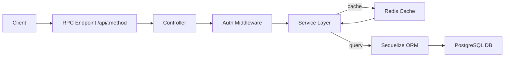
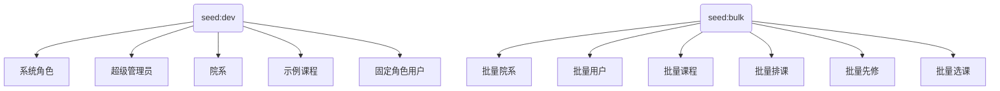

# 后端（NestJS）说明文档

## 一、总体概述

- 技术框架：NestJS + TypeScript；ORM：Sequelize（sequelize-typescript）；日志：Pino
- 运行形态：开发态使用 tsx；生产态使用 tsc 构建后运行
- 接口风格：统一语义化 RPC 入口 `${backend.apiPrefix}/:method`（默认 `/api/:method`），方法名即路径，Body 为 params；响应遵循 JSON‑RPC 2.0（result/error）

## 二、数据链路



- Auth.Login 返回 JWT，随后前端携带 token 调用各业务方法
- 课程与选课查询支持分页与筛选；写入遵循约束与事务策略（视业务场景）

## 三、模块与代码结构

- 入口：main.ts 与 app.module.ts 注册全局中间件与模块
- 业务模块：`src/modules/*`（user、course、enrollment、auth…），每个模块含 `module/controller/service`
- 公共能力：日志工具、批量种子进度条等（见 `src/common/*`）

## 四、数据库与迁移

- 迁移：`src/db/migrations`（扩展：uuid-ossp/pgcrypto/pg_trgm；核心表：users/departments/courses/enrollments/system_configs；新增：class_schedules/prerequisites）
- 索引与约束：唯一索引、JSONB GIN 索引、检查约束、触发器（updated_at 自动更新等）
- 初始化脚本：macOS 与 Linux 一键脚本启动数据库容器、执行迁移、种子与校验

## 五、脚本说明

- 开发与构建
  - `pnpm -F @apps/backend dev` 启动开发服务
  - `pnpm -F @apps/backend build` 构建产物；`pnpm -F @apps/backend start` 运行
- 数据库
  - `pnpm -F @apps/backend migrate:dev` 执行迁移；`migrate:status` 查看状态；`rollback:dev` 回滚
  - `pnpm -F @apps/backend db:validate` 校验扩展/表/触发器
  - `pnpm -F @apps/backend db:reset:dev` 开发态重置（TRUNCATE + RESTART IDENTITY）
- 种子
  - `pnpm -F @apps/backend seed:dev` 最小数据（系统角色、超级管理员、院系、示例课程、固定角色用户）
  - `pnpm -F @apps/backend seed:bulk` 批量假数据（院系/教师/学生/课程/排课/先修/选课），带进度条与 ETA

## 六、种子配置与规则

- 配置集中于 `src/modules/seed/seed-config.ts`
  - `seedDefaults.emailDomain` 批量邮箱域名
  - `seedDefaults.nameLengthPreferOne` 中文一字名概率
  - `seedDefaults.scheduleBlocks` 排课时间块集合
  - `seedDefaults.enrollmentStatusPool` 选课状态池
  - `chineseNames.surnames/givenChars` 中文姓名字典
- 批量行为要点
  - 用户名与显示姓名：username=中文姓名；email 的本地部分保留英数别名（t*/s* + 院系码 + 序号）保持唯一
  - 幂等：使用 `WHERE NOT EXISTS` 与唯一索引；重复不会插入
  - 先修课：同 term 内从前序课程中选取，避免环与自引用
  - 选课：按复合唯一约束避免重复；容量更新留给业务层或统计任务



## 七、固定测试账号

- SUPER_ADMIN：superadmin / a123456 / admin@course-select.edu
- ADMIN：admin001 / a123456
- TEACHER：teacher001 / a123456
- STUDENT：student001 / a123456

## 八、RPC 示例（语义化路径）

```bash
curl -s -X POST http://localhost:3001/api/Auth.Login \
 -H 'Content-Type: application/json' \
 -d '{"username":"superadmin","password":"a123456"}'

curl -s -X POST http://localhost:3001/api/Course.ListForStudent \
 -H 'Content-Type: application/json' \
 -d '{"page":1,"page_size":20}'

curl -s -X POST http://localhost:3001/api/Enrollment.Add \
 -H 'Content-Type: application/json' \
 -d '{"courseId":"<uuid>"}'
```

## 九、FAQ

- 批量生成为什么耗时？
  - 批量涉及大量插入（院系/用户/课程/排课/先修/选课），数据库写入与索引维护会占用时间。seed:bulk 内置进度条与 ETA，TTY 下显示条形进度，非 TTY 回退为结构化日志。建议在本机或高性能容器环境执行，并适当降低规模参数进行迭代。
- 为什么再次执行 seed:bulk 会跳过？
  - 为避免误扩容，存在“跳过守卫”：当核心数据总量 > 10 时整体跳过。你可以在代码/配置中调低或关闭门槛；若需覆盖生成，先执行 `db:reset:dev` 再运行种子脚本。
- 用户名已改中文，邮箱为何仍是英数？
  - 邮箱地址需保持合法字符与唯一性；本地部分保留英数别名（t*/s* + 院系码 + 序号）更稳定。若需邮箱也映射中文姓名，可改为拼音并追加编号解决重名冲突。
- 如何清空并重新生成？
  - 开发态执行 `db:reset:dev` 重置主要表；随后运行 `seed:dev`（最小数据）与 `seed:bulk`（批量数据）。重置会清空数据与序列，便于重复演练与验证。
- 幂等策略如何保证？
  - 通过 `WHERE NOT EXISTS` 与唯一索引/联合唯一约束（如选课复合唯一），重复写入会被跳过。先修课生成避免自引用与环；排课采用唯一组合（课程+星期+开始/结束）。
- 密码如何设置与更改？
  - 所有种子用户统一密码 `a123456`，存储为 pgcrypto 的 bcrypt 哈希。更改密码策略可调整种子服务中的 `crypt('<new>', gen_salt('bf'))` 调用或改为应用层变更。
