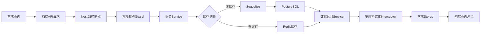

# 项目技术架构文档

## 1. 项目概述

### 1.1 项目定位

本项目采用 monorepo 架构统一管理前端、后端子项目，核心为选课类业务系统，具备用户管理、课程选择、数据统计等核心功能，追求开发效率、可维护性和部署便捷性。

### 1.2 核心技术栈

| 维度     | 技术选型                                                          |
| -------- | ----------------------------------------------------------------- |
| 项目管理 | pnpm + monorepo                                                   |
| 前端     | vite + vue3 + ts + vue-router + pinia + scss + echarts + naive-ui |
| 后端     | esbuild + nest.js + ts + zod + jwt + undici + Sequelize           |
| 数据库   | PostgreSQL（核心业务） + Redis（缓存）                            |
| 部署     | 仅数据库使用 Docker（PostgreSQL/Redis），前后端本机开发运行       |
| 接口规范 | RPC（统一入口 /rpc，方法分发）                                    |

## 2. 项目目录编排（Monorepo）

### 2.1 根目录结构

```Plain Text
course_schedule_system/
├── package.json
├── pnpm-workspace.yaml
├── tsconfig.json
├── .editorconfig
├── eslint.config.ts
├── .prettierrc
├── .gitignore
├── .nvmrc
├── apps/
├── packages/
├── databases/
├── docs/
└── README.md
```

#### 作用说明

- `apps/`：业务应用入口，包含前端与后端子项目；开发与运行的主要目录。
- `packages/`：公共包聚合，放置共享类型、运行时校验、数据库 schema、ORM 模型、通用工具等，供 `apps` 复用。
- `databases/`：数据库基础设施与迁移脚本，仅此处使用 Docker 启动/迁移数据库（PostgreSQL、Redis）；前后端不使用容器。
- `docs/`：项目文档与技术设计说明，作为架构与实现的统一参考。
- 根工程文件（`pnpm-workspace.yaml`、TS/Lint/EditorConfig 等）：统一工程化配置，保障一致的构建与代码质量。

### 2.2 前端子项目（apps/frontend）

```Plain Text
apps/frontend/
├── package.json
├── tsconfig.json
├── vite.config.ts
├── index.html
├── public/
├── src/
│   ├── main.ts
│   ├── App.vue
│   ├── router/
│   ├── stores/
│   ├── api/
│   ├── components/
│   ├── pages/
│   ├── assets/
│   └── styles/
│       ├── _variables.scss
│       ├── _mixins.scss
│       ├── themes/
│       └── types/     # 将类型相关说明/约定集中到样式体系下
└── README.md
```

#### 作用说明

- `src/router/`：路由与守卫配置，管理页面访问与导航逻辑。
- `src/stores/`：Pinia 全局状态（用户、权限、系统配置、应用状态）。
- `src/api/`：HTTP 请求封装与模块化接口定义，统一拦截器与错误处理。
- `src/components/`、`src/pages/`：通用组件与业务页面，实现 UI 与交互。
- `src/styles/`：样式体系（变量、混合、主题）与类型约定聚合，统一视觉与约束。

### 2.3 后端子项目（apps/backend）

```Plain Text
apps/backend/
├── package.json
├── tsconfig.json
├── src/
│   ├── main.ts
│   ├── app.module.ts
│   ├── modules/
│   │   ├── user/
│   │   │   ├── user.module.ts
│   │   │   ├── user.controller.ts
│   │   │   └── user.service.ts
│   │   ├── course/
│   │   │   ├── course.module.ts
│   │   │   ├── course.controller.ts
│   │   │   └── course.service.ts
│   │   ├── enrollment/
│   │   │   ├── enrollment.module.ts
│   │   │   ├── enrollment.controller.ts
│   │   │   └── enrollment.service.ts
│   │   └── ...
│   ├── common/
│   │   ├── dto/
│   │   ├── guards/
│   │   ├── middleware/
│   │   ├── filters/
│   │   ├── config/
│   │   └── utils/
│   ├── models/
│   └── constants/
└── README.md
```

#### 作用说明

- `src/modules/*`：按功能模块分目录，每个模块自包含 `module/controller/service`，提升内聚与可维护性。
- `src/common/`：跨模块复用的 `dto/guards/middleware/filters/config/utils`，统一验证、鉴权、异常与配置。
- `src/models/`：Sequelize ORM 模型定义与关联，承载持久层结构。
- 迁移与种子：统一位于 `databases/`，通过脚本或共享包触发执行；后端不再维护 `migrations/`、`seeders/` 顶层目录。

### 2.4 目录架构（规划总览）

```Plain Text
packages/
├── shared-types/
├── runtime-validation/
├── db-schema/
├── models/
├── utils/
└── config/

databases/
├── docker-compose.db.yml
├── init-scripts/
├── scripts/
│   ├── init_macos.sh
│   ├── init_linux.sh
│   └── init_windows.ps1
├── migrations/
├── seeders/
└── README.md

docs/
├── 技术架构.md
├── 接口文档.md
├── 研究生排课系统前端文档.md
├── 研究生排课系统后端文档 .md
├── 研究生排课系统的业务文档.md
└── 研究生排课系统的数据库脚本.md
```

#### 作用说明

- `packages/shared-types`：前后端共享 TS 类型与接口契约。
- `packages/runtime-validation`：运行时类型校验（如 zod），保证接口入参/出参安全。
- `packages/db-schema`：数据库 schema 与迁移描述，统一结构来源。
- `packages/models`：共享 ORM 模型与实体关系定义，供后端装配。
- `packages/utils`：通用工具（日期、加密、日志等）。
- `packages/config`：统一的公共配置（端口、基础地址、RPC 路径、数据库连接参数），供前后端与脚手架引用。
- `databases/*`：仅数据库容器与迁移/种子脚本；用于初始化与数据维护。

## 3. 数据链路设计

### 3.1 核心数据链路流程图



### 3.2 关键链路说明

1. **前端请求链路**：用户操作触发页面事件 → 调用 api 模块封装的请求 → 携带 token 请求后端接口。

2. **后端处理链路**：
   - 控制器接收请求 → Guard 校验 JWT 权限 → 调用对应 Service 处理业务逻辑；

   - Service 优先查询 Redis 缓存，命中则直接返回，未命中则通过 Sequelize 操作 PostgreSQL；

   - 数据库返回数据后，Service 将数据写入 Redis 缓存（设置过期时间） → 拦截器格式化响应 → 返回前端。

3. **前端渲染链路**：前端接收响应 → 写入 Pinia Stores → 页面监听 Stores 数据变化 → 重新渲染页面。

## 4. 数据库设计核心规则

### 4.1 数据库选型说明

- **核心数据库**：PostgreSQL（选课业务以结构化数据为主，如用户、课程、选课记录，SQL 数据库的事务、关联查询更适配，且 Sequelize 对 PostgreSQL 支持完善）；

- **缓存数据库**：Redis（仅用于热点数据缓存，如课程列表、用户信息，设置合理过期时间避免缓存雪崩）；

- **暂不使用**：MongoDB（非结构化数据少，无需引入）、Neo4j（选课场景无复杂图关系，引入会增加复杂度）。

### 4.2 数据库交互规则

1. 所有数据库操作通过 Sequelize ORM 封装，避免直接写 SQL，提升可维护性；

2. 核心业务（选课/退课）开启数据库事务，保证数据一致性；

3. 热点数据（如课程列表）缓存有效期设置为 10 分钟，用户信息缓存与 JWT 过期时间一致；

4. 数据库迁移通过 Sequelize Migrations 管理，避免手动修改表结构。

## 5. 部署与打包设计

### 5.1 打包流程

1. **前端打包**：`pnpm run build`（vite 打包，输出 dist 目录）；

2. **后端打包**：`pnpm run build`（esbuild 编译 TS，输出 dist 目录，替代 NestJS 默认的 tsc，提升打包速度）。

### 5.2 数据库容器与迁移

- 仅数据库层使用 Docker：通过 `databases/docker-compose.db.yml` 启动 PostgreSQL/Redis，用于迁移与种子数据注入。
- 前端/后端仅开发环境运行：不配置容器，使用本机 Node.js 与 pnpm 开发。
- 常用命令：

  ```bash
  # 启动数据库容器
  docker compose -f databases/docker-compose.db.yml up -d postgres redis

  # 执行迁移与种子（在后端或 db-workflows 包中）
  pnpm run db:migrate
  pnpm run db:seed
  ```

## 6. 接口设计核心规则（RPC）

### 6.1 RPC 规范

- 统一入口：`POST /rpc`
- 请求包：

  ```json
  {
    "id": "<uuid>",
    "method": "Service.Method",
    "params": {
      /* 参数 */
    },
    "meta": { "version": "v1" }
  }
  ```

- 响应包：

  ```json
  {
    "id": "<uuid>",
    "code": 0,
    "message": "OK",
    "data": {
      /* 返回数据 */
    },
    "timestamp": 1730000000000
  }
  ```

- 方法命名：`Auth.Login`、`Course.List`、`Enrollment.Add`、`Admin.SetSelectTime` 等；按领域聚合。
- 错误码与重试：沿用统一错误码，客户端可据 `code` 判定重试/降级。

### 6.2 中间件设计

- 跨域中间件：允许前端域名跨域请求；

- 日志中间件：记录所有请求的 URL、参数、响应时间；

- 异常中间件：统一捕获后端异常，返回标准化错误响应。

---

### 总结

1. 项目基于**pnpm + monorepo** 拆分前端（apps/frontend）和后端（apps/backend）子项目，目录结构按业务模块拆分，符合可维护性原则；

2. 数据链路核心为「前端请求 → 后端权限校验 → 缓存优先 → 数据库操作 → 响应渲染」，优先使用 PostgreSQL（结构化数据适配）+ Redis（缓存）；

3. 部署与运行遵循“数据库用容器、应用用本机”的原则：数据库通过容器完成迁移与初始化；前后端在开发环境以本机运行，避免不必要的容器复杂度。

## 7. 工程化与开发规范（新增）

### 7.1 配置来源

- 全部配置统一来源 `packages/config`，包括前后端端口、基础地址、RPC 路径与数据库连接参数。
- 不再使用根环境变量文件；如需环境变量将单独约定并由部署注入。

### 7.2 代码质量

- ESLint 9（Flat 配置） + Prettier（半角分号、单引号、printWidth 100）统一 JS/TS/Vue 代码风格。
- Stylelint 标准集（含 SCSS/Vue 支持）统一样式规范。
- 提交前：Husky + lint-staged 自动执行增量修复与检查。

### 7.3 脚本约定

- 优先使用 `pnpm -F <workspace>` 运行分项目命令（如 `pnpm -F @apps/frontend dev`、`pnpm -F @apps/backend dev`）。
