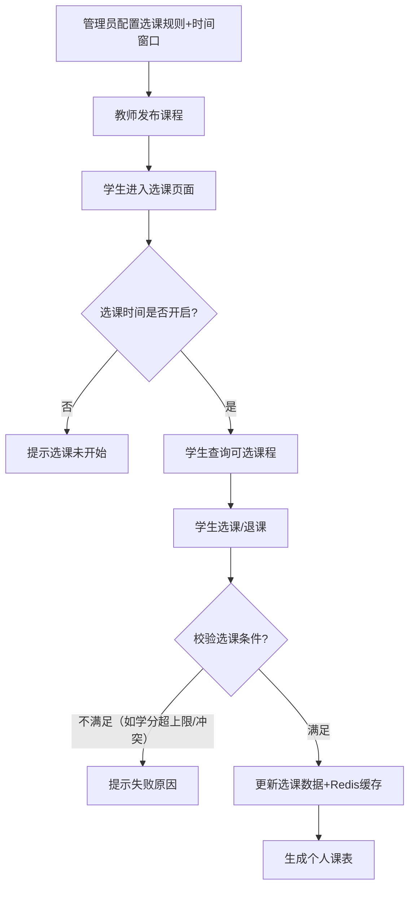
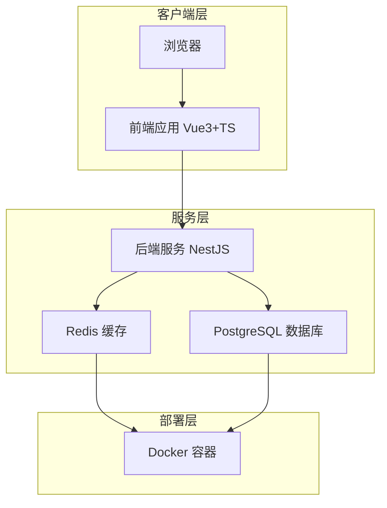

# 基于 pnpm + monorepo 的选课系统全流程设计

# 选课系统 全流程设计文档

你需要的是一套基于 `pnpm + monorepo` 架构的选课系统完整文档体系，涵盖业务、技术架构、前后端设计、数据库设计和接口设计，技术栈已指定，数据库需选择「最简单且适配选课场景」的方案。以下是完整的文档内容：

---

## 一、业务文档

### 1.1 文档基础信息

| 项⽬     | 内容                                                                |
| -------- | ------------------------------------------------------------------- |
| 系统名称 | 高校通用选课系统                                                    |
| 文档版本 | V1.0                                                                |
| 目标用户 | 学生（选课）、教师（管理课程）、管理员（系统配置/权限管理）         |
| 核心目标 | 实现课程查询、选课/退课、课表生成、课程管理、数据统计的全流程线上化 |

### 1.2 核心业务需求

#### 1.2.1 角色与权限

| 角色   | 核心权限                                                            |
| ------ | ------------------------------------------------------------------- |
| 学生   | 查看可选课程、选课/退课、查看个人课表、查看选课规则                 |
| 教师   | 发布/编辑/下架课程、查看选自己课程的学生列表、导出课程成绩模板      |
| 管理员 | 管理用户（增删改查）、管理专业/班级、配置选课时间窗口、统计选课数据 |

#### 1.2.2 核心业务流程



#### 1.2.3 核心约束

1. 选课有时间窗口限制，仅管理员配置的时间段内可操作；

2. 学生选课有学分上限（如单学期最多选20学分）；

3. 同一时间段的课程不可重复选择（避免时间冲突）；

4. 课程有选座人数上限，满额后不可选；

5. 退课有时间限制（选课截止前24小时不可退课）。

---

## 二、技术架构文档

### 2.1 整体架构

基于 `pnpm monorepo` 实现前后端代码统一管理，整体架构为「前端 B/S 架构 + 后端分层架构 + 缓存+数据库」，核心架构图：



### 2.2 项目目录编排（Monorepo）

```Plain Text
course_schedule_system/
├── package.json
├── pnpm-workspace.yaml
├── tsconfig.base.json
├── apps/
│   ├── frontend/
│   └── backend/
├── packages/
├── databases/
│   ├── docker-compose.db.yml
│   ├── init-scripts/
│   ├── migrations/
│   ├── seeders/
│   └── scripts/
└── docs/
```

### 2.3 数据链路设计

1. **查询链路**：用户请求 → 前端校验 → 后端接口 → Redis缓存（命中则直接返回）→ 未命中则查PostgreSQL → 结果写入Redis → 返回前端；

2. **写操作链路**：用户操作（选课/退课）→ 前端校验 → 后端接口 → 事务操作PostgreSQL → 清空对应Redis缓存 → 返回操作结果；

3. **缓存策略**：
   - 缓存热点数据：课程列表、学生课表（过期时间1小时）；

   - 不缓存：实时选课人数、选课时间窗口（需实时校验）。

---

## 三、前端设计文档

### 3.1 目录结构设计（Vite + Vue3 + TS）

```Plain Text
apps/frontend/
├── package.json
├── vite.config.ts
├── tsconfig.json
├── index.html
├── public/
└── src/
    ├── main.ts
    ├── App.vue
    ├── router/
    ├── stores/
    ├── api/
    ├── components/
    ├── pages/
    ├── assets/
    └── styles/
        ├── _variables.scss
        ├── _mixins.scss
        ├── themes/
        └── types/   # 类型约定集中在样式体系下
```

### 3.2 页面绘图设计（核心页面）

#### 3.2.1 学生选课页面

| 区域       | 内容描述                                                                  |
| ---------- | ------------------------------------------------------------------------- |
| 顶部导航   | 用户名、角色、退出登录、选课倒计时（若未开始）                            |
| 筛选区     | 按课程名称/教师/学分/专业筛选、按时间冲突过滤（勾选后仅显示无冲突课程）   |
| 课程列表区 | 表格展示：课程名称、教师、学分、剩余名额、上课时间、操作按钮（选课/退课） |
| 侧边栏     | 已选课程列表、已选学分统计、学分上限提示                                  |

#### 3.2.2 教师课程管理页面

| 区域       | 内容描述                                                                            |
| ---------- | ----------------------------------------------------------------------------------- |
| 操作区     | 新增课程按钮、导入课程模板按钮、搜索框                                              |
| 课程列表区 | 表格展示：课程名称、学分、选课人数、状态（已发布/下架）、操作（编辑/删除/查看学生） |
| 编辑弹窗   | 课程名称、学分、上课时间、教室、最大选课人数、课程描述等表单                        |

---

## 四、后端设计文档

### 4.1 目录结构设计（Nest.js + TS + esbuild）

```Plain Text
apps/backend/
├── package.json
├── tsconfig.json
└── src/
    ├── main.ts
    ├── app.module.ts
    ├── modules/
    │   ├── user/{user.module.ts,user.controller.ts,user.service.ts}
    │   ├── course/{course.module.ts,course.controller.ts,course.service.ts}
    │   └── enrollment/{enrollment.module.ts,enrollment.controller.ts,enrollment.service.ts}
    ├── common/
    │   ├── dto/
    │   ├── guards/
    │   ├── middleware/
    │   ├── filters/
    │   ├── config/
    │   └── utils/
    ├── models/
    └── constants/
```

### 4.2 部署与打包设计

#### 4.2.1 打包流程（esbuild）

在后端 `package.json` 增加构建与启动脚本：

```json
{
  "scripts": {
    "build": "esbuild src/main.ts --bundle --platform=node --target=node18 --outfile=dist/main.js",
    "start": "node dist/main.js"
  }
}
```

#### 4.2.2 数据库容器（仅数据库）

数据库通过 `databases/docker-compose.db.yml` 管理：

```yaml
version: '3.9'
services:
  postgres:
    image: postgres:15-alpine
    ports:
      - '5432:5432'
    environment:
      POSTGRES_USER: ${DB_USER}
      POSTGRES_PASSWORD: ${DB_PASSWORD}
      POSTGRES_DB: ${DB_NAME}
    volumes:
      - ./data:/var/lib/postgresql/data
      - ./init-scripts:/docker-entrypoint-initdb.d
  redis:
    image: redis:7-alpine
    ports:
      - '6379:6379'
```

##### （3）初始化命令

```bash
docker compose -f databases/docker-compose.db.yml up -d
pnpm run db:migrate
pnpm run db:seed
```

---

## 五、数据库设计文档

### 5.1 数据库选型

| 数据库     | 选型理由                                                                                                                               | 用途                                       |
| ---------- | -------------------------------------------------------------------------------------------------------------------------------------- | ------------------------------------------ |
| PostgreSQL | 1. 关系型数据库，适配选课系统「用户-课程-选课记录」的关联关系；<br>2. 比Neo4j更通用，新手易上手；<br>3. 支持复杂查询（如时间冲突校验） | 存储核心业务数据（用户、课程、选课记录等） |
| Redis      | 1. 高性能缓存；<br>2. 支持过期时间，适配选课时间窗口、热点课程列表缓存                                                                 | 缓存热点数据、减轻数据库压力               |

### 5.2 核心Model设计（Sequelize）

#### 5.2.1 用户表（users）

| 字段名     | 类型         | 约束            | 描述                          |
| ---------- | ------------ | --------------- | ----------------------------- |
| id         | BIGINT       | PRIMARY KEY     | 主键                          |
| username   | VARCHAR(50)  | UNIQUE NOT NULL | 用户名（学号/工号）           |
| password   | VARCHAR(100) | NOT NULL        | 加密后的密码                  |
| name       | VARCHAR(20)  | NOT NULL        | 真实姓名                      |
| role       | VARCHAR(10)  | NOT NULL        | 角色（student/teacher/admin） |
| major      | VARCHAR(50)  | NULL            | 专业（学生/教师）             |
| class      | VARCHAR(20)  | NULL            | 班级（仅学生）                |
| created_at | TIMESTAMP    | DEFAULT NOW()   | 创建时间                      |
| updated_at | TIMESTAMP    | DEFAULT NOW()   | 更新时间                      |

#### 5.2.2 课程表（courses）

| 字段名           | 类型         | 约束                | 描述                        |
| ---------------- | ------------ | ------------------- | --------------------------- |
| id               | BIGINT       | PRIMARY KEY         | 主键                        |
| name             | VARCHAR(100) | NOT NULL            | 课程名称                    |
| teacher_id       | BIGINT       | FOREIGN KEY         | 授课教师ID（关联users）     |
| credit           | INT          | NOT NULL            | 学分                        |
| max_students     | INT          | NOT NULL            | 最大选课人数                |
| current_students | INT          | DEFAULT 0           | 当前选课人数                |
| time             | VARCHAR(100) | NOT NULL            | 上课时间（如「周一1-2节」） |
| classroom        | VARCHAR(50)  | NOT NULL            | 教室                        |
| status           | VARCHAR(10)  | DEFAULT 'published' | 状态（published/closed）    |
| created_at       | TIMESTAMP    | DEFAULT NOW()       | 创建时间                    |
| updated_at       | TIMESTAMP    | DEFAULT NOW()       | 更新时间                    |

#### 5.2.3 选课记录表（select_records）

| 字段名      | 类型        | 约束             | 描述                    |
| ----------- | ----------- | ---------------- | ----------------------- |
| id          | BIGINT      | PRIMARY KEY      | 主键                    |
| student_id  | BIGINT      | FOREIGN KEY      | 学生ID（关联users）     |
| course_id   | BIGINT      | FOREIGN KEY      | 课程ID（关联courses）   |
| select_time | TIMESTAMP   | DEFAULT NOW()    | 选课时间                |
| status      | VARCHAR(10) | DEFAULT 'normal' | 状态（normal/canceled） |

### 5.3 初始化SQL（PostgreSQL）

```SQL

```

### 5.4 Redis缓存设计

| 缓存Key                | 类型   | 过期时间                 | 存储内容                                                 |
| ---------------------- | ------ | ------------------------ | -------------------------------------------------------- |
| course:hot_list        | LIST   | 1小时                    | 热门课程ID列表（按选课人数排序）                         |
| student:timetable:{id} | HASH   | 1小时                    | 学生ID为{id}的个人课表                                   |
| select:time_window     | STRING | 永久（管理员修改时更新） | 选课时间窗口（如「2025-09-01 08:00至2025-09-07 20:00」） |

---

## 六、接口设计文档（RPC 风格）

### 6.1 基础信息

| 项⽬     | 内容                                     |
| -------- | ---------------------------------------- |
| 调用入口 | `POST /rpc`（统一 RPC 入口）             |
| 请求包   | `{ id, method, params, meta }`           |
| 响应包   | `{ id, code, message, data, timestamp }` |
| 错误码   | 与业务文档统一错误码一致                 |

### 6.2 核心方法列表

#### 6.2.1 Auth.Login

- 方法名：`Auth.Login`
- 请求示例：

```json
{
  "id": "b0b0b3b2-1a2b-4c5d-8e9f-1234567890ab",
  "method": "Auth.Login",
  "params": { "username": "20250001", "password": "***" },
  "meta": { "version": "v1" }
}
```

- 响应示例：

```json
{
  "id": "b0b0b3b2-1a2b-4c5d-8e9f-1234567890ab",
  "code": 0,
  "message": "OK",
  "data": {
    "token": "jwt...",
    "refreshToken": "rt...",
    "user": {
      /* 用户信息 */
    }
  },
  "timestamp": 1730000000000
}
```

#### 6.2.2 Course.ListForStudent

- 方法名：`Course.ListForStudent`
- 请求示例：

```json
{
  "id": "...",
  "method": "Course.ListForStudent",
  "params": { "keyword": "算法", "credit": 3, "avoidConflict": true, "page": 1, "pageSize": 20 }
}
```

- 响应示例：

```json
{
  "id": "...",
  "code": 0,
  "message": "OK",
  "data": {
    "list": [
      /* 课程列表 */
    ],
    "pagination": { "page": 1, "pageSize": 20, "total": 200 }
  }
}
```

#### 6.2.3 Enrollment.Add

- 方法名：`Enrollment.Add`
- 请求示例：

```json
{
  "id": "...",
  "method": "Enrollment.Add",
  "params": { "courseId": "uuid", "sectionId": "uuid" }
}
```

- 响应示例：

```json
{
  "id": "...",
  "code": 0,
  "message": "OK",
  "data": { "enrollmentId": "uuid", "status": "SELECTED" }
}
```

#### 6.2.4 Course.CreateByTeacher

- 方法名：`Course.CreateByTeacher`
- 请求示例：

```json
{
  "id": "...",
  "method": "Course.CreateByTeacher",
  "params": {
    "name": "数据库系统原理",
    "credit": 3,
    "capacity": 60,
    "schedule": {
      /* 时间安排 */
    }
  }
}
```

- 响应示例：

```json
{
  "id": "...",
  "code": 0,
  "message": "OK",
  "data": { "courseId": "uuid", "status": "PENDING_REVIEW" }
}
```

#### 6.2.5 Admin.SetSelectTime

- 方法名：`Admin.SetSelectTime`
- 请求示例：

```json
{
  "id": "...",
  "method": "Admin.SetSelectTime",
  "params": { "startTime": "2025-09-01 08:00", "endTime": "2025-09-07 20:00" }
}
```

- 响应示例：

```json
{
  "id": "...",
  "code": 0,
  "message": "OK",
  "data": { "updated": true }
}
```

---

### 总结

1. **架构**：monorepo 管理多子项目与共享包，统一工程化与目录规范。

2. **数据库**：PostgreSQL + Redis，迁移/种子集中在 `databases/`，仅数据库使用容器。

3. **接口**：统一采用 RPC 风格，单入口、统一包结构与错误码，覆盖核心业务场景，便于前后端协作与演进。

### 关键点回顾

- 业务层面：核心约束（时间窗口、学分上限、时间冲突）是选课系统的核心逻辑，需在代码中严格校验；

- 技术层面：monorepo目录结构保证前后端代码统一管理，Docker-compose简化部署流程；

- 数据层面：PostgreSQL存储核心数据，Redis缓存减轻数据库压力，需注意缓存更新策略（写操作后清空对应缓存）。
