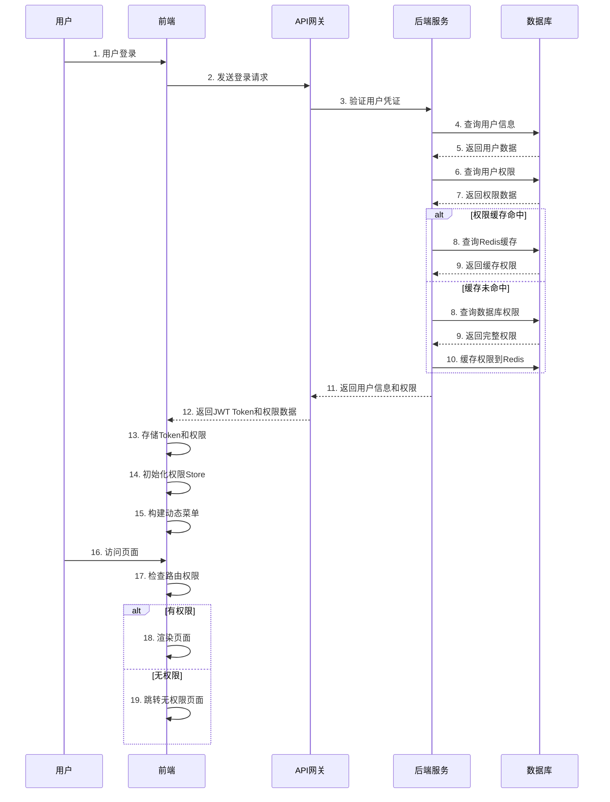
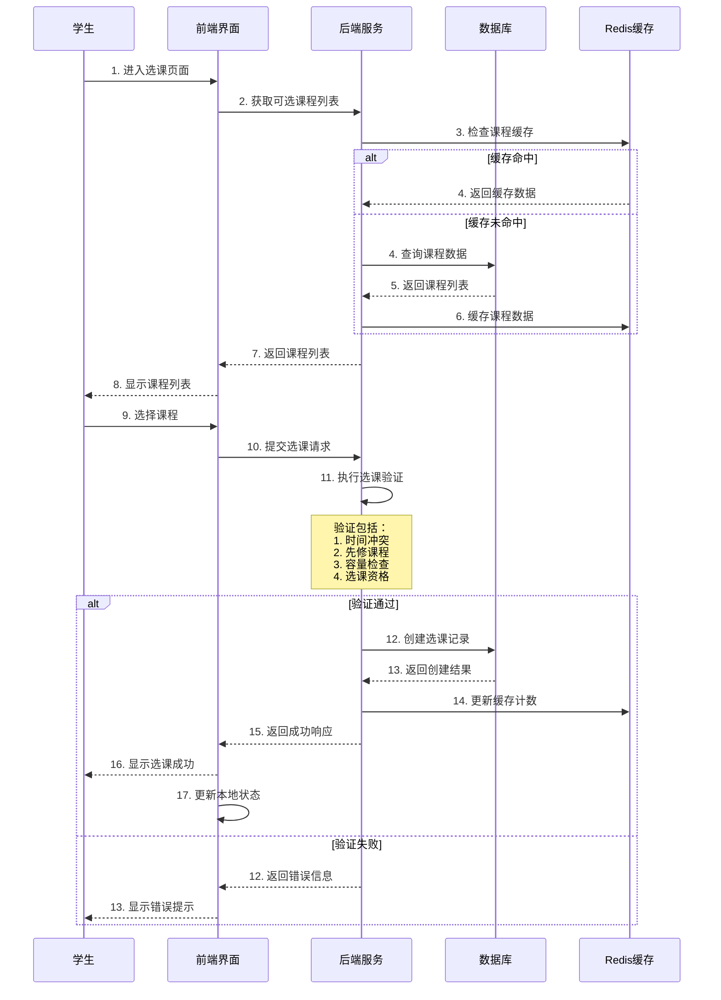
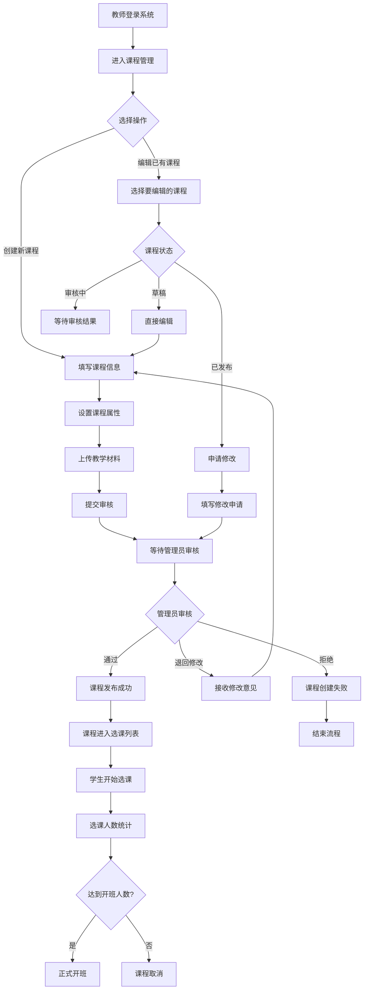

# 在线选课系统业务需求文档 (PRD)

## 目录

- [1. 文档概述](#1-文档概述)
  - [1.1 文档目的](#11-文档目的)
  - [1.2 项目背景](#12-项目背景)
  - [1.3 项目范围](#13-项目范围)
- [2. 系统架构概览](#2-系统架构概览)
  - [2.1 技术栈选择](#21-技术栈选择)
  - [2.2 系统架构图](#22-系统架构图)
- [3. 用户角色与权限体系](#3-用户角色与权限体系)
  - [3.1 角色定义](#31-角色定义)
  - [3.2 权限模型](#32-权限模型)
  - [3.3 权限数据结构](#33-权限数据结构)
- [4. 前端UI/UX设计](#4-前端uiux设计)
  - [4.1 布局设计](#41-布局设计)
  - [4.2 导航栏设计](#42-导航栏设计)
  - [4.3 侧边栏模块化设计](#43-侧边栏模块化设计)
  - [4.4 响应式设计](#44-响应式设计)
- [5. 功能模块详细设计](#5-功能模块详细设计)
  - [5.1 通用模块（所有角色）](#51-通用模块所有角色)
  - [5.2 学生专属模块](#52-学生专属模块)
  - [5.3 教师专属模块](#53-教师专属模块)
  - [5.4 管理员专属模块](#54-管理员专属模块)
  - [5.5 超级管理员模块](#55-超级管理员模块)
- [6. 权限控制流程](#6-权限控制流程)
  - [6.1 权限获取流程](#61-权限获取流程)
  - [6.2 模块渲染控制](#62-模块渲染控制)
  - [6.3 动态权限更新](#63-动态权限更新)
- [7. 核心业务流程](#7-核心业务流程)
  - [7.1 学生选课流程](#71-学生选课流程)
  - [7.2 教师开课流程](#72-教师开课流程)
  - [7.3 管理员审核流程](#73-管理员审核流程)
- [8. 接口设计规范](#8-接口设计规范)
  - [8.1 权限接口](#81-权限接口)
  - [8.2 数据接口规范](#82-数据接口规范)
- [9. 非功能需求](#9-非功能需求)
  - [9.1 性能要求](#91-性能要求)
  - [9.2 安全性要求](#92-安全性要求)
  - [9.3 可用性要求](#93-可用性要求)
- [10. 部署与维护](#10-部署与维护)
  - [10.1 部署架构](#101-部署架构)
  - [10.2 监控与告警](#102-监控与告警)
- [附录](#附录)
  - [A. 角色权限矩阵表](#a-角色权限矩阵表)
  - [B. 模块图标规范](#b-模块图标规范)
  - [C. 错误码定义](#c-错误码定义)

---

## 1. 文档概述

### 1.1 文档目的

本文档详细定义在线选课系统的业务需求、功能模块、权限体系和用户界面设计，特别强调基于角色的动态侧边栏模块展示机制。为前后端开发团队提供明确的功能规格和实现指导。

### 1.2 项目背景

针对高校选课管理信息化需求，开发一套集课程管理、学生选课、教学管理于一体的在线系统。系统需要支持多角色协同工作，并根据不同角色动态展示相应功能模块。

### 1.3 项目范围

- 支持学生、教师、管理员、超级管理员四种角色
- 基于角色的动态界面渲染
- 完整的课程生命周期管理
- 智能选课冲突检测
- 多维度统计分析
- 系统监控与管理

## 2. 系统架构概览

### 2.1 技术栈选择

**前端技术栈：**

- **框架**：Vue 3 + TypeScript + Composition API
- **构建工具**：Vite 4+
- **状态管理**：Pinia
- **路由**：Vue Router 4
- **UI组件库**：Naive UI 2.34+
- **图表库**：ECharts 5.4+
- **样式预处理器**：SCSS
- **包管理**：pnpm 8+

**后端技术栈：**

- **框架**：Nest.js 9+ + TypeScript
- **构建工具**：esbuild
- **ORM**：Sequelize 6+
- **数据库**：PostgreSQL 15 + Redis 7
- **验证**：Zod + JWT
- **HTTP客户端**：undici
- **部署**：仅数据库使用 Docker Compose（PostgreSQL/Redis）

### 2.2 系统架构图

```
┌─────────────────────────────────────────────────────────────┐
│                       前端展示层 (Frontend)                   │
│  ┌──────────┐ ┌──────────┐ ┌──────────┐ ┌──────────┐      │
│  │   导航栏  │ │  侧边栏   │ │  主体内容  │ │  状态栏  │      │
│  │(NavBar)  │ │(Sidebar) │ │(Main)    │ │(Status) │      │
│  └──────────┘ └──────────┘ └──────────┘ └──────────┘      │
└─────────────────────────────────────────────────────────────┘
                               │
                               ▼
┌─────────────────────────────────────────────────────────────┐
│                      API网关层 (Gateway)                     │
│  ┌─────────────────────────────────────────────────────┐    │
│  │              JWT验证 + 权限中间件                     │    │
│  └─────────────────────────────────────────────────────┘    │
└─────────────────────────────────────────────────────────────┘
                               │
                               ▼
┌─────────────────────────────────────────────────────────────┐
│                     业务逻辑层 (Backend)                     │
│  ┌──────────┐ ┌──────────┐ ┌──────────┐ ┌──────────┐      │
│  │ 用户服务  │ │ 课程服务  │ │ 选课服务  │ │ 权限服务  │      │
│  └──────────┘ └──────────┘ └──────────┘ └──────────┘      │
└─────────────────────────────────────────────────────────────┘
                               │
                               ▼
┌─────────────────────────────────────────────────────────────┐
│                      数据持久层 (Database)                   │
│  ┌──────────┐                         ┌──────────┐         │
│  │PostgreSQL│                         │  Redis   │         │
│  │   15+    │                         │    7+    │         │
│  └──────────┘                         └──────────┘         │
└─────────────────────────────────────────────────────────────┘
```

## 3. 用户角色与权限体系

### 3.1 角色定义

#### 3.1.1 学生 (STUDENT)

**用户画像：**

- 主要目标：选择适合的课程，规划学业
- 核心需求：便捷选课、查看课表、查询成绩
- 用户规模：约8000-10000人

**核心权限：**

- 浏览公开课程信息
- 选课/退课操作
- 查看个人课表
- 查询个人成绩
- 查看选课历史

#### 3.1.2 教师 (TEACHER)

**用户画像：**

- 主要目标：管理课程，评估学生
- 核心需求：课程管理、成绩录入、教学统计
- 用户规模：约500-800人

**核心权限：**

- 创建和管理个人课程
- 审核选课学生
- 录入和管理成绩
- 查看教学统计
- 发布课程公告

#### 3.1.3 管理员 (ADMIN)

**用户画像：**

- 主要目标：系统运营，数据管理
- 核心需求：用户管理、数据审核、系统监控
- 用户规模：约20-50人（院系级管理员）

**核心权限：**

- 管理用户账户
- 审核课程申请
- 配置选课规则
- 查看系统报表
- 管理院系数据

#### 3.1.4 超级管理员 (SUPER_ADMIN)

**用户画像：**

- 主要目标：系统维护，权限管理
- 核心需求：系统配置、权限分配、数据维护
- 用户规模：约5-10人（校级管理员）

**核心权限：**

- 所有管理员的权限
- 角色权限分配
- 系统参数配置
- 数据库维护
- 操作日志审计

### 3.2 权限模型

#### 3.2.1 RBAC（基于角色的访问控制）模型

```
┌─────────────┐    ┌─────────────┐    ┌─────────────┐
│    用户      │    │    角色      │    │    权限      │
│  (User)     │───▶│  (Role)     │───▶│ (Permission)│
└─────────────┘    └─────────────┘    └─────────────┘
       │                   │                   │
       │                   │                   ▼
       │                   │           ┌─────────────┐
       │                   │           │    资源      │
       │                   │           │  (Resource) │
       │                   │           └─────────────┘
       ▼                   ▼                   ▼
┌─────────────┐    ┌─────────────┐    ┌─────────────┐
│  用户-角色   │    │  角色-权限   │    │  权限-资源   │
│  关联表      │    │  关联表      │    │  关联表      │
└─────────────┘    └─────────────┘    └─────────────┘
```

#### 3.2.2 权限层级结构

```
权限系统
├── 系统级别权限（System Level）
│   ├── 用户管理
│   ├── 角色管理
│   └── 系统配置
├── 模块级别权限（Module Level）
│   ├── 课程模块
│   ├── 选课模块
│   ├── 成绩模块
│   └── 统计模块
└── 操作级别权限（Operation Level）
    ├── 查看（view）
    ├── 创建（create）
    ├── 编辑（edit）
    ├── 删除（delete）
    ├── 审核（review）
    └── 导出（export）
```

### 3.3 权限数据结构

#### 3.3.1 后端权限数据结构

```typescript
// 用户权限响应接口
interface UserPermissionResponse {
  user: {
    id: string;
    username: string;
    email: string;
    real_name: string;
    role: 'STUDENT' | 'TEACHER' | 'ADMIN' | 'SUPER_ADMIN';
    department?: {
      id: string;
      name: string;
      code: string;
    };
    avatar_url?: string;
  };

  // 权限树结构
  permissions: {
    // 模块权限
    modules: ModulePermission[];

    // 特殊权限标记
    flags: {
      can_manage_users: boolean;
      can_audit_courses: boolean;
      can_configure_system: boolean;
      can_view_all_courses: boolean;
      can_export_data: boolean;
    };

    // 数据范围权限
    data_scopes: {
      course_scope: 'ALL' | 'DEPARTMENT' | 'OWN';
      user_scope: 'ALL' | 'DEPARTMENT' | 'OWN_STUDENTS';
      enrollment_scope: 'ALL' | 'DEPARTMENT' | 'OWN_COURSES';
    };
  };

  // 菜单配置
  menus: {
    navigation: NavItem[]; // 导航栏菜单
    sidebar: SidebarModule[]; // 侧边栏模块
    shortcuts: ShortcutItem[]; // 快捷操作
  };

  // 系统配置
  system_config: {
    academic_year: string;
    current_semester: string;
    selection_status: 'NOT_STARTED' | 'IN_PROGRESS' | 'ENDED';
    allow_withdraw: boolean;
    max_credits: number;
  };
}

// 模块权限接口
interface ModulePermission {
  id: string;
  code: string; // 模块代码，如：course_management
  name: string; // 模块名称，如：课程管理
  icon: string; // 模块图标
  path: string; // 路由路径
  order: number; // 显示顺序

  // 权限控制
  accessible: boolean; // 是否可访问
  visible: boolean; // 是否显示

  // 子模块
  children?: ModulePermission[];

  // 操作权限
  operations: {
    view: boolean;
    create: boolean;
    edit: boolean;
    delete: boolean;
    export: boolean;
    audit?: boolean;
  };

  // 数据过滤条件
  filters?: Record<string, any>;
}
```

#### 3.3.2 前端权限存储结构

```typescript
// 前端权限存储（Pinia Store）
interface PermissionStoreState {
  // 用户信息
  user: UserInfo | null;

  // 权限信息
  permissions: {
    modules: Map<string, ModulePermission>; // 模块权限映射
    flags: Record<string, boolean>; // 权限标记
    data_scopes: Record<string, string>; // 数据范围
  };

  // 菜单配置
  menus: {
    navigation: NavItem[];
    sidebar: SidebarModule[];
    activeModule: string; // 当前激活模块
  };

  // 系统状态
  system: {
    config: SystemConfig;
    status: SystemStatus;
  };

  // 缓存控制
  cache: {
    lastUpdated: number;
    expiresIn: number;
  };
}
```

## 4. 前端UI/UX设计

### 4.1 布局设计

#### 4.1.1 整体布局结构

```
┌─────────────────────────────────────────────────────────────────────┐
│                             导航栏 (NavBar)                          │
├─────────────────────────────────────────────────────────────────────┤
│                                                                     │
│  ┌─────────────────┐  ┌────────────────────────────────────────┐  │
│  │                 │  │                                        │  │
│  │                 │  │                                        │  │
│  │                 │  │                                        │  │
│  │   侧边栏        │  │              主体内容                   │  │
│  │  (Sidebar)     │  │              (Main Content)            │  │
│  │                 │  │                                        │  │
│  │                 │  │                                        │  │
│  │                 │  │                                        │  │
│  │                 │  │                                        │  │
│  └─────────────────┘  └────────────────────────────────────────┘  │
│                                                                     │
├─────────────────────────────────────────────────────────────────────┤
│                         状态栏/页脚 (StatusBar)                      │
└─────────────────────────────────────────────────────────────────────┘
```

#### 4.1.2 布局组件技术实现

```vue
<!-- AppLayout.vue -->
<template>
  <n-layout has-sider class="app-layout">
    <!-- 导航栏 -->
    <n-layout-header bordered class="nav-header">
      <NavBar :user="user" :menus="navMenus" />
    </n-layout-header>

    <n-layout has-sider>
      <!-- 侧边栏 -->
      <n-layout-sider
        bordered
        collapse-mode="width"
        :collapsed-width="64"
        :width="240"
        :collapsed="sidebarCollapsed"
        show-trigger
        @collapse="handleSidebarCollapse"
        class="sidebar"
      >
        <SidebarMenu
          :modules="sidebarModules"
          :active-key="activeModule"
          @select="handleModuleSelect"
        />
      </n-layout-sider>

      <!-- 主体内容 -->
      <n-layout-content class="main-content">
        <div class="content-wrapper">
          <!-- 页面标题和操作栏 -->
          <PageHeader :title="pageTitle" :actions="pageActions" />

          <!-- 动态内容区域 -->
          <router-view v-slot="{ Component }">
            <transition name="fade" mode="out-in">
              <component :is="Component" />
            </transition>
          </router-view>
        </div>
      </n-layout-content>
    </n-layout>

    <!-- 全局状态栏 -->
    <n-layout-footer bordered class="status-footer">
      <StatusBar :system-status="systemStatus" />
    </n-layout-footer>
  </n-layout>
</template>
```

### 4.2 导航栏设计

#### 4.2.1 导航栏功能结构

```
导航栏 (NavBar)
├── 品牌标识区 (Branding Area)
│   ├── 系统Logo
│   ├── 系统名称
│   └── 当前学期标识
│
├── 快速导航区 (Quick Navigation)
│   ├── 搜索框（全局搜索）
│   ├── 快捷操作按钮
│   │   ├── 消息通知
│   │   ├── 待办事项
│   │   └── 帮助中心
│   └── 全局设置
│
└── 用户功能区 (User Area)
    ├── 用户头像和姓名
    ├── 角色标识
    ├── 用户菜单下拉
    │   ├── 个人中心
    │   ├── 账户设置
    │   ├── 切换主题
    │   ├── 退出登录
    │   └── （管理员）系统管理入口
    └── 移动端菜单按钮
```

#### 4.2.2 导航栏权限控制

```typescript
// 导航栏菜单配置接口
interface NavMenuItem {
  id: string;
  type: 'brand' | 'nav' | 'search' | 'user' | 'notification';

  // 品牌项配置
  brand?: {
    logo: string;
    title: string;
    miniTitle: string;
    href?: string;
  };

  // 导航项配置
  nav?: {
    label: string;
    icon?: string;
    path?: string;
    external?: boolean;
    children?: NavMenuItem[];
    permission?: string; // 所需权限
    roles?: string[]; // 允许的角色
  };

  // 搜索项配置
  search?: {
    placeholder: string;
    scope: 'global' | 'courses' | 'users';
    enabled: boolean;
  };

  // 用户项配置
  user?: {
    showAvatar: boolean;
    showRole: boolean;
    showDepartment: boolean;
    menuItems: UserMenuItem[];
  };

  // 通知项配置
  notification?: {
    enabled: boolean;
    maxCount: number;
    pollingInterval: number;
  };
}
```

### 4.3 侧边栏模块化设计

#### 4.3.1 侧边栏模块结构

```
侧边栏模块分类
├── 仪表盘类模块 (Dashboard Modules)
│   ├── 首页概览
│   ├── 个人工作台
│   └── 数据看板
│
├── 业务功能模块 (Business Modules)
│   ├── 课程管理相关
│   ├── 选课操作相关
│   ├── 成绩管理相关
│   └── 统计分析相关
│
├── 系统管理模块 (System Modules)
│   ├── 用户管理
│   ├── 角色权限
│   ├── 系统配置
│   └── 日志审计
│
└── 辅助工具模块 (Utility Modules)
    ├── 消息中心
    ├── 文件管理
    ├── 帮助文档
    └── 个人设置
```

#### 4.3.2 模块详细定义

##### 模块1：首页概览 (Dashboard)

```typescript
const dashboardModule: SidebarModule = {
  id: 'dashboard',
  code: 'dashboard',
  name: '首页概览',
  icon: 'dashboard',
  path: '/dashboard',
  order: 1,
  accessible: true, // 所有角色都可访问
  visible: true,

  // 根据不同角色展示不同内容
  roleVariants: {
    STUDENT: {
      name: '学生首页',
      widgets: ['course_selection_status', 'class_schedule', 'upcoming_deadlines', 'recent_grades'],
      quickActions: ['select_courses', 'view_schedule', 'check_grades'],
    },
    TEACHER: {
      name: '教师工作台',
      widgets: ['teaching_courses', 'pending_grades', 'course_statistics', 'student_questions'],
      quickActions: ['create_course', 'enter_grades', 'send_notice'],
    },
    ADMIN: {
      name: '管理仪表盘',
      widgets: ['system_status', 'user_statistics', 'course_approval_queue', 'selection_metrics'],
      quickActions: ['audit_courses', 'manage_users', 'view_reports'],
    },
  },

  operations: {
    view: true,
    create: false,
    edit: false,
    delete: false,
    export: true,
  },
};
```

##### 模块2：课程中心 (Course Center)

```typescript
const courseCenterModule: SidebarModule = {
  id: 'course_center',
  code: 'course_center',
  name: '课程中心',
  icon: 'book',
  path: '/courses',
  order: 2,

  // 权限控制
  accessible: true, // 所有角色都可访问
  visible: true,

  // 子模块定义
  children: [
    {
      id: 'course_browse',
      code: 'course_browse',
      name: '浏览课程',
      icon: 'search',
      path: '/courses/browse',
      order: 1,
      accessible: true,
      visible: true,
      operations: { view: true, create: false, edit: false, delete: false, export: false },

      // 数据过滤（根据角色）
      filters: {
        STUDENT: { status: ['PUBLISHED', 'SELECTING'], department_scope: 'ALL' },
        TEACHER: { status: ['ALL'], department_scope: 'OWN' },
        ADMIN: { status: ['ALL'], department_scope: 'DEPARTMENT' },
      },
    },
    {
      id: 'course_management',
      code: 'course_management',
      name: '课程管理',
      icon: 'edit',
      path: '/courses/manage',
      order: 2,
      // 仅教师和管理员可见
      accessible: user => ['TEACHER', 'ADMIN', 'SUPER_ADMIN'].includes(user.role),
      visible: true,
      operations: {
        view: true,
        create: user => user.role === 'TEACHER',
        edit: true,
        delete: user => user.role === 'TEACHER',
        export: true,
      },
      children: [
        {
          id: 'my_courses',
          code: 'my_courses',
          name: '我的课程',
          path: '/courses/manage/my',
          order: 1,
          // 仅教师可见
          roles: ['TEACHER'],
          filters: { teacher_id: 'current_user' },
        },
        {
          id: 'course_approval',
          code: 'course_approval',
          name: '课程审核',
          path: '/courses/manage/approval',
          order: 2,
          // 仅管理员可见
          roles: ['ADMIN', 'SUPER_ADMIN'],
          filters: { status: ['PENDING_REVIEW'] },
        },
        {
          id: 'all_courses',
          code: 'all_courses',
          name: '所有课程',
          path: '/courses/manage/all',
          order: 3,
          // 仅管理员可见
          roles: ['ADMIN', 'SUPER_ADMIN'],
          filters: { status: ['ALL'] },
        },
      ],
    },
    {
      id: 'course_creation',
      code: 'course_creation',
      name: '创建课程',
      icon: 'add',
      path: '/courses/create',
      order: 3,
      // 仅教师可见
      roles: ['TEACHER'],
      operations: { view: true, create: true, edit: false, delete: false, export: false },
    },
  ],
};
```

##### 模块3：选课管理 (Enrollment Management)

```typescript
const enrollmentModule: SidebarModule = {
  id: 'enrollment',
  code: 'enrollment',
  name: '选课管理',
  icon: 'checklist',
  path: '/enrollment',
  order: 3,

  children: [
    {
      id: 'course_selection',
      code: 'course_selection',
      name: '选课操作',
      icon: 'select',
      path: '/enrollment/select',
      order: 1,
      // 仅学生可见，且在选课时间段内
      accessible: (user, system) =>
        user.role === 'STUDENT' && system.selection_status === 'IN_PROGRESS',
      visible: true,
      operations: { view: true, create: true, edit: true, delete: true, export: false },

      // 子操作
      subOperations: [
        { code: 'select_course', name: '选课', icon: 'add', enabled: true },
        { code: 'withdraw_course', name: '退课', icon: 'remove', enabled: system.allow_withdraw },
        { code: 'swap_course', name: '换课', icon: 'swap', enabled: true },
      ],
    },
    {
      id: 'my_schedule',
      code: 'my_schedule',
      name: '我的课表',
      icon: 'calendar',
      path: '/enrollment/schedule',
      order: 2,
      roles: ['STUDENT'],
      operations: { view: true, create: false, edit: false, delete: false, export: true },

      // 视图选项
      views: [
        { type: 'weekly', name: '周视图', default: true },
        { type: 'daily', name: '日视图' },
        { type: 'list', name: '列表视图' },
      ],
    },
    {
      id: 'enrollment_management',
      code: 'enrollment_management',
      name: '选课管理',
      icon: 'group',
      path: '/enrollment/manage',
      order: 3,
      roles: ['TEACHER', 'ADMIN', 'SUPER_ADMIN'],
      operations: {
        view: true,
        create: false,
        edit: true, // 可以调整选课
        delete: true, // 可以移除学生
        export: true,
      },
      children: [
        {
          id: 'course_enrollment',
          code: 'course_enrollment',
          name: '课程选课名单',
          path: '/enrollment/manage/course',
          roles: ['TEACHER'],
          filters: { teacher_id: 'current_user' },
        },
        {
          id: 'department_enrollment',
          code: 'department_enrollment',
          name: '院系选课统计',
          path: '/enrollment/manage/department',
          roles: ['ADMIN', 'SUPER_ADMIN'],
          filters: { department_id: 'current_department' },
        },
        {
          id: 'enrollment_audit',
          code: 'enrollment_audit',
          name: '选课审核',
          path: '/enrollment/manage/audit',
          roles: ['ADMIN', 'SUPER_ADMIN'],
        },
      ],
    },
    {
      id: 'selection_rules',
      code: 'selection_rules',
      name: '选课规则',
      icon: 'rule',
      path: '/enrollment/rules',
      order: 4,
      roles: ['ADMIN', 'SUPER_ADMIN'],
      operations: { view: true, create: true, edit: true, delete: true, export: true },
    },
  ],
};
```

##### 模块4：成绩管理 (Grade Management)

```typescript
const gradeModule: SidebarModule = {
  id: 'grades',
  code: 'grades',
  name: '成绩管理',
  icon: 'score',
  path: '/grades',
  order: 4,

  children: [
    {
      id: 'my_grades',
      code: 'my_grades',
      name: '我的成绩',
      icon: 'person',
      path: '/grades/my',
      order: 1,
      roles: ['STUDENT'],
      operations: { view: true, create: false, edit: false, delete: false, export: true },

      // 成绩视图
      views: [
        { type: 'semester', name: '按学期查看', default: true },
        { type: 'course_type', name: '按课程类型' },
        { type: 'statistics', name: '成绩统计' },
      ],
    },
    {
      id: 'grade_entry',
      code: 'grade_entry',
      name: '成绩录入',
      icon: 'edit_note',
      path: '/grades/entry',
      order: 2,
      roles: ['TEACHER'],
      operations: { view: true, create: true, edit: true, delete: false, export: false },

      // 录入方式
      entryMethods: [
        { type: 'manual', name: '手动录入', default: true },
        { type: 'import', name: 'Excel导入' },
        { type: 'template', name: '模板批量' },
      ],
    },
    {
      id: 'grade_management',
      code: 'grade_management',
      name: '成绩管理',
      icon: 'manage_accounts',
      path: '/grades/manage',
      order: 3,
      roles: ['ADMIN', 'SUPER_ADMIN'],
      operations: { view: true, create: false, edit: true, delete: false, export: true },

      children: [
        {
          id: 'grade_audit',
          code: 'grade_audit',
          name: '成绩审核',
          path: '/grades/manage/audit',
          roles: ['ADMIN'],
        },
        {
          id: 'grade_statistics',
          code: 'grade_statistics',
          name: '成绩统计',
          path: '/grades/manage/statistics',
          roles: ['ADMIN', 'SUPER_ADMIN'],
        },
        {
          id: 'grade_export',
          code: 'grade_export',
          name: '成绩导出',
          path: '/grades/manage/export',
          roles: ['ADMIN', 'SUPER_ADMIN'],
        },
      ],
    },
    {
      id: 'gpa_calculation',
      code: 'gpa_calculation',
      name: '绩点计算',
      icon: 'calculate',
      path: '/grades/gpa',
      order: 4,
      roles: ['STUDENT', 'ADMIN', 'SUPER_ADMIN'],
      operations: { view: true, create: false, edit: false, delete: false, export: true },
    },
  ],
};
```

##### 模块5：统计分析 (Analytics)

```typescript
const analyticsModule: SidebarModule = {
  id: 'analytics',
  code: 'analytics',
  name: '统计分析',
  icon: 'analytics',
  path: '/analytics',
  order: 5,

  children: [
    {
      id: 'course_analytics',
      code: 'course_analytics',
      name: '课程分析',
      icon: 'book_analytics',
      path: '/analytics/courses',
      order: 1,
      roles: ['TEACHER', 'ADMIN', 'SUPER_ADMIN'],
      operations: { view: true, create: false, edit: false, delete: false, export: true },

      // 分析维度
      dimensions: [
        { key: 'enrollment_rate', name: '选课率分析' },
        { key: 'grade_distribution', name: '成绩分布' },
        { key: 'popularity_trend', name: '热门度趋势' },
        { key: 'teacher_comparison', name: '教师对比' },
      ],
    },
    {
      id: 'student_analytics',
      code: 'student_analytics',
      name: '学生分析',
      icon: 'school',
      path: '/analytics/students',
      order: 2,
      roles: ['ADMIN', 'SUPER_ADMIN'],
      operations: { view: true, create: false, edit: false, delete: false, export: true },

      // 分析类型
      analysisTypes: [
        { type: 'performance', name: '学业表现' },
        { type: 'selection_pattern', name: '选课模式' },
        { type: 'graduation_analysis', name: '毕业分析' },
        { type: 'warning_students', name: '预警学生' },
      ],
    },
    {
      id: 'system_analytics',
      code: 'system_analytics',
      name: '系统分析',
      icon: 'monitoring',
      path: '/analytics/system',
      order: 3,
      roles: ['ADMIN', 'SUPER_ADMIN'],
      operations: { view: true, create: false, edit: false, delete: false, export: true },

      // 监控指标
      metrics: [
        { key: 'user_activity', name: '用户活跃度' },
        { key: 'system_performance', name: '系统性能' },
        { key: 'data_quality', name: '数据质量' },
        { key: 'error_rates', name: '错误率监控' },
      ],
    },
    {
      id: 'report_generation',
      code: 'report_generation',
      name: '报表生成',
      icon: 'summarize',
      path: '/analytics/reports',
      order: 4,
      roles: ['TEACHER', 'ADMIN', 'SUPER_ADMIN'],
      operations: { view: true, create: true, edit: true, delete: true, export: true },

      // 报表模板
      reportTemplates: [
        { id: 'course_summary', name: '课程总结报表', roles: ['TEACHER'] },
        { id: 'department_report', name: '院系报表', roles: ['ADMIN'] },
        { id: 'system_report', name: '系统运行报表', roles: ['SUPER_ADMIN'] },
      ],
    },
  ],
};
```

##### 模块6：系统管理 (System Management)

```typescript
const systemModule: SidebarModule = {
  id: 'system',
  code: 'system',
  name: '系统管理',
  icon: 'settings',
  path: '/system',
  order: 6,
  roles: ['ADMIN', 'SUPER_ADMIN'],

  children: [
    {
      id: 'user_management',
      code: 'user_management',
      name: '用户管理',
      icon: 'people',
      path: '/system/users',
      order: 1,
      roles: ['ADMIN', 'SUPER_ADMIN'],
      operations: { view: true, create: true, edit: true, delete: true, export: true },

      children: [
        {
          id: 'student_management',
          code: 'student_management',
          name: '学生管理',
          path: '/system/users/students',
          roles: ['ADMIN', 'SUPER_ADMIN'],
        },
        {
          id: 'teacher_management',
          code: 'teacher_management',
          name: '教师管理',
          path: '/system/users/teachers',
          roles: ['ADMIN', 'SUPER_ADMIN'],
        },
        {
          id: 'admin_management',
          code: 'admin_management',
          name: '管理员管理',
          path: '/system/users/admins',
          roles: ['SUPER_ADMIN'], // 仅超级管理员
        },
        {
          id: 'batch_operations',
          code: 'batch_operations',
          name: '批量操作',
          path: '/system/users/batch',
          roles: ['ADMIN', 'SUPER_ADMIN'],
        },
      ],
    },
    {
      id: 'role_management',
      code: 'role_management',
      name: '角色权限',
      icon: 'admin_panel_settings',
      path: '/system/roles',
      order: 2,
      roles: ['SUPER_ADMIN'], // 仅超级管理员
      operations: { view: true, create: true, edit: true, delete: true, export: true },

      children: [
        {
          id: 'role_list',
          code: 'role_list',
          name: '角色列表',
          path: '/system/roles/list',
        },
        {
          id: 'permission_management',
          code: 'permission_management',
          name: '权限配置',
          path: '/system/roles/permissions',
        },
        {
          id: 'access_logs',
          code: 'access_logs',
          name: '访问日志',
          path: '/system/roles/logs',
        },
      ],
    },
    {
      id: 'department_management',
      code: 'department_management',
      name: '院系管理',
      icon: 'corporate_fare',
      path: '/system/departments',
      order: 3,
      roles: ['ADMIN', 'SUPER_ADMIN'],
      operations: { view: true, create: true, edit: true, delete: true, export: true },
    },
    {
      id: 'system_config',
      code: 'system_config',
      name: '系统配置',
      icon: 'tune',
      path: '/system/config',
      order: 4,
      roles: ['SUPER_ADMIN'], // 仅超级管理员
      operations: { view: true, create: false, edit: true, delete: false, export: false },

      // 配置分类
      categories: [
        { key: 'basic', name: '基本设置' },
        { key: 'academic', name: '教务设置' },
        { key: 'selection', name: '选课设置' },
        { key: 'notification', name: '通知设置' },
        { key: 'security', name: '安全设置' },
        { key: 'backup', name: '备份设置' },
      ],
    },
    {
      id: 'audit_logs',
      code: 'audit_logs',
      name: '审计日志',
      icon: 'history',
      path: '/system/logs',
      order: 5,
      roles: ['SUPER_ADMIN'], // 仅超级管理员
      operations: { view: true, create: false, edit: false, delete: true, export: true },

      // 日志类型
      logTypes: [
        { type: 'user_actions', name: '用户操作日志' },
        { type: 'system_events', name: '系统事件日志' },
        { type: 'security_logs', name: '安全日志' },
        { type: 'error_logs', name: '错误日志' },
      ],
    },
    {
      id: 'data_management',
      code: 'data_management',
      name: '数据管理',
      icon: 'database',
      path: '/system/data',
      order: 6,
      roles: ['SUPER_ADMIN'],
      operations: { view: true, create: false, edit: false, delete: true, export: true },

      children: [
        {
          id: 'data_backup',
          code: 'data_backup',
          name: '数据备份',
          path: '/system/data/backup',
        },
        {
          id: 'data_recovery',
          code: 'data_recovery',
          name: '数据恢复',
          path: '/system/data/recovery',
        },
        {
          id: 'data_cleanup',
          code: 'data_cleanup',
          name: '数据清理',
          path: '/system/data/cleanup',
        },
        {
          id: 'data_export',
          code: 'data_export',
          name: '数据导出',
          path: '/system/data/export',
        },
      ],
    },
  ],
};
```

##### 模块7：消息中心 (Message Center)

```typescript
const messageModule: SidebarModule = {
  id: 'messages',
  code: 'messages',
  name: '消息中心',
  icon: 'message',
  path: '/messages',
  order: 7,
  accessible: true, // 所有角色都可访问
  visible: true,

  children: [
    {
      id: 'inbox',
      code: 'inbox',
      name: '收件箱',
      icon: 'inbox',
      path: '/messages/inbox',
      order: 1,
      badge: 'unread_count', // 显示未读消息数
      operations: { view: true, create: false, edit: false, delete: true, export: false },
    },
    {
      id: 'sent',
      code: 'sent',
      name: '已发送',
      icon: 'send',
      path: '/messages/sent',
      order: 2,
      roles: ['TEACHER', 'ADMIN', 'SUPER_ADMIN'],
    },
    {
      id: 'announcements',
      code: 'announcements',
      name: '系统公告',
      icon: 'campaign',
      path: '/messages/announcements',
      order: 3,
      accessible: true,
      filters: {
        STUDENT: { type: ['SYSTEM', 'COURSE'] },
        TEACHER: { type: ['SYSTEM', 'DEPARTMENT'] },
        ADMIN: { type: ['ALL'] },
      },
    },
    {
      id: 'notifications',
      code: 'notifications',
      name: '系统通知',
      icon: 'notifications',
      path: '/messages/notifications',
      order: 4,
      accessible: true,
      badge: 'unread_notifications',
    },
    {
      id: 'compose',
      code: 'compose',
      name: '发送消息',
      icon: 'edit',
      path: '/messages/compose',
      order: 5,
      roles: ['TEACHER', 'ADMIN', 'SUPER_ADMIN'],
      operations: { view: true, create: true, edit: false, delete: false, export: false },

      // 发送权限
      sendPermissions: {
        TEACHER: {
          to_students: true, // 可以给学生发消息
          to_teachers: true, // 可以给教师发消息
          to_all: false, // 不能给所有人发消息
          broadcast: false, // 不能广播
        },
        ADMIN: {
          to_students: true,
          to_teachers: true,
          to_all: true, // 可以给所有人发消息
          broadcast: true, // 可以广播
        },
        SUPER_ADMIN: {
          to_students: true,
          to_teachers: true,
          to_all: true,
          broadcast: true,
        },
      },
    },
  ],
};
```

##### 模块8：个人中心 (Personal Center)

```typescript
const personalModule: SidebarModule = {
  id: 'personal',
  code: 'personal',
  name: '个人中心',
  icon: 'person',
  path: '/personal',
  order: 8,
  accessible: true, // 所有角色都可访问
  visible: true,

  children: [
    {
      id: 'profile',
      code: 'profile',
      name: '个人资料',
      icon: 'badge',
      path: '/personal/profile',
      order: 1,
      operations: { view: true, create: false, edit: true, delete: false, export: false },

      // 可编辑字段（根据角色）
      editableFields: {
        STUDENT: ['avatar', 'phone', 'email', 'bio'],
        TEACHER: [
          'avatar',
          'phone',
          'email',
          'bio',
          'office_location',
          'office_hours',
          'research_interests',
        ],
        ADMIN: ['avatar', 'phone', 'email', 'bio'],
        SUPER_ADMIN: ['avatar', 'phone', 'email', 'bio'],
      },
    },
    {
      id: 'account_settings',
      code: 'account_settings',
      name: '账户设置',
      icon: 'settings_account_box',
      path: '/personal/account',
      order: 2,
      operations: { view: true, create: false, edit: true, delete: false, export: false },

      // 设置项
      settings: [
        { key: 'password', name: '修改密码', enabled: true },
        { key: 'notification', name: '通知设置', enabled: true },
        { key: 'privacy', name: '隐私设置', enabled: true },
        { key: 'security', name: '安全设置', enabled: true },
      ],
    },
    {
      id: 'preferences',
      code: 'preferences',
      name: '偏好设置',
      icon: 'tune',
      path: '/personal/preferences',
      order: 3,
      operations: { view: true, create: false, edit: true, delete: false, export: false },

      // 偏好选项
      preferences: [
        {
          category: 'appearance',
          name: '外观设置',
          options: [
            { key: 'theme', type: 'select', options: ['light', 'dark', 'auto'] },
            { key: 'language', type: 'select', options: ['zh-CN', 'en-US'] },
            { key: 'font_size', type: 'range', min: 12, max: 18 },
          ],
        },
        {
          category: 'behavior',
          name: '行为设置',
          options: [
            { key: 'auto_save', type: 'switch', default: true },
            { key: 'confirm_before_delete', type: 'switch', default: true },
            { key: 'enable_shortcuts', type: 'switch', default: true },
          ],
        },
      ],
    },
    {
      id: 'activity_log',
      code: 'activity_log',
      name: '活动记录',
      icon: 'history',
      path: '/personal/activity',
      order: 4,
      operations: { view: true, create: false, edit: false, delete: false, export: true },

      // 可查看的活动类型
      activityTypes: {
        STUDENT: ['enrollment', 'grade_view', 'profile_update'],
        TEACHER: ['course_creation', 'grade_entry', 'message_sent'],
        ADMIN: ['user_management', 'course_audit', 'system_operations'],
        SUPER_ADMIN: ['all'], // 查看所有活动
      },
    },
  ],
};
```

#### 4.3.3 侧边栏组件实现

```vue
<!-- SidebarMenu.vue -->
<template>
  <n-menu
    :value="activeKey"
    :options="menuOptions"
    :collapsed="collapsed"
    :collapsed-width="64"
    :collapsed-icon-size="22"
    :indent="24"
    @update:value="handleUpdateValue"
    class="sidebar-menu"
  />
</template>

<script setup lang="ts">
import { computed } from 'vue';
import { NMenu } from 'naive-ui';
import { usePermissionStore } from '@/stores/permission';
import type { MenuOption } from 'naive-ui';

const props = defineProps<{
  collapsed: boolean;
}>();

const emit = defineEmits<{
  select: [key: string];
}>();

const permissionStore = usePermissionStore();

// 转换权限模块为菜单选项
const menuOptions = computed<MenuOption[]>(() => {
  const modules = permissionStore.menus.sidebar;

  return modules
    .filter(module => module.visible && module.accessible)
    .sort((a, b) => a.order - b.order)
    .map(module => transformModuleToMenuOption(module));
});

// 递归转换模块
const transformModuleToMenuOption = (module: SidebarModule): MenuOption => {
  const option: MenuOption = {
    key: module.id,
    label: module.name,
    icon: renderIcon(module.icon),
    path: module.path,
    order: module.order,
  };

  // 如果有子模块且可见
  if (module.children && module.children.length > 0) {
    const visibleChildren = module.children
      .filter(child => child.visible && child.accessible)
      .sort((a, b) => a.order - b.order)
      .map(child => transformModuleToMenuOption(child));

    if (visibleChildren.length > 0) {
      option.children = visibleChildren;
    }
  }

  return option;
};

// 图标渲染
const renderIcon = (icon: string) => {
  // 使用Naive UI的图标或自定义图标
  return h(resolveComponent(`n-icon-${icon}`) || 'div');
};

// 菜单选择处理
const handleUpdateValue = (key: string, item: MenuOption) => {
  emit('select', key);

  // 导航到对应路由
  if (item.path) {
    router.push(item.path);
  }
};
</script>

<style scoped>
.sidebar-menu {
  height: 100%;
  user-select: none;

  :deep(.n-menu-item) {
    transition: all 0.2s ease;

    &--selected {
      background-color: var(--n-color-primary);
      color: white;

      .n-menu-item-content__icon {
        color: white;
      }
    }

    &:hover:not(.n-menu-item--selected) {
      background-color: var(--n-color-hover);
    }
  }

  :deep(.n-submenu) {
    .n-submenu-children {
      padding-left: 12px;
    }
  }
}
</style>
```

### 4.4 响应式设计

#### 4.4.1 断点定义

```scss
// 响应式断点
$breakpoints: (
  'xs': 0,
  'sm': 576px,
  'md': 768px,
  'lg': 992px,
  'xl': 1200px,
  'xxl': 1600px,
);

// 移动端适配
.mobile-layout {
  // 移动端隐藏侧边栏，使用底部导航
  @media (max-width: map-get($breakpoints, 'md')) {
    .sidebar {
      display: none;
    }

    .nav-header {
      height: 56px;
    }

    .main-content {
      padding-bottom: 64px; // 为底部导航留出空间
    }

    // 显示底部导航栏
    .bottom-navigation {
      display: flex;
      position: fixed;
      bottom: 0;
      left: 0;
      right: 0;
      height: 56px;
      background: white;
      border-top: 1px solid #e8e8e8;
      z-index: 1000;
    }
  }

  // 平板端调整
  @media (min-width: map-get($breakpoints, 'md')) and (max-width: map-get($breakpoints, 'lg')) {
    .sidebar {
      width: 200px;
    }
  }

  // 桌面端
  @media (min-width: map-get($breakpoints, 'lg')) {
    .sidebar {
      width: 240px;
    }
  }
}
```

#### 4.4.2 移动端底部导航

```vue
<!-- BottomNavigation.vue -->
<template>
  <n-tabs
    v-model:value="activeTab"
    type="line"
    :tabs-padding="0"
    :bar-width="60"
    class="bottom-tabs"
    @update:value="handleTabChange"
  >
    <n-tab v-for="item in navigationItems" :key="item.key" :name="item.key" class="tab-item">
      <n-icon :component="item.icon" size="22" />
      <span class="tab-label">{{ item.label }}</span>
    </n-tab>
  </n-tabs>
</template>

<script setup lang="ts">
import { ref, computed } from 'vue';
import { useRouter } from 'vue-router';
import { NTabs, NTab, NIcon } from 'naive-ui';
import { usePermissionStore } from '@/stores/permission';

const router = useRouter();
const permissionStore = usePermissionStore();
const activeTab = ref('dashboard');

// 移动端导航项（从侧边栏模块中筛选）
const navigationItems = computed(() => {
  const modules = permissionStore.menus.sidebar;

  return modules
    .filter(module => module.visible && module.accessible && module.mobile_navigation !== false)
    .sort((a, b) => a.order - b.order)
    .slice(0, 5) // 最多显示5个
    .map(module => ({
      key: module.id,
      label: module.name,
      icon: module.icon,
      path: module.path,
    }));
});

const handleTabChange = (key: string) => {
  const item = navigationItems.value.find(item => item.key === key);
  if (item && item.path) {
    router.push(item.path);
  }
};
</script>

<style scoped>
.bottom-tabs {
  height: 100%;

  :deep(.n-tabs-nav) {
    height: 100%;
    display: flex;
    justify-content: space-around;

    .n-tabs-tab {
      flex: 1;
      height: 100%;
      display: flex;
      flex-direction: column;
      align-items: center;
      justify-content: center;
      padding: 4px 0;

      .n-tabs-tab__label {
        display: flex;
        flex-direction: column;
        align-items: center;
        gap: 4px;
      }
    }

    .n-tabs-tab--active {
      color: var(--n-color-primary);

      .n-icon {
        color: var(--n-color-primary);
      }
    }
  }

  :deep(.n-tabs-bar) {
    top: 0;
    height: 3px;
  }
}

.tab-item {
  .tab-label {
    font-size: 10px;
    line-height: 1.2;
  }
}
</style>
```

## 5. 功能模块详细设计

### 5.1 通用模块（所有角色）

#### 5.1.1 首页概览 (Dashboard)

**功能描述：**

- 显示个性化欢迎信息
- 展示关键数据和统计信息
- 提供快捷操作入口
- 显示待办事项和通知

**角色差异化展示：**

- **学生**：选课状态、近期课程、成绩提醒
- **教师**：教学任务、待批改作业、课程统计
- **管理员**：系统状态、待审核事项、用户统计
- **超级管理员**：系统健康度、安全警报、性能指标

**组件设计：**

```vue
<template>
  <div class="dashboard">
    <!-- 欢迎区域 -->
    <WelcomeBanner :user="user" :system="system" />

    <!-- 统计卡片网格 -->
    <n-grid :cols="4" :x-gap="16" :y-gap="16">
      <n-gi v-for="stat in stats" :key="stat.key">
        <StatCard :data="stat" />
      </n-gi>
    </n-grid>

    <!-- 主要内容区域 -->
    <n-grid :cols="2" :x-gap="16" :y-gap="16">
      <!-- 左侧：图表和列表 -->
      <n-gi>
        <n-card title="最近活动">
          <ActivityTimeline :activities="recentActivities" />
        </n-card>

        <n-card title="数据图表">
          <DataChart :type="chartType" :data="chartData" />
        </n-card>
      </n-gi>

      <!-- 右侧：快捷操作和通知 -->
      <n-gi>
        <n-card title="快捷操作">
          <QuickActions :actions="quickActions" />
        </n-card>

        <n-card title="最新通知">
          <NotificationList :notifications="notifications" />
        </n-card>

        <n-card title="待办事项">
          <TodoList :todos="todos" />
        </n-card>
      </n-gi>
    </n-grid>
  </div>
</template>
```

#### 5.1.2 个人中心 (Personal Center)

**功能描述：**

- 管理个人资料和账户设置
- 查看活动记录
- 配置个人偏好

**子模块：**

1. **个人资料**
   - 基本信息编辑
   - 头像上传和裁剪
   - 联系方式管理

2. **账户安全**
   - 密码修改
   - 登录设备管理
   - 安全日志查看

3. **偏好设置**
   - 界面主题选择
   - 通知偏好设置
   - 隐私设置

### 5.2 学生专属模块

#### 5.2.1 课程中心 (Course Center)

**功能描述：**

- 浏览和搜索课程
- 查看课程详情
- 收藏感兴趣课程

**关键特性：**

- **智能搜索**：支持课程名、教师、时间等多维度搜索
- **筛选过滤**：按院系、课程类型、时间等进行筛选
- **课程对比**：支持多门课程对比查看
- **课程评价**：查看往届学生评价

#### 5.2.2 选课管理 (Enrollment Management)

**功能描述：**

- 在线选课和退课
- 查看个人课表
- 选课冲突检测
- 选课结果确认

**选课流程：**

1. **课程查询**：查找感兴趣的课程
2. **详情查看**：查看课程详情、时间安排
3. **冲突检测**：系统自动检测时间冲突
4. **容量检查**：检查课程是否已满
5. **选课提交**：提交选课申请
6. **结果确认**：确认选课结果

**课表展示：**

- **周视图**：按周显示课程安排
- **日视图**：详细显示某天课程
- **列表视图**：课程列表展示
- **导出功能**：导出为iCalendar格式

#### 5.2.3 成绩查询 (Grade Query)

**功能描述：**

- 查看各科成绩
- 查看绩点计算
- 成绩统计分析
- 成绩单导出

**功能特性：**

- **学期筛选**：按学期查看成绩
- **成绩分析**：成绩趋势分析
- **绩点计算**：自动计算GPA
- **预警功能**：低分课程预警

### 5.3 教师专属模块

#### 5.3.1 课程管理 (Course Management)

**功能描述：**

- 创建和编辑课程
- 设置课程信息
- 管理课程材料
- 发布课程公告

**课程创建流程：**

1. **基本信息**：填写课程名称、学分等
2. **时间安排**：设置上课时间和地点
3. **内容设置**：上传教学大纲和资料
4. **限制条件**：设置选课限制和要求
5. **提交审核**：提交管理员审核

#### 5.3.2 教学管理 (Teaching Management)

**功能描述：**

- 查看选课学生名单
- 管理课程材料
- 发布作业和通知
- 在线答疑

**学生管理功能：**

- **名单导出**：导出学生名单
- **分组管理**：对学生进行分组
- **考勤记录**：记录学生考勤
- **沟通记录**：与学生沟通记录

#### 5.3.3 成绩管理 (Grade Management)

**功能描述：**

- 录入学生成绩
- 成绩统计分析
- 成绩发布管理
- 成绩单生成

**成绩录入方式：**

1. **手动录入**：逐个学生录入成绩
2. **Excel导入**：批量导入成绩
3. **模板下载**：下载成绩录入模板
4. **公式计算**：使用公式计算成绩

### 5.4 管理员专属模块

#### 5.4.1 用户管理 (User Management)

**功能描述：**

- 管理用户账户
- 批量导入用户
- 账户状态管理
- 权限分配

**用户管理功能：**

- **账户创建**：手动创建用户账户
- **批量导入**：Excel批量导入用户
- **状态管理**：激活/禁用账户
- **密码重置**：重置用户密码

#### 5.4.2 课程审核 (Course Audit)

**功能描述：**

- 审核教师提交的课程
- 课程信息审核
- 审核结果反馈
- 审核记录管理

**审核流程：**

1. **待审核列表**：查看待审核课程
2. **课程审核**：审核课程信息
3. **审核意见**：填写审核意见
4. **审核结果**：通过/退回/拒绝

#### 5.4.3 系统监控 (System Monitoring)

**功能描述：**

- 监控系统运行状态
- 查看系统日志
- 性能指标监控
- 异常报警

**监控指标：**

- **用户活跃度**：在线用户数、访问量
- **系统性能**：响应时间、错误率
- **数据统计**：课程数、选课数、成绩数
- **安全监控**：登录尝试、异常操作

### 5.5 超级管理员模块

#### 5.5.1 系统配置 (System Configuration)

**功能描述：**

- 管理系统参数
- 配置业务规则
- 设置学期信息
- 配置通知模板

**配置项分类：**

1. **基本设置**：系统名称、Logo等
2. **教务设置**：学期设置、学分规则等
3. **选课设置**：选课时间、容量规则等
4. **通知设置**：邮件模板、短信设置等
5. **安全设置**：密码策略、登录限制等

#### 5.5.2 权限管理 (Permission Management)

**功能描述：**

- 管理角色和权限
- 分配用户角色
- 权限审计
- 访问控制

**权限管理功能：**

- **角色定义**：定义系统角色
- **权限分配**：为角色分配权限
- **用户分配**：为用户分配角色
- **权限测试**：测试权限配置

#### 5.5.3 数据维护 (Data Maintenance)

**功能描述：**

- 数据库备份恢复
- 数据清理归档
- 数据导入导出
- 系统迁移

**数据维护操作：**

1. **定期备份**：自动备份数据库
2. **数据清理**：清理过期数据
3. **数据迁移**：系统升级数据迁移
4. **灾难恢复**：系统故障数据恢复

## 6. 权限控制流程

### 6.1 权限获取流程



### 6.2 模块渲染控制

#### 6.2.1 前端权限检查中间件

```typescript
// router/permission.ts
import { createRouter, createWebHistory } from 'vue-router';
import { usePermissionStore } from '@/stores/permission';
import { NMessage } from 'naive-ui';

// 路由守卫
export function setupPermissionGuard(router: Router) {
  router.beforeEach(async (to, from, next) => {
    const permissionStore = usePermissionStore();

    // 1. 检查是否已登录
    if (!permissionStore.isAuthenticated) {
      if (to.meta.requiresAuth) {
        next('/login');
        return;
      }
      next();
      return;
    }

    // 2. 检查是否需要权限
    if (!to.meta.requiresAuth) {
      next();
      return;
    }

    // 3. 检查路由权限
    const hasPermission = await checkRoutePermission(to);

    if (hasPermission) {
      next();
    } else {
      // 无权限处理
      NMessage.error('您没有访问此页面的权限');
      next(from.fullPath || '/dashboard');
    }
  });
}

// 检查路由权限
async function checkRoutePermission(route: RouteLocationNormalized): Promise<boolean> {
  const permissionStore = usePermissionStore();

  // 获取路由对应的模块权限
  const moduleCode = route.meta.moduleCode as string;
  if (!moduleCode) {
    return true; // 没有设置模块代码的路由默认允许访问
  }

  // 从权限Store中检查权限
  const modulePermission = permissionStore.getModulePermission(moduleCode);

  if (!modulePermission) {
    console.warn(`未找到模块权限配置: ${moduleCode}`);
    return false;
  }

  // 检查是否可访问
  if (!modulePermission.accessible) {
    return false;
  }

  // 检查操作权限
  const operation = route.meta.operation as string;
  if (operation) {
    return modulePermission.operations[operation] || false;
  }

  return true;
}
```

#### 6.2.2 组件级权限控制

```vue
<!-- PermissionWrapper.vue -->
<template>
  <slot v-if="hasPermission" />
  <template v-else>
    <slot name="no-permission" v-if="$slots['no-permission']" />
    <div v-else class="no-permission">
      <n-empty description="您没有权限访问此内容" />
    </div>
  </template>
</template>

<script setup lang="ts">
import { computed } from 'vue';
import { usePermissionStore } from '@/stores/permission';
import { NEmpty } from 'naive-ui';

const props = defineProps<{
  module: string;
  operation?: string;
  resource?: any;
}>();

const permissionStore = usePermissionStore();

const hasPermission = computed(() => {
  // 获取模块权限
  const modulePermission = permissionStore.getModulePermission(props.module);

  if (!modulePermission) {
    return false;
  }

  // 检查操作权限
  if (props.operation) {
    const hasOpPermission = modulePermission.operations[props.operation];

    // 如果需要检查资源权限
    if (props.resource && typeof hasOpPermission === 'function') {
      return hasOpPermission(props.resource);
    }

    return hasOpPermission;
  }

  return modulePermission.accessible;
});
</script>
```

**使用示例：**

```vue
<template>
  <div>
    <PermissionWrapper module="course_management" operation="create">
      <n-button type="primary" @click="handleCreate"> 创建课程 </n-button>

      <template #no-permission>
        <n-tooltip>
          <template #trigger>
            <n-button disabled>创建课程</n-button>
          </template>
          您没有创建课程的权限
        </n-tooltip>
      </template>
    </PermissionWrapper>

    <PermissionWrapper module="grade_management" operation="edit" :resource="currentGrade">
      <!-- 只有对当前成绩有编辑权限时才显示编辑按钮 -->
      <n-button @click="handleEdit">编辑成绩</n-button>
    </PermissionWrapper>
  </div>
</template>
```

### 6.3 动态权限更新

#### 6.3.1 权限刷新机制

```typescript
// stores/permission.ts
export const usePermissionStore = defineStore('permission', {
  state: () => ({
    user: null as UserInfo | null,
    permissions: {} as PermissionData,
    menus: {} as MenuData,
    lastUpdated: 0,
    refreshInterval: 5 * 60 * 1000, // 5分钟刷新一次
  }),

  actions: {
    // 初始化权限
    async initializePermissions() {
      try {
        // 从本地存储恢复
        const cached = localStorage.getItem('permission_cache');
        if (cached) {
          const data = JSON.parse(cached);
          if (Date.now() - data.timestamp < this.refreshInterval) {
            this.$patch(data.state);
            return;
          }
        }

        // 从服务器获取
        await this.refreshPermissions();
      } catch (error) {
        console.error('初始化权限失败:', error);
      }
    },

    // 刷新权限
    async refreshPermissions() {
      try {
        const response = await api.get('/api/auth/permissions');
        const data = response.data;

        // 更新状态
        this.user = data.user;
        this.permissions = data.permissions;
        this.menus = data.menus;
        this.lastUpdated = Date.now();

        // 缓存到本地存储
        this.cachePermissions();

        // 发送权限更新事件
        this.emitPermissionUpdate();
      } catch (error) {
        console.error('刷新权限失败:', error);
        throw error;
      }
    },

    // 缓存权限
    cachePermissions() {
      const cacheData = {
        timestamp: this.lastUpdated,
        state: {
          user: this.user,
          permissions: this.permissions,
          menus: this.menus,
        },
      };
      localStorage.setItem('permission_cache', JSON.stringify(cacheData));
    },

    // 发送权限更新事件
    emitPermissionUpdate() {
      const event = new CustomEvent('permission-updated', {
        detail: { user: this.user },
      });
      window.dispatchEvent(event);
    },

    // 检查权限
    hasPermission(module: string, operation?: string): boolean {
      const modulePerm = this.permissions.modules?.[module];
      if (!modulePerm) return false;

      if (!modulePerm.accessible) return false;

      if (operation) {
        return modulePerm.operations?.[operation] || false;
      }

      return true;
    },

    // 获取模块权限
    getModulePermission(module: string): ModulePermission | null {
      return this.permissions.modules?.[module] || null;
    },

    // 清除权限
    clearPermissions() {
      this.$reset();
      localStorage.removeItem('permission_cache');
    },
  },

  getters: {
    // 是否已认证
    isAuthenticated: state => !!state.user,

    // 用户角色
    userRole: state => state.user?.role,

    // 侧边栏模块
    sidebarModules: state => {
      const modules = state.menus.sidebar || [];
      return modules
        .filter(module => module.visible && module.accessible)
        .sort((a, b) => a.order - b.order);
    },

    // 导航栏菜单
    navMenus: state => {
      return state.menus.navigation || [];
    },

    // 快捷操作
    shortcuts: state => {
      return state.menus.shortcuts || [];
    },
  },
});
```

#### 6.3.2 权限变化监听

```typescript
// utils/permissionObserver.ts
export class PermissionObserver {
  private store: ReturnType<typeof usePermissionStore>;
  private observers: Map<string, Function[]> = new Map();

  constructor() {
    this.store = usePermissionStore();
    this.setupEventListeners();
  }

  // 设置事件监听
  private setupEventListeners() {
    // 监听权限更新事件
    window.addEventListener('permission-updated', () => {
      this.notifyObservers('permission-updated');
    });

    // 监听路由变化
    window.addEventListener('popstate', () => {
      this.checkRoutePermissions();
    });
  }

  // 注册观察者
  subscribe(event: string, callback: Function) {
    if (!this.observers.has(event)) {
      this.observers.set(event, []);
    }
    this.observers.get(event)!.push(callback);

    // 返回取消订阅函数
    return () => {
      const callbacks = this.observers.get(event);
      if (callbacks) {
        const index = callbacks.indexOf(callback);
        if (index > -1) {
          callbacks.splice(index, 1);
        }
      }
    };
  }

  // 通知观察者
  private notifyObservers(event: string, data?: any) {
    const callbacks = this.observers.get(event);
    if (callbacks) {
      callbacks.forEach(callback => callback(data));
    }
  }

  // 检查路由权限
  private async checkRoutePermissions() {
    const route = useRoute();
    const router = useRouter();

    // 检查当前路由权限
    const hasPermission = await this.store.checkRoutePermission(route);

    if (!hasPermission) {
      // 无权限时重定向到首页
      router.push('/dashboard');
    }
  }

  // 检查操作权限
  checkOperationPermission(module: string, operation: string, resource?: any): boolean {
    return this.store.hasPermission(module, operation, resource);
  }

  // 获取数据过滤条件
  getDataFilters(module: string): Record<string, any> {
    const modulePerm = this.store.getModulePermission(module);
    return modulePerm?.filters || {};
  }
}

// 创建全局实例
export const permissionObserver = new PermissionObserver();
```

## 7. 核心业务流程

### 7.1 学生选课流程



### 7.2 教师开课流程



### 7.3 管理员审核流程

```typescript
// 审核业务逻辑
class CourseAuditService {
  // 获取待审核课程列表
  async getPendingCourses(filters: AuditFilters): Promise<Course[]> {
    // 1. 根据管理员的数据范围过滤
    const dataScope = await this.getAuditorDataScope();

    // 2. 构建查询条件
    const query = this.buildAuditQuery(filters, dataScope);

    // 3. 执行查询
    const courses = await CourseRepository.findPendingCourses(query);

    // 4. 格式化返回数据
    return this.formatCourseList(courses);
  }

  // 审核课程
  async auditCourse(auditRequest: AuditRequest): Promise<AuditResult> {
    // 1. 验证审核权限
    await this.validateAuditPermission(auditRequest.courseId);

    // 2. 获取课程信息
    const course = await CourseRepository.findById(auditRequest.courseId);

    // 3. 执行审核逻辑
    const auditResult = await this.performAudit(course, auditRequest);

    // 4. 更新课程状态
    await this.updateCourseStatus(course, auditResult);

    // 5. 记录审核日志
    await this.logAuditAction(auditRequest, auditResult);

    // 6. 发送通知
    await this.notifyCourseOwner(course, auditResult);

    return auditResult;
  }

  // 批量审核
  async batchAudit(batchRequest: BatchAuditRequest): Promise<BatchAuditResult> {
    // 1. 验证批量操作权限
    await this.validateBatchAuditPermission();

    // 2. 执行批量审核
    const results: AuditResult[] = [];
    const errors: BatchError[] = [];

    for (const request of batchRequest.requests) {
      try {
        const result = await this.auditCourse(request);
        results.push(result);
      } catch (error) {
        errors.push({
          courseId: request.courseId,
          error: error.message,
        });
      }
    }

    // 3. 生成批量审核报告
    const report = this.generateAuditReport(results, errors);

    return {
      success: results.length,
      failed: errors.length,
      results,
      errors,
      report,
    };
  }
}
```

## 8. 接口设计规范（RPC）

### 8.1 权限方法

#### 8.1.1 Auth.GetPermissions

```typescript
// Rpc: Auth.GetPermissions
interface GetPermissionsResponse {
  code: number;
  message: string;
  data: {
    user: UserInfo;
    permissions: PermissionData;
    menus: MenuData;
    system_config: SystemConfig;
  };
}

// Rpc: Auth.RefreshPermissions
interface RefreshPermissionsRequest {
  force?: boolean;
}

interface RefreshPermissionsResponse {
  code: number;
  message: string;
  data: {
    permissions: PermissionData;
    menus: MenuData;
    refreshed_at: number;
  };
}

// Rpc: Auth.GetModulePermission
interface GetModulePermissionRequest {
  module: string;
}

interface GetModulePermissionResponse {
  code: number;
  message: string;
  data: {
    permission: ModulePermission;
    accessible: boolean;
    operations: Record<string, boolean>;
  };
}
```

#### 8.1.2 Auth.CheckPermission / Auth.CheckBatchPermissions

```typescript
// Rpc: Auth.CheckPermission
interface CheckPermissionRequest {
  module: string;
  operation?: string;
  resource_id?: string;
}

interface CheckPermissionResponse {
  code: number;
  message: string;
  data: {
    has_permission: boolean;
    reason?: string;
    suggested_action?: string;
  };
}

// Rpc: Auth.CheckBatchPermissions
interface CheckBatchPermissionsRequest {
  checks: Array<{
    module: string;
    operation?: string;
    resource_id?: string;
  }>;
}

interface CheckBatchPermissionsResponse {
  code: number;
  message: string;
  data: Array<{
    module: string;
    operation?: string;
    has_permission: boolean;
  }>;
}
```

### 8.2 数据方法规范

#### 8.2.1 通用请求/响应格式

```typescript
// 分页请求
interface PaginatedRequest {
  page?: number;
  page_size?: number;
  sort_by?: string;
  sort_order?: 'asc' | 'desc';
  filters?: Record<string, any>;
}

// 分页响应
interface PaginatedResponse<T> {
  data: T[];
  pagination: {
    page: number;
    page_size: number;
    total: number;
    total_pages: number;
  };
  meta?: {
    filters_applied: Record<string, any>;
    permissions?: Record<string, boolean>;
  };
}

// 通用响应
interface RpcResponse<T> {
  code: number;
  message: string;
  data: T;
  timestamp: number;
  id: string;
}
```

#### 8.2.2 课程相关方法

```typescript
// Course.ListForStudent
interface GetCoursesRequest extends PaginatedRequest {
  status?: string[];
  department_id?: string;
  teacher_id?: string;
  course_type?: string;
  academic_year?: string;
  semester?: string;
}

interface CourseListItem {
  id: string;
  course_code: string;
  name: string;
  credit: number;
  teacher: {
    id: string;
    name: string;
  };
  department: {
    id: string;
    name: string;
  };
  status: string;
  enrolled_count: number;
  capacity: number;
  schedule: CourseSchedule[];
}

// Course.Detail
interface GetCourseDetailResponse {
  code: number;
  message: string;
  data: {
    course: CourseDetail;
    permissions: {
      can_enroll: boolean;
      can_edit: boolean;
      can_delete: boolean;
      can_audit: boolean;
    };
    related: {
      prerequisites: CourseBasic[];
      teacher: TeacherInfo;
      department: DepartmentInfo;
    };
  };
}

// Course.CreateByTeacher
interface CreateCourseRequest {
  course_code: string;
  name: string;
  credit: number;
  department_id: string;
  teacher_id: string;
  academic_year: string;
  semester: string;
  capacity: number;
  schedule: CourseSchedule[];
  description?: string;
  syllabus?: string;
  restrictions?: CourseRestrictions;
}

// Course.Update
interface UpdateCourseRequest extends Partial<CreateCourseRequest> {
  version: number; // 乐观锁版本控制
}

// Course.Audit
interface AuditCourseRequest {
  action: 'APPROVE' | 'REJECT' | 'RETURN';
  notes?: string;
  return_reasons?: string[];
}
```

## 9. 非功能需求

### 9.1 性能要求

#### 9.1.1 响应时间要求

| 操作类型 | 平均响应时间 | 最大响应时间 | 成功率 |
| -------- | ------------ | ------------ | ------ |
| 页面加载 | < 2秒        | < 5秒        | 99.9%  |
| 数据查询 | < 1秒        | < 3秒        | 99.9%  |
| 选课操作 | < 500ms      | < 2秒        | 99.9%  |
| 文件上传 | < 5秒        | < 30秒       | 99.5%  |
| 报表生成 | < 10秒       | < 60秒       | 99%    |

#### 9.1.2 并发性能要求

| 场景       | 并发用户数  | 吞吐量       | 资源使用率 |
| ---------- | ----------- | ------------ | ---------- |
| 正常选课   | 1000用户/秒 | 2000请求/秒  | CPU < 70%  |
| 高峰期选课 | 5000用户/秒 | 10000请求/秒 | CPU < 85%  |
| 成绩查询   | 2000用户/秒 | 5000请求/秒  | CPU < 60%  |
| 批量操作   | 100用户/秒  | 500请求/秒   | CPU < 50%  |

#### 9.1.3 缓存策略

```typescript
// 缓存配置
const cacheConfig = {
  // 课程数据缓存
  courses: {
    ttl: 5 * 60, // 5分钟
    max: 1000, // 最多缓存1000条
    strategy: 'LRU', // 最近最少使用
  },

  // 用户权限缓存
  permissions: {
    ttl: 10 * 60, // 10分钟
    max: 5000, // 最多5000用户
    strategy: 'LFU', // 最不经常使用
  },

  // 选课结果缓存
  enrollments: {
    ttl: 30, // 30秒
    max: 10000, // 最多10000条
    strategy: 'FIFO', // 先进先出
  },

  // 系统配置缓存
  config: {
    ttl: 60 * 60, // 1小时
    max: 100, // 最多100条
    strategy: 'TTL', // 按过期时间
  },
};
```

### 9.2 安全性要求

#### 9.2.1 认证安全

- 使用JWT进行无状态认证
- Token有效期：访问令牌2小时，刷新令牌7天
- 强制密码复杂度：至少8位，包含大小写字母和数字
- 登录失败限制：5次失败后锁定30分钟
- 多因素认证支持（可选）

#### 9.2.2 授权安全

- 最小权限原则：只授予必要权限
- 角色分离：不同角色权限隔离
- 操作审计：记录所有重要操作
- 数据权限：行级数据访问控制
- 会话管理：支持强制下线

#### 9.2.3 数据安全

- 数据传输：全程HTTPS加密
- 敏感数据加密存储
- 数据库字段级加密
- 数据备份：每日全量备份，每小时增量备份
- 数据保留策略：业务数据保留7年，日志保留1年

#### 9.2.4 应用安全

- 输入验证：所有输入都进行验证和清理
- SQL注入防护：使用参数化查询
- XSS防护：输出编码和CSP策略
- CSRF防护：Token验证
- 文件上传：类型、大小限制，病毒扫描

### 9.3 可用性要求

#### 9.3.1 系统可用性

- 核心功能可用性：99.9%
- 维护窗口：每月第一个周日凌晨2-5点
- 故障恢复时间：核心功能30分钟内恢复
- 数据恢复时间：关键数据1小时内恢复

#### 9.3.2 浏览器兼容性

| 浏览器       | 最低版本 | 支持程度 |
| ------------ | -------- | -------- |
| Chrome       | 90+      | 完全支持 |
| Firefox      | 88+      | 完全支持 |
| Safari       | 14+      | 完全支持 |
| Edge         | 90+      | 完全支持 |
| 移动端浏览器 | 最新版本 | 基本支持 |

#### 9.3.3 无障碍访问

- 符合WCAG 2.1 AA标准
- 支持屏幕阅读器
- 键盘导航支持
- 高对比度模式
- 字体大小调整

## 10. 部署与维护

### 10.1 部署架构

#### 10.1.1 整体部署架构

```
┌─────────────────────────────────────────────────────────────────────┐
│                           负载均衡器 (Nginx)                          │
│                             (HAProxy)                                │
└────────────────┬────────────────────────────────────────────────────┘
                 │
    ┌────────────┼────────────┐
    ▼            ▼            ▼
┌─────────┐  ┌─────────┐  ┌─────────┐
│ Web服务器 │  │ Web服务器 │  │ Web服务器 │
│  Node 1  │  │  Node 2  │  │  Node 3  │
└─────────┘  └─────────┘  └─────────┘
    │            │            │
    └────────────┼────────────┘
                 ▼
┌─────────────────────────────────────────────────────────────────────┐
│                              API网关层                               │
│                        (Kong / APISIX)                              │
└────────────────┬────────────────────────────────────────────────────┘
                 │
    ┌────────────┼────────────┐
    ▼            ▼            ▼
┌─────────┐  ┌─────────┐  ┌─────────┐
│  业务服务 │  │  业务服务 │  │  业务服务 │
│ (Nest.js) │  │ (Nest.js) │  │ (Nest.js) │
└─────────┘  └─────────┘  └─────────┘
    │            │            │
    └────────────┼────────────┘
                 ▼
┌─────────────────────────────────────────────────────────────────────┐
│                           数据层集群                                 │
├────────────────┬─────────────────┬──────────────────────────────────┤
│  PostgreSQL主从 │   Redis集群     │      对象存储 (MinIO/S3)         │
│   (1主2从)     │   (3节点)       │        (文件存储)                │
└────────────────┴─────────────────┴──────────────────────────────────┘
```

#### 10.1.2 数据库容器配置（databases/docker-compose.db.yml）

```yaml
version: '3.9'
services:
  postgres:
    image: postgres:15-alpine
    environment:
      - POSTGRES_DB=${DB_NAME}
      - POSTGRES_USER=${DB_USER}
      - POSTGRES_PASSWORD=${DB_PASSWORD}
    ports:
      - '5432:5432'
    volumes:
      - ./databases/data:/var/lib/postgresql/data
      - ./databases/init-scripts:/docker-entrypoint-initdb.d

  redis:
    image: redis:7-alpine
    ports:
      - '6379:6379'
```

### 10.2 监控与告警

#### 10.2.1 监控指标

```yaml
# monitoring/prometheus.yml
global:
  scrape_interval: 15s
  evaluation_interval: 15s

scrape_configs:
  - job_name: 'backend'
    static_configs:
      - targets: ['backend:3000']
    metrics_path: '/metrics'

  - job_name: 'postgres'
    static_configs:
      - targets: ['postgres-exporter:9187']

  - job_name: 'redis'
    static_configs:
      - targets: ['redis-exporter:9121']

  - job_name: 'node'
    static_configs:
      - targets: ['node-exporter:9100']

  - job_name: 'nginx'
    static_configs:
      - targets: ['nginx-exporter:9113']

rule_files:
  - 'alert.rules.yml'
```

#### 10.2.2 告警规则

```yaml
# monitoring/alert.rules.yml
groups:
  - name: system
    rules:
      - alert: HighCPUUsage
        expr: 100 - (avg by(instance) (rate(node_cpu_seconds_total{mode="idle"}[5m])) * 100) > 80
        for: 5m
        labels:
          severity: warning
        annotations:
          summary: 'High CPU usage on {{ $labels.instance }}'
          description: 'CPU usage is above 80% for 5 minutes'

      - alert: HighMemoryUsage
        expr: (node_memory_MemTotal_bytes - node_memory_MemAvailable_bytes) / node_memory_MemTotal_bytes * 100 > 85
        for: 5m
        labels:
          severity: warning
        annotations:
          summary: 'High memory usage on {{ $labels.instance }}'
          description: 'Memory usage is above 85% for 5 minutes'

  - name: application
    rules:
      - alert: HighErrorRate
        expr: rate(http_requests_total{status=~"5.."}[5m]) / rate(http_requests_total[5m]) * 100 > 5
        for: 2m
        labels:
          severity: critical
        annotations:
          summary: 'High error rate on {{ $labels.instance }}'
          description: '5xx error rate is above 5% for 2 minutes'

      - alert: HighResponseTime
        expr: histogram_quantile(0.95, rate(http_request_duration_seconds_bucket[5m])) > 2
        for: 5m
        labels:
          severity: warning
        annotations:
          summary: 'High response time on {{ $labels.instance }}'
          description: '95th percentile response time is above 2 seconds for 5 minutes'

  - name: database
    rules:
      - alert: DatabaseDown
        expr: up{job="postgres"} == 0
        for: 1m
        labels:
          severity: critical
        annotations:
          summary: 'PostgreSQL database is down'
          description: 'PostgreSQL database has been down for more than 1 minute'

      - alert: HighDatabaseConnections
        expr: pg_stat_database_numbackends{datname="course_select"} > 100
        for: 5m
        labels:
          severity: warning
        annotations:
          summary: 'High database connections'
          description: 'Database connections exceed 100 for 5 minutes'
```

#### 10.2.3 日志管理

```yaml
# logging/fluentd-config.yml
<source>
  @type forward
  port 24224
  bind 0.0.0.0
</source>

# 应用日志
<match app.**>
  @type elasticsearch
  host elasticsearch
  port 9200
  index_name app-logs
  type_name app-log

  <buffer>
    @type file
    path /var/log/fluentd/buffer/app
    flush_interval 5s
    retry_forever true
  </buffer>
</match>

# 访问日志
<match access.**>
  @type elasticsearch
  host elasticsearch
  port 9200
  index_name access-logs
  type_name access-log

  <buffer>
    @type file
    path /var/log/fluentd/buffer/access
    flush_interval 5s
    retry_forever true
  </buffer>
</match>

# 错误日志
<match error.**>
  @type slack
  webhook_url ${SLACK_WEBHOOK_URL}
  channel alerts
  username fluentd
  icon_emoji :warning:

  <buffer>
    @type file
    path /var/log/fluentd/buffer/error
    flush_interval 1s
    retry_forever true
  </buffer>
</match>
```

---

## 附录

### A. 角色权限矩阵表

| 模块         | 子模块   | 学生 | 教师 | 管理员 | 超级管理员 |
| ------------ | -------- | ---- | ---- | ------ | ---------- |
| **首页概览** | 仪表盘   | ✅   | ✅   | ✅     | ✅         |
| **课程中心** | 浏览课程 | ✅   | ✅   | ✅     | ✅         |
|              | 课程管理 | ❌   | ✅   | ✅     | ✅         |
|              | 创建课程 | ❌   | ✅   | ❌     | ✅         |
|              | 课程审核 | ❌   | ❌   | ✅     | ✅         |
| **选课管理** | 选课操作 | ✅   | ❌   | ❌     | ✅         |
|              | 我的课表 | ✅   | ❌   | ❌     | ✅         |
|              | 选课管理 | ❌   | ✅   | ✅     | ✅         |
|              | 选课规则 | ❌   | ❌   | ✅     | ✅         |
| **成绩管理** | 我的成绩 | ✅   | ❌   | ❌     | ✅         |
|              | 成绩录入 | ❌   | ✅   | ❌     | ✅         |
|              | 成绩管理 | ❌   | ❌   | ✅     | ✅         |
|              | 绩点计算 | ✅   | ❌   | ✅     | ✅         |
| **统计分析** | 课程分析 | ❌   | ✅   | ✅     | ✅         |
|              | 学生分析 | ❌   | ❌   | ✅     | ✅         |
|              | 系统分析 | ❌   | ❌   | ❌     | ✅         |
|              | 报表生成 | ❌   | ✅   | ✅     | ✅         |
| **系统管理** | 用户管理 | ❌   | ❌   | ✅     | ✅         |
|              | 角色权限 | ❌   | ❌   | ❌     | ✅         |
|              | 院系管理 | ❌   | ❌   | ✅     | ✅         |
|              | 系统配置 | ❌   | ❌   | ❌     | ✅         |
|              | 审计日志 | ❌   | ❌   | ❌     | ✅         |
|              | 数据管理 | ❌   | ❌   | ❌     | ✅         |
| **消息中心** | 收件箱   | ✅   | ✅   | ✅     | ✅         |
|              | 已发送   | ❌   | ✅   | ✅     | ✅         |
|              | 系统公告 | ✅   | ✅   | ✅     | ✅         |
|              | 发送消息 | ❌   | ✅   | ✅     | ✅         |
| **个人中心** | 个人资料 | ✅   | ✅   | ✅     | ✅         |
|              | 账户设置 | ✅   | ✅   | ✅     | ✅         |
|              | 偏好设置 | ✅   | ✅   | ✅     | ✅         |
|              | 活动记录 | ✅   | ✅   | ✅     | ✅         |

### B. 模块图标规范

| 模块     | 图标名称  | Material Icon | 颜色    |
| -------- | --------- | ------------- | ------- |
| 首页概览 | dashboard | dashboard     | #1890ff |
| 课程中心 | book      | menu_book     | #52c41a |
| 选课管理 | checklist | checklist     | #fa8c16 |
| 成绩管理 | score     | score         | #f5222d |
| 统计分析 | analytics | analytics     | #722ed1 |
| 系统管理 | settings  | settings      | #13c2c2 |
| 消息中心 | message   | message       | #faad14 |
| 个人中心 | person    | person        | #eb2f96 |

### C. 错误码定义

| 错误码 | 类型     | 描述           | 处理建议             |
| ------ | -------- | -------------- | -------------------- |
| 1001   | 权限错误 | 无访问权限     | 检查用户角色和权限   |
| 1002   | 权限错误 | 操作被拒绝     | 验证操作权限         |
| 1003   | 权限错误 | 数据访问受限   | 检查数据范围权限     |
| 2001   | 业务错误 | 选课时间冲突   | 调整选课时间         |
| 2002   | 业务错误 | 课程容量已满   | 选择其他课程         |
| 2003   | 业务错误 | 先修课程未满足 | 先修读先修课程       |
| 2004   | 业务错误 | 选课资格不符   | 检查选课条件         |
| 3001   | 数据错误 | 数据不存在     | 检查数据ID           |
| 3002   | 数据错误 | 数据重复       | 检查唯一性约束       |
| 3003   | 数据错误 | 数据格式错误   | 验证输入格式         |
| 4001   | 系统错误 | 服务不可用     | 稍后重试或联系管理员 |
| 4002   | 系统错误 | 数据库错误     | 联系系统管理员       |
| 4003   | 系统错误 | 缓存错误       | 清除缓存或联系管理员 |
| 5001   | 网络错误 | 请求超时       | 检查网络连接         |
| 5002   | 网络错误 | 连接失败       | 检查服务状态         |

---

_文档版本：v2.0_
_最后更新日期：2024年1月_
_文档状态：已评审_
