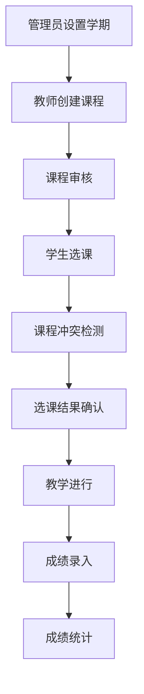

# 研究生排课系统 - 完整功能文档

## 文档概述

本文档详细描述了研究生排课系统的完整功能架构、用户角色权限、核心业务模块和技术实现细节，为开发团队提供全面的功能指南和技术参考。

## 目录

- [1. 系统概览](#1-系统概览)
- [2. 用户角色与权限体系](#2-用户角色与权限体系)
- [3. 功能模块详解](#3-功能模块详解)
- [4. 技术架构](#4-技术架构)
- [5. 数据库设计](#5-数据库设计)
- [6. API接口规范](#6-api接口规范)
- [7. 前端实现](#7-前端实现)
- [8. 部署与运维](#8-部署与运维)
- [9. 开发指南](#9-开发指南)
- [10. 附录](#10-附录)

---

## 1. 系统概览

### 1.1 项目简介

研究生排课系统是一个基于现代Web技术构建的在线教育管理平台，专门为高等院校的研究生课程管理而设计。系统集成了课程管理、选课管理、教学管理、成绩管理、数据统计等核心功能，支持多角色协同工作。

### 1.2 核心特性

- **多角色支持**：学生、教师、管理员、超级管理员四种角色
- **动态权限控制**：基于角色的功能模块动态展示
- **智能选课**：课程冲突检测、时间冲突避免
- **实时统计**：多维度数据分析和可视化
- **响应式设计**：支持桌面端和移动端访问
- **模块化架构**：前后端分离，微服务架构设计

### 1.3 业务流程



## 2. 用户角色与权限体系

### 2.1 角色定义

#### 2.1.1 学生角色 (STUDENT)

- **主要职责**：课程选择、学习管理、成绩查看
- **权限范围**：个人学习相关功能
- **核心操作**：选课、退课、查看课表、成绩查询

#### 2.1.2 教师角色 (TEACHER)

- **主要职责**：课程管理、教学执行、成绩管理
- **权限范围**：教学相关功能
- **核心操作**：课程创建、资料管理、成绩录入、教学统计

#### 2.1.3 管理员角色 (ADMIN)

- **主要职责**：系统管理、规则配置、基础维护
- **权限范围**：系统管理功能
- **核心操作**：用户管理、选课规则配置、学期管理

#### 2.1.4 超级管理员角色 (SUPER_ADMIN)

- **主要职责**：系统全局管理、数据分析、系统监控
- **权限范围**：所有系统功能
- **核心操作**：课程管理、数据统计、系统设置

### 2.2 权限模型

系统采用RBAC（基于角色的访问控制）模型：

```typescript
interface Permission {
  id: string;
  code: string;
  name: string;
  icon: string;
  path?: string;
  operations: {
    view: boolean;
    create?: boolean;
    edit?: boolean;
    delete?: boolean;
    export?: boolean;
  };
  children?: Permission[];
}
```

### 2.3 权限数据结构

权限配置存储在 `src/config/permissions.ts` 中，通过 `getSidebarByRole(role)` 函数根据用户角色动态生成侧边栏菜单。

## 3. 功能模块详解

### 3.1 学生功能模块

#### 3.1.1 选课管理

- **选课操作** (`/enrollment/select`)

  **页面设计**：
  - 课程搜索筛选区（支持课程名、教师、院系、学分筛选）
  - 课程卡片列表展示（课程名、学分、容量、剩余名额、授课教师）
  - 批量操作功能（支持多选选课）
  - 选课冲突提示弹窗

  **操作流程**：
  1. 用户进入选课页面，自动加载可选课程列表
  2. 用户可使用搜索框或筛选器缩小课程范围
  3. 点击课程卡片查看详细信息（课程介绍、教学计划、授课教师等）
  4. 点击"选课"按钮触发选课请求
  5. 系统进行以下检查：
     - 用户身份验证
     - 选课时间窗口检查
     - 课程容量限制检查
     - 时间冲突检测
     - 已选课程重复检查
  6. 选课成功后在用户课表中显示该课程
  7. 如有冲突，显示具体冲突信息和可选解决方案

  **数据处理逻辑**：

  ```typescript
  // 选课核心逻辑
  async function handleCourseSelection(courseId: string) {
    // 1. 检查选课时间
    const selectionTime = await checkSelectionTime();
    if (!selectionTime.isOpen) {
      return showMessage('选课时间未开放', 'error');
    }

    // 2. 检查课程容量
    const courseInfo = await getCourseInfo(courseId);
    if (courseInfo.enrolled >= courseInfo.capacity) {
      return showMessage('课程容量已满', 'warning');
    }

    // 3. 检查时间冲突
    const conflicts = await checkScheduleConflict(courseId);
    if (conflicts.hasConflict) {
      return showConflictDialog(conflicts);
    }

    // 4. 执行选课
    try {
      const result =
        await enrollmentService.selectCourse(courseId);
      showMessage('选课成功', 'success');
      updateStudentSchedule();
    } catch (error) {
      showMessage(error.message, 'error');
    }
  }
  ```

  **API调用**：
  - `Enrollment.Select`: 学生选课
  - `Enrollment.CheckConflict`: 检查选课冲突
  - `Course.GetInfo`: 获取课程详细信息
  - `Enrollment.GetSchedule`: 获取学生当前课表

- **我的课表** (`/enrollment/schedule`)

  **页面设计**：
  - 周视图和月视图切换
  - 拖拽式时间调整（支持鼠标拖拽调整课程时间）
  - 课程颜色标识（不同课程使用不同颜色）
  - 退课按钮（课程卡片右上角）
  - 课表导出功能（PDF/Excel格式）

  **操作流程**：
  1. 页面加载时显示当前学期课程
  2. 用户可切换周视图/月视图
  3. 点击课程块显示详细信息和操作菜单
  4. 支持拖拽调整课程时间（需要教师和管理员审批）
  5. 支持一键导出课表

  **数据处理逻辑**：

  ```typescript
  // 课表渲染逻辑
  function renderScheduleView(viewType: 'week' | 'month') {
    const schedules = computed(() =>
      store.getStudentSchedule()
    );
    const timeSlots =
      viewType === 'week'
        ? WEEK_TIME_SLOTS
        : MONTH_TIME_SLOTS;

    return {
      timeSlots,
      courses: schedules.value,
      conflicts: detectScheduleConflicts(schedules.value),
    };
  }
  ```

  **API调用**：
  - `Enrollment.GetSchedule`: 获取学生课表
  - `Enrollment.Drop`: 退课操作
  - `Enrollment.UpdateSchedule`: 调整课程时间

#### 3.1.2 课程中心

- **浏览课程** (`/courses/browse`)

  **页面设计**：
  - 侧边栏分类导航（按院系、专业、课程类型分类）
  - 顶部搜索栏（支持课程名、教师名模糊搜索）
  - 筛选器面板（院系、学分范围、授课时间、教师职称）
  - 课程列表网格布局（显示课程封面、名称、学分、教师、剩余容量）
  - 课程详情模态框（课程介绍、教学大纲、教材、考核方式）

  **操作流程**：
  1. 进入课程浏览页面，加载全部可选课程
  2. 用户可通过侧边栏选择特定院系或专业
  3. 使用搜索框输入关键词实时搜索
  4. 通过筛选器组合条件缩小范围
  5. 点击课程卡片查看详细信息
  6. 课程详情页支持：
     - 查看教学大纲和课程计划
     - 查看授课教师信息（职称、研究方向、评价）
     - 查看已选学生评价和评分
     - 一键添加到收藏夹
     - 直接跳转到选课页面

  **数据处理逻辑**：

  ```typescript
  // 课程搜索和筛选逻辑
  function filterCourses(filters: CourseFilters) {
    const allCourses = ref<Course[]>([]);
    const filteredCourses = computed(() => {
      let result = allCourses.value;

      // 文本搜索
      if (filters.keyword) {
        result = result.filter(
          course =>
            course.name.includes(filters.keyword) ||
            course.teacher_name.includes(filters.keyword)
        );
      }

      // 院系筛选
      if (filters.department) {
        result = result.filter(
          course => course.department === filters.department
        );
      }

      // 学分范围
      if (filters.credits) {
        result = result.filter(
          course =>
            course.credits >= filters.credits!.min &&
            course.credits <= filters.credits!.max
        );
      }

      // 授课时间筛选
      if (filters.timeSlots) {
        result = result.filter(course =>
          course.schedules.some(schedule =>
            filters.timeSlots!.includes(schedule.time_slot)
          )
        );
      }

      return result;
    });

    return filteredCourses;
  }
  ```

  **API调用**：
  - `Course.GetBrowseList`: 获取课程浏览列表
  - `Course.GetDetail`: 获取课程详细信息
  - `Course.GetTeacherInfo`: 获取教师信息
  - `Course.AddToFavorites`: 添加课程到收藏夹

- **我的收藏** (`/courses/favorites`)

  **页面设计**：
  - 收藏课程卡片列表
  - 批量操作工具栏（全选、批量选课、批量删除）
  - 收藏课程分类管理
  - 收藏时间排序和筛选

  **操作流程**：
  1. 显示用户收藏的所有课程
  2. 支持按收藏时间排序
  3. 支持批量操作（批量选课、批量删除收藏）
  4. 支持分类管理（用户可自定义分类）
  5. 一键快速选课（批量选课功能）

  **数据处理逻辑**：

  ```typescript
  // 收藏课程管理
  function manageFavorites(
    action: 'select_all' | 'select_batch' | 'remove_batch'
  ) {
    const selectedCourses = ref<string[]>([]);

    switch (action) {
      case 'select_all':
        selectedCourses.value = favoriteCourses.value.map(
          c => c.id
        );
        break;
      case 'select_batch':
        performBatchEnrollment(selectedCourses.value);
        break;
      case 'remove_batch':
        removeFromFavorites(selectedCourses.value);
        break;
    }
  }
  ```

  **API调用**：
  - `Course.GetFavorites`: 获取收藏课程列表
  - `Course.RemoveFavorite`: 取消收藏
  - `Course.BatchEnroll`: 批量选课

#### 3.1.3 成绩管理

- **我的成绩** (`/my-grades`)

  **页面设计**：
  - 学期选择器（支持下拉选择历史学期）
  - 成绩统计面板（总学分、GPA、排名等）
  - 成绩列表表格（课程名、学分、成绩、等级、排名）
  - 成绩趋势图表（折线图显示各学期成绩变化）
  - 成绩分析报告（薄弱课程分析、学习建议）
  - 成绩单导出功能（PDF格式，支持电子签名）

  **操作流程**：
  1. 页面加载显示当前学期成绩
  2. 用户可切换不同学期查看历史成绩
  3. 成绩数据实时更新（教师录入后立即同步）
  4. 点击成绩项目查看详细评分标准
  5. 生成个人成绩分析报告
  6. 支持导出成绩单（带水印和电子签名）

  **数据处理逻辑**：

  ```typescript
  // 成绩计算和统计
  function calculateGradeStats(grades: Grade[]) {
    const stats = {
      totalCredits: 0,
      gpa: 0,
      averageScore: 0,
      ranking: 0,
      gradeDistribution: {} as Record<string, number>,
    };

    grades.forEach(grade => {
      stats.totalCredits += grade.course_credits;
      stats.averageScore += grade.score;
      stats.gradeDistribution[grade.grade] =
        (stats.gradeDistribution[grade.grade] || 0) + 1;
    });

    stats.averageScore /= grades.length;
    stats.gpa = calculateGPA(grades);

    return stats;
  }
  ```

  **API调用**：
  - `Grade.GetStudentGrades`: 获取学生成绩列表
  - `Grade.GetGradeDetail`: 获取成绩详细信息
  - `Grade.ExportTranscript`: 导出成绩单
  - `Grade.GetStatistics`: 获取成绩统计信息

#### 3.1.4 个人中心

- **个人信息** (`/personal-center`)

  **页面设计**：
  - 个人信息表单（姓名、学号、院系、专业、联系方式）
  - 头像上传区域（支持拖拽上传，预览裁剪功能）
  - 密码修改表单（原密码、新密码、确认密码）
  - 通知偏好设置（邮件通知、短信通知、系统消息）
  - 账户安全设置（登录记录、设备管理、权限查看）

  **操作流程**：
  1. 页面加载显示当前用户基本信息
  2. 支持在线编辑个人信息（实时保存）
  3. 头像上传流程：
     - 选择图片文件
     - 图片裁剪和压缩
     - 上传到云存储
     - 更新用户头像URL
  4. 密码修改需要验证原密码
  5. 通知设置实时生效
  6. 账户安全页面显示登录历史

  **数据处理逻辑**：

  ```typescript
  // 个人信息更新
  async function updateProfile(profileData: ProfileData) {
    try {
      // 表单验证
      validateProfileData(profileData);

      // 头像上传（如果有新头像）
      if (profileData.avatarFile) {
        const avatarUrl = await uploadAvatar(
          profileData.avatarFile
        );
        profileData.avatar = avatarUrl;
        delete profileData.avatarFile;
      }

      // 更新用户信息
      await userService.updateProfile(profileData);
      showMessage('个人信息更新成功', 'success');

      // 更新全局状态
      authStore.updateUser(profileData);
    } catch (error) {
      showMessage('更新失败：' + error.message, 'error');
    }
  }
  ```

  **API调用**：
  - `User.GetProfile`: 获取用户个人信息
  - `User.UpdateProfile`: 更新个人信息
  - `User.ChangePassword`: 修改密码
  - `User.UploadAvatar`: 上传头像
  - `User.GetLoginHistory`: 获取登录历史

### 3.2 教师功能模块

#### 3.2.1 课程中心

- **我的课程** (`/courses/manage/my`)

  **页面设计**：
  - 课程列表表格（课程名、学期、学分、选课人数、状态）
  - 课程操作工具栏（新建、编辑、复制、删除、导出）
  - 课程状态标签（草稿、待审核、已发布、已结课）
  - 批量操作功能（批量审核、批量导出数据）
  - 课程搜索和筛选器（按学期、状态、院系筛选）

  **操作流程**：
  1. 登录后自动显示当前学期教授的课程
  2. 点击课程名称进入课程详情编辑页面
  3. 支持创建新课程（填写基本信息、设置时间安排）
  4. 课程创建后进入草稿状态，需要提交审核
  5. 审核通过的课程可以发布供学生选课
  6. 支持课程复制功能（快速创建相似课程）
  7. 学期结束后课程自动归档，可查看历史数据

  **数据处理逻辑**：

  ```typescript
  // 课程管理核心逻辑
  function manageCourses(action: CourseAction) {
    switch (action.type) {
      case 'CREATE':
        return createCourse(action.data);
      case 'UPDATE':
        return updateCourse(action.courseId, action.data);
      case 'SUBMIT_FOR_REVIEW':
        return submitCourseForReview(action.courseId);
      case 'PUBLISH':
        return publishCourse(action.courseId);
      case 'ARCHIVE':
        return archiveCourse(action.courseId);
      case 'COPY':
        return copyCourse(action.courseId, action.newData);
    }
  }

  // 课程状态管理
  function updateCourseStatus(
    courseId: string,
    newStatus: CourseStatus
  ) {
    const course = courses.value.find(
      c => c.id === courseId
    );
    if (!course) return;

    // 状态流转验证
    const validTransitions = {
      DRAFT: ['PENDING_REVIEW'],
      PENDING_REVIEW: ['PUBLISHED', 'REJECTED'],
      PUBLISHED: ['ARCHIVED'],
      REJECTED: ['DRAFT'],
      ARCHIVED: [],
    };

    if (
      !validTransitions[course.status].includes(newStatus)
    ) {
      throw new Error(
        `无法从 ${course.status} 转换到 ${newStatus}`
      );
    }

    course.status = newStatus;
    course.updated_at = new Date();
    return courseService.updateCourse(courseId, {
      status: newStatus,
    });
  }
  ```

  **API调用**：
  - `Course.GetMyCourses`: 获取我的课程列表
  - `Course.Create`: 创建新课程
  - `Course.Update`: 更新课程信息
  - `Course.Delete`: 删除课程
  - `Course.SubmitForReview`: 提交课程审核
  - `Course.Publish`: 发布课程

- **课程资料** (`/courses/materials`)

  **页面设计**：
  - 课程选择器（选择要管理的课程）
  - 资料分类树形结构（课件、作业、参考材料、实验指导等）
  - 资料上传区域（支持拖拽上传、多文件批量上传）
  - 资料列表展示（文件名、大小、上传时间、下载次数、权限设置）
  - 在线预览功能（PDF、图片、文档在线查看）
  - 资料权限控制（公开、学生可见、指定学生可见）

  **操作流程**：
  1. 选择要管理资料的课程
  2. 选择资料分类或创建新分类
  3. 上传资料文件（支持多种格式：PDF、PPT、DOC、图片、视频等）
  4. 设置资料权限（公开/限制/指定学生）
  5. 为资料添加描述和标签
  6. 学生端可按权限访问和下载资料
  7. 支持资料版本管理（覆盖更新/保留历史版本）

  **数据处理逻辑**：

  ```typescript
  // 资料上传和管理
  async function uploadCourseMaterial(
    courseId: string,
    file: File,
    category: string
  ) {
    try {
      // 文件验证
      validateFile(file);

      // 上传文件到云存储
      const uploadResult = await fileService.upload(file, {
        courseId,
        category,
        uploadedBy: authStore.user.id,
      });

      // 创建资料记录
      const material = await materialService.create({
        course_id: courseId,
        file_name: file.name,
        file_url: uploadResult.url,
        file_size: file.size,
        file_type: file.type,
        category: category,
        description: '',
        permissions: 'PUBLIC',
        version: 1,
      });

      return material;
    } catch (error) {
      throw new Error('资料上传失败：' + error.message);
    }
  }

  // 权限检查
  function checkMaterialAccess(
    material: CourseMaterial,
    userId: string,
    userRole: string
  ) {
    if (material.permissions === 'PUBLIC') return true;
    if (
      material.permissions === 'PRIVATE' &&
      material.uploaded_by === userId
    )
      return true;
    if (material.permissions === 'RESTRICTED') {
      return (
        material.allowed_users.includes(userId) ||
        userRole === 'ADMIN'
      );
    }
    return false;
  }
  ```

  **API调用**：
  - `Material.GetCourseMaterials`: 获取课程资料列表
  - `Material.Upload`: 上传资料文件
  - `Material.Update`: 更新资料信息
  - `Material.Delete`: 删除资料
  - `Material.SetPermissions`: 设置资料权限
  - `Material.GetDownloadHistory`: 获取下载历史

- **课程公告** (`/courses/announcements`)

  **页面设计**：
  - 公告编辑器（支持富文本编辑、插入图片、链接）
  - 公告列表（标题、发布时间、状态、阅读量、推送方式）
  - 公告分类标签（课程通知、作业提醒、考试安排、临时通知）
  - 推送设置面板（邮件推送、短信推送、系统消息推送）
  - 效果统计面板（阅读人数、阅读时长、互动统计）

  **操作流程**：
  1. 选择要发布公告的课程
  2. 编写公告内容（支持富文本编辑）
  3. 设置公告分类和优先级
  4. 选择推送方式（系统内通知、邮件、短信）
  5. 设置推送时间（即时发送/定时发送）
  6. 预览公告效果
  7. 发布后监控阅读和互动数据
  8. 支持公告编辑、置顶、删除操作

  **数据处理逻辑**：

  ```typescript
  // 公告发布逻辑
  async function publishAnnouncement(
    announcement: AnnouncementData
  ) {
    try {
      // 公告内容验证
      validateAnnouncementContent(announcement);

      // 创建公告记录
      const newAnnouncement =
        await announcementService.create({
          course_id: announcement.courseId,
          title: announcement.title,
          content: announcement.content,
          category: announcement.category,
          priority: announcement.priority,
          status: 'PUBLISHED',
        });

      // 处理推送
      if (announcement.pushOptions.enabled) {
        const pushPromises = [];

        if (announcement.pushOptions.system) {
          pushPromises.push(
            sendSystemNotification(newAnnouncement)
          );
        }

        if (announcement.pushOptions.email) {
          pushPromises.push(
            sendEmailNotification(
              newAnnouncement,
              announcement.pushOptions.recipients
            )
          );
        }

        if (announcement.pushOptions.sms) {
          pushPromises.push(
            sendSMSNotification(
              newAnnouncement,
              announcement.pushOptions.recipients
            )
          );
        }

        await Promise.all(pushPromises);
      }

      return newAnnouncement;
    } catch (error) {
      throw new Error('公告发布失败：' + error.message);
    }
  }
  ```

  **API调用**：
  - `Announcement.GetList`: 获取公告列表
  - `Announcement.Create`: 创建新公告
  - `Announcement.Update`: 更新公告
  - `Announcement.Delete`: 删除公告
  - `Announcement.Publish`: 发布公告
  - `Announcement.GetStatistics`: 获取公告统计

#### 3.2.2 教学管理

- **成绩录入** (`/grades/entry`)

  **页面设计**：
  - 课程选择器（选择要录入成绩的课程）
  - 学生列表表格（学号、姓名、平时成绩、考试成绩、总评成绩）
  - 成绩录入表单（支持单个录入和批量录入）
  - 成绩计算规则配置（平时成绩占比、考试成绩占比）
  - 成绩审核流程（提交审核、审核状态跟踪）
  - 成绩导出功能（Excel格式，支持多种格式模板）

  **操作流程**：
  1. 选择要录入成绩的课程和考试类型
  2. 加载选课学生列表
  3. 录入学生成绩（支持手动输入和Excel导入）
  4. 系统自动计算总评成绩（按预设比例）
  5. 成绩录入完成后提交审核
  6. 管理员审核通过后成绩正式生效
  7. 学生端可查询成绩，教师端可查看统计信息
  8. 支持成绩修改（需要重新提交审核）

  **数据处理逻辑**：

  ```typescript
  // 成绩录入和计算
  async function inputGrades(
    courseId: string,
    grades: GradeInput[]
  ) {
    try {
      // 成绩验证
      grades.forEach(grade => {
        validateGrade(grade);
      });

      // 批量计算总评成绩
      const calculatedGrades = grades.map(grade => {
        const course = await getCourseConfig(courseId);
        const totalScore =
          grade.usual_score * course.usual_ratio +
          grade.exam_score * course.exam_ratio;

        return {
          ...grade,
          total_score: Math.round(totalScore * 100) / 100,
          grade: convertToGradeLevel(totalScore),
          input_time: new Date(),
        };
      });

      // 批量保存成绩
      await gradeService.batchInput(
        courseId,
        calculatedGrades
      );

      // 触发审核流程
      await submitGradeForReview(courseId);

      return calculatedGrades;
    } catch (error) {
      throw new Error('成绩录入失败：' + error.message);
    }
  }

  // 成绩等级转换
  function convertToGradeLevel(score: number): string {
    if (score >= 90) return 'A';
    if (score >= 80) return 'B';
    if (score >= 70) return 'C';
    if (score >= 60) return 'D';
    return 'F';
  }
  ```

  **API调用**：
  - `Grade.GetCourseStudents`: 获取课程选课学生
  - `Grade.Input`: 录入学生成绩
  - `Grade.BatchInput`: 批量录入成绩
  - `Grade.Update`: 更新成绩
  - `Grade.SubmitForReview`: 提交成绩审核
  - `Grade.GetStatistics`: 获取成绩统计

- **教学统计** (`/teaching/stats`)

  **页面设计**：
  - 统计时间范围选择器（按学期、学年、自定义时间段）
  - 课程统计卡片（课程数量、总学时、学生人数、平均成绩）
  - 成绩分布图表（柱状图显示各分数段学生数量）
  - 教学质量指标（学生满意度、课程评价、改进建议）
  - 教学工作量统计（授课学时、指导学生数、教研活动参与度）
  - 数据导出功能（PDF报告、Excel数据表）

  **操作流程**：
  1. 选择统计时间范围和课程范围
  2. 系统自动计算各项教学指标
  3. 生成可视化图表和统计报告
  4. 对比历史数据，分析教学趋势
  5. 查看学生评价和建议
  6. 导出统计数据用于汇报和存档
  7. 根据统计结果制定教学改进计划

  **数据处理逻辑**：

  ```typescript
  // 教学统计数据计算
  function calculateTeachingStats(
    teacherId: string,
    timeRange: TimeRange
  ) {
    const stats = {
      courseStats: {
        totalCourses: 0,
        totalHours: 0,
        totalStudents: 0,
        averageGrade: 0,
      },
      qualityMetrics: {
        satisfactionScore: 0,
        completionRate: 0,
        improvementSuggestions: [],
      },
      workloadMetrics: {
        teachingHours: 0,
        studentGuidance: 0,
        researchActivities: 0,
      },
    };

    return computed(async () => {
      const courses = await getTeacherCourses(
        teacherId,
        timeRange
      );

      // 课程统计
      stats.courseStats.totalCourses = courses.length;
      stats.courseStats.totalHours = courses.reduce(
        (sum, course) => sum + course.hours,
        0
      );
      stats.courseStats.totalStudents = courses.reduce(
        (sum, course) => sum + course.enrolled_students,
        0
      );
      stats.courseStats.averageGrade =
        calculateAverageGrade(courses);

      // 质量指标
      const evaluations = await getCourseEvaluations(
        courses.map(c => c.id)
      );
      stats.qualityMetrics.satisfactionScore =
        calculateSatisfactionScore(evaluations);
      stats.qualityMetrics.completionRate =
        calculateCompletionRate(courses);

      return stats;
    });
  }
  ```

  **API调用**：
  - `Statistics.GetTeachingStats`: 获取教学统计数据
  - `Statistics.GetGradeDistribution`: 获取成绩分布
  - `Statistics.GetStudentEvaluations`: 获取学生评价
  - `Statistics.ExportReport`: 导出统计报告

#### 3.2.3 教学安排

- **教学时间表** (`/teaching/schedule`)

  **页面设计**：
  - 周视图时间表（显示一周的教学安排）
  - 月视图时间表（月度教学计划概览）
  - 时间冲突检测提示（红色警告标识）
  - 教室资源状态（显示教室可用性）
  - 课程调整申请功能（在线申请调整时间）
  - 教学日历（可添加个人备注和提醒）

  **操作流程**：
  1. 系统自动加载教师的教学安排
  2. 显示所有课程的授课时间、地点、学生人数
  3. 实时检测时间冲突并给出提醒
  4. 支持查看教室资源状态和预约情况
  5. 需要调整时间时提交调整申请
  6. 管理员审核通过后更新时间表
  7. 支持添加个人备注和重要事项提醒
  8. 可导出时间表到日历应用

  **数据处理逻辑**：

  ```typescript
  // 教学时间表管理
  function manageTeachingSchedule(action: ScheduleAction) {
    switch (action.type) {
      case 'VIEW':
        return loadTeachingSchedule();
      case 'APPLY_CHANGE':
        return applyScheduleChange(
          action.scheduleId,
          action.newTime
        );
      case 'CHECK_CONFLICT':
        return checkScheduleConflicts(
          action.courseId,
          action.newTime
        );
      case 'ADD_NOTE':
        return addScheduleNote(action.date, action.note);
    }
  }

  // 时间冲突检测
  async function checkScheduleConflicts(
    courseId: string,
    newTime: TimeSlot
  ) {
    const existingSchedules = await getTeacherSchedules(
      authStore.user.id
    );
    const conflicts = existingSchedules.filter(schedule => {
      if (schedule.course_id === courseId) return false;

      return (
        schedule.day_of_week === newTime.day_of_week &&
        timeOverlap(schedule.time_slot, newTime.time_slot)
      );
    });

    return {
      hasConflict: conflicts.length > 0,
      conflicts: conflicts,
    };
  }
  ```

  **API调用**：
  - `Schedule.GetTeachingSchedule`: 获取教学时间表
  - `Schedule.ApplyChange`: 申请调整时间
  - `Schedule.CheckConflict`: 检查时间冲突
  - `Schedule.GetClassroomStatus`: 获取教室状态

#### 3.2.4 个人管理

- **个人信息** (`/teacher-profile`)

  **页面设计**：
  - 个人信息表单（姓名、工号、院系、职称、联系方式）
  - 头像上传区域（支持裁剪和压缩）
  - 教学经历时间线（教育背景、工作经历、教学经验）
  - 学术成果展示（论文发表、课题研究、获奖情况）
  - 教学特色和理念（个人教学风格介绍）
  - 联系方式更新（办公地址、电话、邮箱、办公时间）

  **操作流程**：
  1. 页面加载显示当前个人信息
  2. 支持在线编辑基本信息
  3. 头像上传和裁剪功能
  4. 添加和编辑教学经历（支持时间线展示）
  5. 录入学术成果（支持文件上传和链接添加）
  6. 填写教学理念和特色
  7. 更新联系方式和办公信息
  8. 保存后同步更新到全局用户状态

  **数据处理逻辑**：

  ```typescript
  // 教师个人信息管理
  async function updateTeacherProfile(
    profileData: TeacherProfile
  ) {
    try {
      // 验证个人信息
      validateTeacherProfile(profileData);

      // 处理头像上传
      if (profileData.avatarFile) {
        const avatarUrl = await uploadAvatar(
          profileData.avatarFile
        );
        profileData.avatar = avatarUrl;
        delete profileData.avatarFile;
      }

      // 处理教学经历时间线
      if (profileData.experiences) {
        profileData.experiences =
          profileData.experiences.sort(
            (a, b) =>
              new Date(a.startDate).getTime() -
              new Date(b.startDate).getTime()
          );
      }

      // 处理学术成果
      if (profileData.achievements) {
        profileData.achievements = await Promise.all(
          profileData.achievements.map(
            async achievement => {
              if (achievement.file) {
                achievement.fileUrl =
                  await uploadAchievementFile(
                    achievement.file
                  );
              }
              return achievement;
            }
          )
        );
      }

      // 更新个人信息
      await teacherService.updateProfile(profileData);

      // 更新全局状态
      authStore.updateUser(profileData);

      return profileData;
    } catch (error) {
      throw new Error('个人信息更新失败：' + error.message);
    }
  }
  ```

  **API调用**：
  - `Teacher.GetProfile`: 获取教师个人信息
  - `Teacher.UpdateProfile`: 更新个人信息
  - `Teacher.UploadAvatar`: 上传头像
  - `Teacher.AddExperience`: 添加教学经历
  - `Teacher.AddAchievement`: 添加学术成果

### 3.3 管理员功能模块

#### 3.3.1 系统管理

- **用户管理** (`/system/users`)

  **页面设计**：
  - 用户列表表格（用户名、姓名、角色、院系、状态、最后登录时间）
  - 用户搜索和筛选器（按角色、院系、状态筛选）
  - 批量操作工具栏（批量启用/禁用、批量分配角色、批量导出）
  - 用户详情模态框（基本信息、角色权限、登录历史、操作记录）
  - 新建用户表单（支持批量导入用户）
  - 角色权限矩阵（可视化权限分配界面）

  **操作流程**：
  1. 加载用户列表，支持分页和排序
  2. 使用搜索框或筛选器快速定位用户
  3. 点击用户行查看详细信息
  4. 支持编辑用户基本信息（姓名、邮箱、院系等）
  5. 角色权限分配（支持多角色组合）
  6. 用户状态管理（启用/禁用/锁定）
  7. 批量操作功能（适用于大量用户管理）
  8. 用户操作日志记录和审计

  **数据处理逻辑**：

  ```typescript
  // 用户管理核心逻辑
  function manageUsers(action: UserAction) {
    switch (action.type) {
      case 'SEARCH':
        return searchUsers(action.filters);
      case 'CREATE':
        return createUser(action.userData);
      case 'UPDATE':
        return updateUser(action.userId, action.userData);
      case 'DELETE':
        return deleteUser(action.userId);
      case 'BATCH_UPDATE':
        return batchUpdateUsers(
          action.userIds,
          action.updateData
        );
      case 'ASSIGN_ROLES':
        return assignUserRoles(action.userId, action.roles);
      case 'TOGGLE_STATUS':
        return toggleUserStatus(action.userId);
    }
  }

  // 权限验证
  function checkUserPermission(
    userId: string,
    resource: string,
    operation: string
  ) {
    const user = users.value.find(u => u.id === userId);
    if (!user) return false;

    // 超级管理员拥有所有权限
    if (user.roles.includes('SUPER_ADMIN')) return true;

    // 检查具体权限
    const requiredPermission = `${resource}:${operation}`;
    return user.permissions.includes(requiredPermission);
  }

  // 批量操作处理
  async function batchUpdateUsers(
    userIds: string[],
    updateData: UserUpdateData
  ) {
    const results = await Promise.allSettled(
      userIds.map(userId => updateUser(userId, updateData))
    );

    const success = results.filter(
      r => r.status === 'fulfilled'
    ).length;
    const failed = results.filter(
      r => r.status === 'rejected'
    ).length;

    return {
      total: userIds.length,
      success,
      failed,
      errors: results
        .filter(r => r.status === 'rejected')
        .map(r => (r as PromiseRejectedResult).reason),
    };
  }
  ```

  **API调用**：
  - `User.GetList`: 获取用户列表
  - `User.GetDetail`: 获取用户详情
  - `User.Create`: 创建用户
  - `User.Update`: 更新用户信息
  - `User.Delete`: 删除用户
  - `User.BatchUpdate`: 批量更新用户
  - `User.AssignRoles`: 分配用户角色
  - `User.GetPermissions`: 获取用户权限

- **选课时间配置** (`/system/select-time`)

  **页面设计**：
  - 时间轴配置界面（可视化选课时间段设置）
  - 选课规则配置面板（容量限制、冲突规则、先修要求）
  - 选课窗口管理（增删改查选课时间窗口）
  - 规则模板库（预设常用选课规则）
  - 冲突检测设置（时间冲突、教师冲突、课程冲突规则）
  - 实时预览功能（预览配置对选课的影响）

  **操作流程**：
  1. 选择要配置的学期
  2. 设置选课时间窗口（开始时间、结束时间）
  3. 配置选课规则：
     - 单个学生最大选课数量
     - 课程容量限制规则
     - 时间冲突处理方式
     - 先修课程检查规则
  4. 设置特殊规则（补选、退课、白名单等）
  5. 预览配置效果
  6. 保存配置并通知相关用户
  7. 支持规则模板保存和复用

  **数据处理逻辑**：

  ```typescript
  // 选课时间配置管理
  function configureSelectionTime(
    config: SelectionTimeConfig
  ) {
    // 时间窗口验证
    if (config.startTime >= config.endTime) {
      throw new Error('开始时间必须早于结束时间');
    }

    // 规则验证
    validateSelectionRules(config.rules);

    // 冲突检测
    const conflicts = detectRuleConflicts(config.rules);
    if (conflicts.length > 0) {
      showRuleConflictWarning(conflicts);
      return false;
    }

    // 保存配置
    return selectionConfigService.update(config);
  }

  // 规则冲突检测
  function detectRuleConflicts(
    rules: SelectionRule[]
  ): RuleConflict[] {
    const conflicts: RuleConflict[] = [];

    // 检查容量规则冲突
    rules.forEach((rule, index) => {
      if (rule.type === 'CAPACITY_LIMIT') {
        const conflictingRules = rules.filter(
          (r, i) =>
            i !== index &&
            r.type === 'CAPACITY_LIMIT' &&
            rule.priority === r.priority
        );
        if (conflictingRules.length > 0) {
          conflicts.push({
            type: 'CAPACITY_CONFLICT',
            rules: [rule, ...conflictingRules],
            message: '容量限制规则优先级冲突',
          });
        }
      }
    });

    return conflicts;
  }

  // 选课窗口验证
  function validateSelectionWindow(
    window: SelectionWindow
  ): boolean {
    const now = new Date();
    const start = new Date(window.startTime);
    const end = new Date(window.endTime);

    if (start >= end) return false;
    if (start < now) return false;

    return true;
  }
  ```

  **API调用**：
  - `SelectionTime.GetConfig`: 获取选课时间配置
  - `SelectionTime.UpdateConfig`: 更新选课时间配置
  - `SelectionTime.GetRules`: 获取选课规则
  - `SelectionTime.UpdateRules`: 更新选课规则
  - `SelectionTime.ValidateConfig`: 验证配置
  - `SelectionTime.GetTemplates`: 获取规则模板

- **学期管理** (`/system/semester`)

  **页面设计**：
  - 学期列表卡片视图（当前学期高亮显示）
  - 学期创建向导（步骤式创建流程）
  - 学期状态管理面板（草稿、激活、结束、归档）
  - 学期数据统计（课程数、选课人数、系统使用情况）
  - 学期复制功能（复制上学期配置）
  - 学期切换确认对话框

  **操作流程**：
  1. 查看当前所有学期列表
  2. 创建新学期：
     - 输入学期名称和学年
     - 设置学期起止时间
     - 配置选课时间窗口
     - 设置默认课程容量和规则
  3. 激活新学期（自动停用其他学期）
  4. 学期进行中可调整配置
  5. 学期结束后标记为已结束
  6. 历史学期可归档（只读状态）
  7. 支持学期数据导出和备份

  **数据处理逻辑**：

  ```typescript
  // 学期管理核心逻辑
  function manageSemester(action: SemesterAction) {
    switch (action.type) {
      case 'CREATE':
        return createSemester(action.semesterData);
      case 'ACTIVATE':
        return activateSemester(action.semesterId);
      case 'UPDATE':
        return updateSemester(
          action.semesterId,
          action.semesterData
        );
      case 'END':
        return endSemester(action.semesterId);
      case 'ARCHIVE':
        return archiveSemester(action.semesterId);
      case 'COPY':
        return copySemester(
          action.sourceSemesterId,
          action.targetSemesterData
        );
    }
  }

  // 激活学期
  async function activateSemester(semesterId: string) {
    // 停用当前活跃学期
    const currentActive =
      await semesterService.getActiveSemester();
    if (currentActive) {
      await semesterService.update(currentActive.id, {
        status: 'ENDED',
      });
    }

    // 激活新学期
    const newSemester = await semesterService.update(
      semesterId,
      {
        status: 'ACTIVE',
        activatedAt: new Date(),
      }
    );

    // 通知所有用户学期变更
    await notificationService.broadcast({
      type: 'SEMESTER_CHANGED',
      semester: newSemester,
      message: `新学期 "${newSemester.name}" 已开始`,
    });

    return newSemester;
  }

  // 学期数据验证
  function validateSemesterData(
    semesterData: SemesterData
  ): boolean {
    const errors: string[] = [];

    if (!semesterData.name?.trim()) {
      errors.push('学期名称不能为空');
    }

    if (!semesterData.academicYear?.trim()) {
      errors.push('学年不能为空');
    }

    const startDate = new Date(semesterData.startDate);
    const endDate = new Date(semesterData.endDate);

    if (startDate >= endDate) {
      errors.push('结束时间必须晚于开始时间');
    }

    if (errors.length > 0) {
      throw new Error(errors.join(', '));
    }

    return true;
  }
  ```

  **API调用**：
  - `Semester.GetList`: 获取学期列表
  - `Semester.GetDetail`: 获取学期详情
  - `Semester.Create`: 创建学期
  - `Semester.Update`: 更新学期
  - `Semester.Activate`: 激活学期
  - `Semester.End`: 结束学期
  - `Semester.Archive`: 归档学期

- **系统设置** (`/system/settings`)

  **页面设计**：
  - 设置分类导航（基础设置、功能开关、安全设置、性能设置）
  - 参数配置表单（支持实时预览和验证）
  - 功能开关矩阵（按角色控制功能可见性）
  - 系统监控面板（实时系统状态和性能指标）
  - 配置导入导出功能（JSON格式配置备份）
  - 批量参数调整工具

  **操作流程**：
  1. 选择设置分类进入对应配置页面
  2. 修改参数值（支持实时验证）
  3. 预览配置变更效果
  4. 保存配置（支持立即生效或定时生效）
  5. 功能开关按角色控制
  6. 系统参数优化调整
  7. 配置变更记录和审计
  8. 支持配置回滚和版本管理

  **数据处理逻辑**：

  ```typescript
  // 系统设置管理
  function manageSettings(action: SettingAction) {
    switch (action.type) {
      case 'UPDATE':
        return updateSetting(action.key, action.value);
      case 'BATCH_UPDATE':
        return batchUpdateSettings(action.settings);
      case 'RESET':
        return resetSetting(action.key);
      case 'EXPORT':
        return exportSettings();
      case 'IMPORT':
        return importSettings(action.config);
    }
  }

  // 参数验证
  function validateSetting(
    key: string,
    value: any
  ): ValidationResult {
    const setting = systemSettings.value.find(
      s => s.key === key
    );
    if (!setting) {
      return { valid: false, message: '设置项不存在' };
    }

    // 类型验证
    if (!validateType(value, setting.type)) {
      return {
        valid: false,
        message: `期望${setting.type}类型`,
      };
    }

    // 值范围验证
    if (
      setting.range &&
      !validateRange(value, setting.range)
    ) {
      return {
        valid: false,
        message: `值必须在${setting.range.min}-${setting.range.max}范围内`,
      };
    }

    // 依赖验证
    if (setting.dependencies) {
      for (const dep of setting.dependencies) {
        const depValue = getSetting(dep.key);
        if (
          !validateDependency(
            value,
            depValue,
            dep.condition
          )
        ) {
          return {
            valid: false,
            message: `与${dep.key}设置冲突`,
          };
        }
      }
    }

    return { valid: true };
  }

  // 配置变更影响分析
  function analyzeSettingImpact(
    settingKey: string,
    newValue: any
  ): ImpactAnalysis {
    const setting = getSetting(settingKey);
    const impacts: ImpactItem[] = [];

    // 检查功能依赖
    const dependentFeatures =
      getDependentFeatures(settingKey);
    dependentFeatures.forEach(feature => {
      if (!isFeatureCompatible(feature, newValue)) {
        impacts.push({
          type: 'FEATURE_INCOMPATIBLE',
          feature: feature.name,
          severity: 'HIGH',
          message: `${feature.name}功能与新设置不兼容`,
        });
      }
    });

    // 检查性能影响
    const performanceImpact = calculatePerformanceImpact(
      settingKey,
      newValue
    );
    if (performanceImpact > 0.8) {
      impacts.push({
        type: 'PERFORMANCE_WARNING',
        severity: 'MEDIUM',
        message: '该设置可能对系统性能产生较大影响',
      });
    }

    return {
      impacts,
      recommended: suggestOptimalValue(settingKey),
    };
  }
  ```

  **API调用**：
  - `SystemSettings.GetAll`: 获取所有系统设置
  - `SystemSettings.GetByCategory`: 按分类获取设置
  - `SystemSettings.Update`: 更新单个设置
  - `SystemSettings.BatchUpdate`: 批量更新设置
  - `SystemSettings.Validate`: 验证设置值
  - `SystemSettings.Export`: 导出配置
  - `SystemSettings.Import`: 导入配置
  - `SystemSettings.GetImpact`: 分析设置影响

### 3.4 超级管理员功能模块

#### 3.4.1 课程管理

- **所有课程** (`/courses/all`)

  **页面设计**：
  - 全校课程总览仪表板（课程总数、院系分布、状态统计）
  - 高级搜索筛选器（按院系、教师、状态、学分范围、时间段）
  - 课程列表表格（课程名、院系、教师、选课人数、状态、评分）
  - 批量操作工具栏（批量审核、批量导出、批量归档）
  - 课程详情侧边栏（完整课程信息、选课学生、成绩统计）
  - 课程质量评估面板（学生评价、教学效果、数据分析）
  - 课程趋势图表（选课人数变化、评分趋势、退课率）

  **操作流程**：
  1. 进入课程总览页面，加载全校所有课程数据
  2. 使用多维度筛选器快速定位目标课程
  3. 查看课程详细信息和统计数据
  4. 监控课程状态变化和异常情况
  5. 执行批量管理操作（审核、导出、归档）
  6. 分析课程质量和教学效果
  7. 生成课程管理报告
  8. 设置课程质量预警规则

  **数据处理逻辑**：

  ```typescript
  // 全校课程管理核心逻辑
  function manageAllCourses(
    action: CourseManagementAction
  ) {
    switch (action.type) {
      case 'SEARCH':
        return searchCourses(action.filters);
      case 'BATCH_APPROVE':
        return batchApproveCourses(action.courseIds);
      case 'BATCH_ARCHIVE':
        return batchArchiveCourses(action.courseIds);
      case 'EXPORT_DATA':
        return exportCourseData(
          action.filters,
          action.format
        );
      case 'ANALYZE_QUALITY':
        return analyzeCourseQuality(action.courseId);
      case 'MONITOR_TRENDS':
        return monitorCourseTrends(action.timeRange);
    }
  }

  // 课程质量评估算法
  function calculateCourseQuality(
    courseId: string
  ): CourseQualityScore {
    const course = courses.value.find(
      c => c.id === courseId
    );
    if (!course) throw new Error('课程不存在');

    // 评分因子权重配置
    const weights = {
      enrollmentRate: 0.3, // 选课率
      completionRate: 0.25, // 完成率
      averageScore: 0.2, // 平均成绩
      studentSatisfaction: 0.15, // 学生满意度
      teacherRating: 0.1, // 教师评分
    };

    // 获取各项指标数据
    const metrics = {
      enrollmentRate: course.enrolled / course.capacity,
      completionRate: getCompletionRate(courseId),
      averageScore: getAverageScore(courseId),
      studentSatisfaction: getStudentSatisfaction(courseId),
      teacherRating: getTeacherRating(courseId),
    };

    // 计算综合质量分数
    const qualityScore = Object.entries(weights).reduce(
      (total, [key, weight]) => {
        return (
          total +
          metrics[key as keyof typeof metrics] * weight
        );
      },
      0
    );

    return {
      overall: Math.round(qualityScore * 100),
      metrics,
      level:
        qualityScore >= 0.8
          ? 'EXCELLENT'
          : qualityScore >= 0.6
            ? 'GOOD'
            : qualityScore >= 0.4
              ? 'FAIR'
              : 'POOR',
      suggestions: generateImprovementSuggestions(metrics),
    };
  }

  // 异常课程检测
  function detectAnomalousCourses(): AnomalousCourse[] {
    const anomalies: AnomalousCourse[] = [];

    courses.value.forEach(course => {
      // 检测选课人数异常
      if (course.enrolled < course.capacity * 0.1) {
        anomalies.push({
          courseId: course.id,
          type: 'LOW_ENROLLMENT',
          severity: 'HIGH',
          message: `课程选课人数过少（${course.enrolled}/${course.capacity}）`,
        });
      }

      // 检测退课率异常
      const dropRate = getDropRate(course.id);
      if (dropRate > 0.3) {
        anomalies.push({
          courseId: course.id,
          type: 'HIGH_DROP_RATE',
          severity: 'MEDIUM',
          message: `课程退课率过高（${Math.round(dropRate * 100)}%）`,
        });
      }

      // 检测成绩分布异常
      const gradeDistribution = getGradeDistribution(
        course.id
      );
      if (gradeDistribution.failRate > 0.4) {
        anomalies.push({
          courseId: course.id,
          type: 'HIGH_FAIL_RATE',
          severity: 'HIGH',
          message: `课程不及格率过高（${Math.round(gradeDistribution.failRate * 100)}%）`,
        });
      }
    });

    return anomalies.sort((a, b) =>
      b.severity.localeCompare(a.severity)
    );
  }
  ```

  **API调用**：
  - `Course.GetAllCourses`: 获取所有课程
  - `Course.BatchUpdate`: 批量更新课程
  - `Course.Approve`: 审核课程
  - `Course.GetStatistics`: 获取课程统计
  - `Course.GetQualityScore`: 获取课程质量评分
  - `Course.ExportData`: 导出课程数据
  - `Course.GetAnomalies`: 获取异常课程

- **课程审核** (`/courses/approval`)

  **页面设计**：
  - 审核队列面板（待审核课程列表，优先级排序）
  - 审核工作流状态图（流程步骤可视化）
  - 课程详情审核表单（基本信息、教学计划、师资配置）
  - 审核历史记录（审核人、时间、意见、结果）
  - 审核标准配置（可自定义审核规则和评分标准）
  - 批量审核工具（支持批量通过、拒绝、要求修改）
  - 审核统计分析（审核效率、通过率、常见问题）
  - 审核通知管理（自动通知申请者审核结果）

  **操作流程**：
  1. 查看待审核课程队列
  2. 选择课程进入详细审核界面
  3. 按照审核标准逐项检查：
     - 课程信息完整性
     - 教学计划合理性
     - 师资配置适当性
     - 课程时间冲突检查
     - 教室资源可用性
  4. 添加审核意见和建议
  5. 选择审核结果（通过/拒绝/要求修改）
  6. 系统自动通知申请者
  7. 记录审核历史和统计数据
  8. 定期分析审核质量和改进标准

  **数据处理逻辑**：

  ```typescript
  // 课程审核核心逻辑
  function manageCourseApproval(action: ApprovalAction) {
    switch (action.type) {
      case 'REVIEW':
        return reviewCourse(
          action.courseId,
          action.reviewData
        );
      case 'BATCH_REVIEW':
        return batchReviewCourses(
          action.courseIds,
          action.reviewData
        );
      case 'APPROVE':
        return approveCourse(action.courseId, action.notes);
      case 'REJECT':
        return rejectCourse(action.courseId, action.reason);
      case 'REQUEST_CHANGES':
        return requestChanges(
          action.courseId,
          action.changeRequests
        );
      case 'GET_QUEUE':
        return getApprovalQueue(action.filters);
    }
  }

  // 自动审核算法
  async function autoReviewCourse(
    courseId: string
  ): AutoReviewResult {
    const course = await getCourseDetail(courseId);
    const issues: ReviewIssue[] = [];
    let score = 100;

    // 检查课程信息完整性
    if (!course.description?.trim()) {
      issues.push({
        type: 'MISSING_DESCRIPTION',
        severity: 'HIGH',
        message: '缺少课程描述',
      });
      score -= 20;
    }

    if (!course.teachingPlan?.trim()) {
      issues.push({
        type: 'MISSING_TEACHING_PLAN',
        severity: 'HIGH',
        message: '缺少教学计划',
      });
      score -= 15;
    }

    // 检查师资配置
    const teacher = await getTeacherInfo(course.teacherId);
    if (teacher.rating < 3.0) {
      issues.push({
        type: 'LOW_TEACHER_RATING',
        severity: 'MEDIUM',
        message: '教师评分较低',
      });
      score -= 10;
    }

    // 检查时间冲突
    const conflicts = await checkScheduleConflicts(
      course.schedules
    );
    if (conflicts.length > 0) {
      issues.push({
        type: 'SCHEDULE_CONFLICT',
        severity: 'HIGH',
        message: '存在时间冲突',
      });
      score -= 30;
    }

    // 检查教室资源
    for (const schedule of course.schedules) {
      const availability = await checkClassroomAvailability(
        schedule.classroomId,
        schedule.timeSlot
      );
      if (!availability.available) {
        issues.push({
          type: 'CLASSROOM_UNAVAILABLE',
          severity: 'HIGH',
          message: `教室${schedule.classroomId}在指定时间不可用`,
        });
        score -= 25;
      }
    }

    // 生成审核结果
    const result: AutoReviewResult = {
      courseId,
      score,
      status:
        score >= 80
          ? 'AUTO_APPROVED'
          : score >= 60
            ? 'NEEDS_MANUAL_REVIEW'
            : 'AUTO_REJECTED',
      issues,
      recommendations: generateRecommendations(issues),
    };

    return result;
  }

  // 审核统计和分析
  function generateApprovalAnalytics(
    timeRange: TimeRange
  ): ApprovalAnalytics {
    const approvals = getApprovalHistory(timeRange);

    return {
      totalReviewed: approvals.length,
      approved: approvals.filter(
        a => a.status === 'APPROVED'
      ).length,
      rejected: approvals.filter(
        a => a.status === 'REJECTED'
      ).length,
      needsChanges: approvals.filter(
        a => a.status === 'NEEDS_CHANGES'
      ).length,
      averageReviewTime:
        calculateAverageReviewTime(approvals),
      commonIssues: getCommonIssues(approvals),
      reviewerWorkload: getReviewerWorkload(approvals),
      trends: analyzeApprovalTrends(approvals),
    };
  }
  ```

  **API调用**：
  - `Approval.GetQueue`: 获取审核队列
  - `Approval.Review`: 审核课程
  - `Approval.Approve`: 通过审核
  - `Approval.Reject`: 拒绝审核
  - `Approval.GetHistory`: 获取审核历史
  - `Approval.GetStandards`: 获取审核标准
  - `Approval.UpdateStandards`: 更新审核标准

#### 3.4.2 数据统计

- **系统统计** (`/statistics/system`)

  **页面设计**：
  - 系统监控仪表板（CPU、内存、磁盘使用率）
  - 实时访问统计图表（在线用户、请求量、响应时间）
  - 系统性能指标面板（数据库连接、缓存命中率、API响应时间）
  - 存储使用分析（用户数据、课程资料、备份文件）
  - 系统健康检查面板（服务状态、依赖服务、错误率）
  - 预警和告警中心（性能告警、容量告警、错误告警）
  - 系统日志分析（错误日志、访问日志、操作日志）
  - 容量规划建议（基于历史数据的扩容建议）

  **操作流程**：
  1. 进入系统统计页面查看实时监控数据
  2. 监控各项系统指标的健康状态
  3. 分析系统性能趋势和瓶颈
  4. 检查预警和告警信息
  5. 查看系统日志和错误分析
  6. 生成系统运行报告
  7. 制定系统优化和扩容计划
  8. 配置监控规则和告警阈值

  **数据处理逻辑**：

  ```typescript
  // 系统监控核心逻辑
  function monitorSystem(action: MonitoringAction) {
    switch (action.type) {
      case 'GET_REALTIME_METRICS':
        return getRealtimeMetrics();
      case 'GET_PERFORMANCE_DATA':
        return getPerformanceData(action.timeRange);
      case 'GET_STORAGE_USAGE':
        return getStorageUsage();
      case 'GET_SYSTEM_HEALTH':
        return getSystemHealth();
      case 'ANALYZE_LOGS':
        return analyzeSystemLogs(action.filters);
      case 'GENERATE_REPORT':
        return generateSystemReport(action.reportType);
    }
  }

  // 实时指标收集
  async function getRealtimeMetrics(): Promise<RealtimeMetrics> {
    const metrics = await Promise.all([
      getSystemMetrics(), // CPU、内存、磁盘
      getApplicationMetrics(), // 应用层指标
      getDatabaseMetrics(), // 数据库指标
      getNetworkMetrics(), // 网络指标
    ]);

    return {
      timestamp: new Date(),
      system: metrics[0],
      application: metrics[1],
      database: metrics[2],
      network: metrics[3],
      alerts: detectSystemAlerts(metrics),
    };
  }

  // 系统健康检查
  async function getSystemHealth(): Promise<SystemHealthStatus> {
    const healthChecks = await Promise.allSettled([
      checkDatabaseConnection(),
      checkRedisConnection(),
      checkFileStorage(),
      checkExternalAPIs(),
      checkMicroservices(),
    ]);

    const services = [
      {
        name: 'Database',
        status:
          healthChecks[0].status === 'fulfilled'
            ? 'HEALTHY'
            : 'UNHEALTHY',
      },
      {
        name: 'Redis',
        status:
          healthChecks[1].status === 'fulfilled'
            ? 'HEALTHY'
            : 'UNHEALTHY',
      },
      {
        name: 'File Storage',
        status:
          healthChecks[2].status === 'fulfilled'
            ? 'HEALTHY'
            : 'UNHEALTHY',
      },
      {
        name: 'External APIs',
        status:
          healthChecks[3].status === 'fulfilled'
            ? 'HEALTHY'
            : 'UNHEALTHY',
      },
      {
        name: 'Microservices',
        status:
          healthChecks[4].status === 'fulfilled'
            ? 'HEALTHY'
            : 'UNHEALTHY',
      },
    ];

    const overallStatus = services.every(
      s => s.status === 'HEALTHY'
    )
      ? 'HEALTHY'
      : services.some(s => s.status === 'UNHEALTHY')
        ? 'DEGRADED'
        : 'UNHEALTHY';

    return {
      overall: overallStatus,
      services,
      lastCheck: new Date(),
      uptime: getSystemUptime(),
      version: getSystemVersion(),
    };
  }

  // 容量规划分析
  function analyzeCapacityPlanning(): CapacityPlan {
    const currentUsage = getCurrentResourceUsage();
    const historicalTrends = getHistoricalUsageTrends();

    // 预测未来3个月资源需求
    const predictions = predictResourceNeeds(
      historicalTrends,
      90
    );

    return {
      current: currentUsage,
      predicted: predictions,
      recommendations: generateCapacityRecommendations(
        currentUsage,
        predictions
      ),
      upgradeSchedule: suggestUpgradeSchedule(predictions),
      costAnalysis: calculateCapacityCosts(predictions),
    };
  }
  ```

  **API调用**：
  - `SystemStats.GetRealtimeMetrics`: 获取实时系统指标
  - `SystemStats.GetPerformanceData`: 获取性能数据
  - `SystemStats.GetStorageUsage`: 获取存储使用情况
  - `SystemStats.GetSystemHealth`: 获取系统健康状态
  - `SystemStats.AnalyzeLogs`: 分析系统日志
  - `SystemStats.GenerateReport`: 生成系统报告

- **教学数据** (`/statistics/teaching`)

  **页面设计**：
  - 全校教学数据概览仪表板（课程总数、教师人数、学生人数、选课总数）
  - 教学质量分析面板（平均成绩分布、课程完成率、学生满意度）
  - 教师工作量统计（授课学时、指导学生数、教研活动参与度）
  - 课程受欢迎度排行（选课人数、评分、完课率）
  - 院系教学对比分析（各院系教学数据对比）
  - 学期教学趋势图（选课人数变化、成绩变化趋势）
  - 教学质量预警系统（异常数据检测和预警）
  - 教学数据导出工具（支持多种格式和维度）

  **操作流程**：
  1. 选择统计时间范围和统计维度
  2. 查看全校教学数据概览
  3. 分析教学质量指标和趋势
  4. 对比不同院系和教师的教学数据
  5. 识别教学质量问题和改进机会
  6. 生成教学数据分析报告
  7. 制定教学质量改进计划
  8. 设置教学质量预警规则

  **数据处理逻辑**：

  ```typescript
  // 教学数据统计分析
  function analyzeTeachingData(
    action: TeachingAnalysisAction
  ) {
    switch (action.type) {
      case 'GET_OVERVIEW':
        return getTeachingOverview(action.timeRange);
      case 'ANALYZE_QUALITY':
        return analyzeTeachingQuality(action.filters);
      case 'COMPARE_DEPARTMENTS':
        return compareDepartmentTeaching(
          action.departmentIds
        );
      case 'GET_TRENDS':
        return getTeachingTrends(
          action.timeRange,
          action.metrics
        );
      case 'DETECT_ANOMALIES':
        return detectTeachingAnomalies(action.criteria);
      case 'GENERATE_INSIGHTS':
        return generateTeachingInsights(action.data);
    }
  }

  // 教学质量综合评估
  function calculateTeachingQualityScore(
    departmentId: string,
    timeRange: TimeRange
  ): QualityScore {
    const courses = getDepartmentCourses(
      departmentId,
      timeRange
    );

    const metrics = {
      averageGrade: calculateAverageGrade(courses),
      completionRate: calculateCompletionRate(courses),
      studentSatisfaction: getStudentSatisfaction(courses),
      teacherPerformance: getTeacherPerformance(courses),
      courseInnovation: getCourseInnovationIndex(courses),
    };

    // 质量评估权重
    const weights = {
      averageGrade: 0.25,
      completionRate: 0.2,
      studentSatisfaction: 0.25,
      teacherPerformance: 0.2,
      courseInnovation: 0.1,
    };

    const overallScore = Object.entries(metrics).reduce(
      (total, [key, value]) => {
        return (
          total +
          value * weights[key as keyof typeof weights]
        );
      },
      0
    );

    return {
      overall: Math.round(overallScore * 100),
      metrics,
      level:
        overallScore >= 0.8
          ? 'EXCELLENT'
          : overallScore >= 0.6
            ? 'GOOD'
            : overallScore >= 0.4
              ? 'FAIR'
              : 'NEEDS_IMPROVEMENT',
      recommendations:
        generateQualityRecommendations(metrics),
      benchmarks: getQualityBenchmarks(departmentId),
    };
  }

  // 教学异常检测
  function detectTeachingAnomalies(
    criteria: AnomalyCriteria
  ): TeachingAnomaly[] {
    const anomalies: TeachingAnomaly[] = [];
    const courses = getAllCourses(criteria.timeRange);

    courses.forEach(course => {
      // 检测异常低分课程
      if (course.averageScore < criteria.minAverageScore) {
        anomalies.push({
          type: 'LOW_AVERAGE_SCORE',
          courseId: course.id,
          severity: 'HIGH',
          value: course.averageScore,
          threshold: criteria.minAverageScore,
          message: `课程平均分过低（${course.averageScore}分）`,
        });
      }

      // 检测异常高退课率
      const dropRate = getDropRate(course.id);
      if (dropRate > criteria.maxDropRate) {
        anomalies.push({
          type: 'HIGH_DROP_RATE',
          courseId: course.id,
          severity: 'MEDIUM',
          value: dropRate,
          threshold: criteria.maxDropRate,
          message: `课程退课率过高（${Math.round(dropRate * 100)}%）`,
        });
      }

      // 检测教师工作量异常
      const teacherWorkload = getTeacherWorkload(
        course.teacherId
      );
      if (
        teacherWorkload.hoursPerWeek >
        criteria.maxWeeklyHours
      ) {
        anomalies.push({
          type: 'EXCESSIVE_WORKLOAD',
          teacherId: course.teacherId,
          severity: 'MEDIUM',
          value: teacherWorkload.hoursPerWeek,
          threshold: criteria.maxWeeklyHours,
          message: `教师工作量过重（${teacherWorkload.hoursPerWeek}小时/周）`,
        });
      }
    });

    return anomalies.sort((a, b) => {
      const severityOrder = { HIGH: 3, MEDIUM: 2, LOW: 1 };
      return (
        severityOrder[b.severity] -
        severityOrder[a.severity]
      );
    });
  }

  // 教学趋势预测
  function predictTeachingTrends(
    historicalData: TeachingData[],
    forecastDays: number
  ): TeachingForecast {
    const trends = analyzeHistoricalTrends(historicalData);

    return {
      enrollmentTrend: predictEnrollmentTrend(
        trends.enrollment,
        forecastDays
      ),
      performanceTrend: predictPerformanceTrend(
        trends.performance,
        forecastDays
      ),
      satisfactionTrend: predictSatisfactionTrend(
        trends.satisfaction,
        forecastDays
      ),
      confidence: calculateForecastConfidence(trends),
      factors: identifyTrendFactors(trends),
    };
  }
  ```

  **API调用**：
  - `TeachingStats.GetOverview`: 获取教学数据概览
  - `TeachingStats.GetQualityAnalysis`: 获取教学质量分析
  - `TeachingStats.GetDepartmentComparison`: 获取院系对比
  - `TeachingStats.GetTrends`: 获取教学趋势
  - `TeachingStats.DetectAnomalies`: 检测教学异常
  - `TeachingStats.GenerateInsights`: 生成教学洞察

- **用户统计** (`/statistics/users`)

  **页面设计**：
  - 用户增长分析面板（注册用户数、活跃用户数、用户增长率）
  - 用户行为分析图表（功能使用频率、页面访问路径、操作时长）
  - 用户画像分析（用户分布、偏好分析、使用习惯）
  - 用户留存率分析（新增用户留存、活跃用户留存）
  - 用户活跃度热力图（按时间、功能的活跃度分布）
  - 用户反馈分析（满意度调查、建议分类、改进优先级）
  - 权限使用统计（各角色功能使用情况、权限分配效果）
  - 用户生命周期分析（用户阶段分布、流失原因分析）

  **操作流程**：
  1. 选择分析维度和时间范围
  2. 查看用户增长和活跃度趋势
  3. 分析用户行为模式和偏好
  4. 评估用户留存和满意度
  5. 识别高价值和流失风险用户
  6. 分析功能使用情况和用户反馈
  7. 制定用户增长和留存策略
  8. 优化用户体验和功能设计

  **数据处理逻辑**：

  ```typescript
  // 用户统计分析
  function analyzeUsers(action: UserAnalysisAction) {
    switch (action.type) {
      case 'GET_GROWTH_METRICS':
        return getUserGrowthMetrics(action.timeRange);
      case 'ANALYZE_BEHAVIOR':
        return analyzeUserBehavior(
          action.userIds,
          action.timeRange
        );
      case 'GET_RETENTION_ANALYSIS':
        return getRetentionAnalysis(action.cohortType);
      case 'ANALYZE_SATISFACTION':
        return analyzeUserSatisfaction(action.filters);
      case 'GET_USER_SEGMENTS':
        return getUserSegments(action.criteria);
      case 'PREDICT_CHURN':
        return predictUserChurn(action.userIds);
    }
  }

  // 用户增长分析
  function analyzeUserGrowth(
    timeRange: TimeRange
  ): GrowthAnalysis {
    const userGrowth = getUserGrowthData(timeRange);
    const activeUsers = getActiveUserData(timeRange);
    const newUsers = getNewUserData(timeRange);

    // 计算增长率
    const growthRate = calculateGrowthRate(userGrowth);
    const activeRate = calculateActiveRate(
      activeUsers,
      userGrowth
    );
    const retentionRate = calculateRetentionRate(
      newUsers,
      timeRange
    );

    // 趋势分析
    const trends = {
      growth: analyzeGrowthTrend(userGrowth),
      activity: analyzeActivityTrend(activeUsers),
      retention: analyzeRetentionTrend(retentionRate),
    };

    // 预测未来增长
    const forecast = predictUserGrowth(trends, 90);

    return {
      current: {
        totalUsers:
          userGrowth[userGrowth.length - 1]?.count || 0,
        activeUsers:
          activeUsers[activeUsers.length - 1]?.count || 0,
        growthRate,
        activeRate,
      },
      trends,
      forecast,
      insights: generateGrowthInsights(trends, forecast),
      recommendations: generateGrowthRecommendations(
        trends,
        forecast
      ),
    };
  }

  // 用户行为分析
  function analyzeUserBehavior(
    userIds: string[],
    timeRange: TimeRange
  ): BehaviorAnalysis {
    const behaviors = getUserBehaviorData(
      userIds,
      timeRange
    );

    // 功能使用频率分析
    const featureUsage = calculateFeatureUsage(behaviors);

    // 用户路径分析
    const userPaths = analyzeUserPaths(behaviors);

    // 停留时间分析
    const sessionAnalysis = analyzeSessionData(behaviors);

    // 用户分群
    const segments = segmentUsers(behaviors);

    return {
      featureUsage,
      userPaths,
      sessionAnalysis,
      segments,
      anomalies: detectBehaviorAnomalies(behaviors),
      insights: generateBehaviorInsights(behaviors),
    };
  }

  // 用户流失预测
  function predictUserChurn(
    userIds: string[]
  ): ChurnPrediction {
    const userFeatures = extractUserFeatures(userIds);
    const churnModel = getChurnPredictionModel();

    const predictions = userFeatures.map(user => {
      const churnProbability = churnModel.predict(user);
      return {
        userId: user.id,
        churnProbability,
        riskLevel:
          churnProbability > 0.7
            ? 'HIGH'
            : churnProbability > 0.4
              ? 'MEDIUM'
              : 'LOW',
        factors: identifyChurnFactors(user, churnModel),
      };
    });

    const highRiskUsers = predictions.filter(
      p => p.riskLevel === 'HIGH'
    );
    const churnRate =
      predictions.reduce(
        (sum, p) => sum + p.churnProbability,
        0
      ) / predictions.length;

    return {
      predictions,
      summary: {
        totalUsers: predictions.length,
        highRiskUsers: highRiskUsers.length,
        predictedChurnRate: churnRate,
        averageChurnProbability:
          predictions.reduce(
            (sum, p) => sum + p.churnProbability,
            0
          ) / predictions.length,
      },
      recommendations:
        generateChurnPreventionRecommendations(
          highRiskUsers
        ),
    };
  }
  ```

  **API调用**：
  - `UserStats.GetGrowthMetrics`: 获取用户增长指标
  - `UserStats.GetBehaviorAnalysis`: 获取用户行为分析
  - `UserStats.GetRetentionData`: 获取用户留存数据
  - `UserStats.GetSatisfactionData`: 获取用户满意度数据
  - `UserStats.GetUserSegments`: 获取用户分群数据
  - `UserStats.PredictChurn`: 预测用户流失

## 4. 技术架构

### 4.1 整体架构

```
┌─────────────────────────────────────────────────────────────┐
│                       前端展示层                              │
│  Vue 3 + TypeScript + Naive UI + Pinia + Vue Router        │
└─────────────────────────────────────────────────────────────┘
                              │
                              ▼
┌─────────────────────────────────────────────────────────────┐
│                       后端服务层                              │
│        NestJS + TypeScript + Sequelize + PostgreSQL        │
└─────────────────────────────────────────────────────────────┘
                              │
                              ▼
┌─────────────────────────────────────────────────────────────┐
│                       数据存储层                              │
│            PostgreSQL + Redis + 文件存储                    │
└─────────────────────────────────────────────────────────────┘
```

### 4.2 前端技术栈

- **框架**：Vue 3.5.26 + TypeScript 4.9.5
- **构建工具**：Vite 4.5.14
- **UI组件库**：Naive UI 2.43.2
- **状态管理**：Pinia 3.0.4
- **路由管理**：Vue Router 4.6.4
- **HTTP客户端**：Axios + 自定义RPC
- **样式处理**：SCSS + CSS Modules
- **代码规范**：ESLint + Prettier

### 4.3 后端技术栈

- **框架**：NestJS + TypeScript
- **ORM**：Sequelize
- **数据库**：PostgreSQL 15
- **缓存**：Redis 7
- **身份验证**：JWT
- **API文档**：Swagger
- **测试**：Jest + Supertest

### 4.4 项目结构

```
course_schedule_system/
├── apps/
│   ├── frontend/                 # 前端子项目
│   │   ├── src/
│   │   │   ├── api/             # API接口定义
│   │   │   ├── components/      # 公共组件
│   │   │   ├── layouts/         # 布局组件
│   │   │   ├── pages/           # 页面组件
│   │   │   ├── router/          # 路由配置
│   │   │   ├── stores/          # 状态管理
│   │   │   ├── styles/          # 样式文件
│   │   │   └── types/           # 类型定义
│   │   └── package.json
│   └── backend/                  # 后端子项目
│       ├── src/
│       │   ├── auth/            # 认证模块
│       │   ├── courses/         # 课程模块
│       │   ├── users/           # 用户模块
│       │   ├── enrollment/      # 选课模块
│       │   ├── grades/          # 成绩模块
│       │   └── system/          # 系统模块
│       └── package.json
├── packages/                     # 共享包
│   ├── shared-types/            # 共享类型
│   └── shared-utils/            # 共享工具
└── docs/                        # 文档目录
```

## 5. 数据库设计

### 5.1 核心表结构

#### 5.1.1 用户相关表

**users（用户表）**

```sql
CREATE TABLE users (
    id UUID PRIMARY KEY DEFAULT gen_random_uuid(),
    username VARCHAR(50) UNIQUE NOT NULL,
    email VARCHAR(100) UNIQUE NOT NULL,
    password_hash VARCHAR(255) NOT NULL,
    role VARCHAR(20) NOT NULL CHECK (role IN ('STUDENT', 'TEACHER', 'ADMIN', 'SUPER_ADMIN')),
    status VARCHAR(20) DEFAULT 'ACTIVE' CHECK (status IN ('ACTIVE', 'INACTIVE', 'SUSPENDED')),
    profile JSONB,
    created_at TIMESTAMP DEFAULT CURRENT_TIMESTAMP,
    updated_at TIMESTAMP DEFAULT CURRENT_TIMESTAMP
);
```

**user_profiles（用户资料表）**

```sql
CREATE TABLE user_profiles (
    id UUID PRIMARY KEY DEFAULT gen_random_uuid(),
    user_id UUID REFERENCES users(id) ON DELETE CASCADE,
    full_name VARCHAR(100),
    student_id VARCHAR(20),
    teacher_id VARCHAR(20),
    department VARCHAR(100),
    major VARCHAR(100),
    phone VARCHAR(20),
    avatar_url TEXT,
    created_at TIMESTAMP DEFAULT CURRENT_TIMESTAMP,
    updated_at TIMESTAMP DEFAULT CURRENT_TIMESTAMP
);
```

#### 5.1.2 课程相关表

**courses（课程表）**

```sql
CREATE TABLE courses (
    id UUID PRIMARY KEY DEFAULT gen_random_uuid(),
    course_code VARCHAR(20) UNIQUE NOT NULL,
    name VARCHAR(200) NOT NULL,
    description TEXT,
    teacher_id UUID REFERENCES users(id),
    department VARCHAR(100),
    credits INTEGER DEFAULT 0,
    capacity INTEGER DEFAULT 0,
    enrolled_count INTEGER DEFAULT 0,
    status VARCHAR(20) DEFAULT 'PENDING' CHECK (status IN ('PENDING', 'APPROVED', 'REJECTED', 'ACTIVE', 'INACTIVE')),
    semester_id UUID,
    created_at TIMESTAMP DEFAULT CURRENT_TIMESTAMP,
    updated_at TIMESTAMP DEFAULT CURRENT_TIMESTAMP
);
```

**course_schedules（课程时间表）**

```sql
CREATE TABLE course_schedules (
    id UUID PRIMARY KEY DEFAULT gen_random_uuid(),
    course_id UUID REFERENCES courses(id) ON DELETE CASCADE,
    day_of_week INTEGER NOT NULL CHECK (day_of_week BETWEEN 1 AND 7),
    start_time TIME NOT NULL,
    end_time TIME NOT NULL,
    location VARCHAR(100),
    week_start INTEGER DEFAULT 1,
    week_end INTEGER DEFAULT 16,
    created_at TIMESTAMP DEFAULT CURRENT_TIMESTAMP
);
```

#### 5.1.3 选课相关表

**enrollments（选课表）**

```sql
CREATE TABLE enrollments (
    id UUID PRIMARY KEY DEFAULT gen_random_uuid(),
    student_id UUID REFERENCES users(id),
    course_id UUID REFERENCES courses(id),
    enrollment_date TIMESTAMP DEFAULT CURRENT_TIMESTAMP,
    status VARCHAR(20) DEFAULT 'ENROLLED' CHECK (status IN ('ENROLLED', 'DROPPED', 'COMPLETED')),
    grade DECIMAL(5,2),
    created_at TIMESTAMP DEFAULT CURRENT_TIMESTAMP,
    UNIQUE(student_id, course_id)
);
```

#### 5.1.4 系统管理表

**semesters（学期表）**

```sql
CREATE TABLE semesters (
    id UUID PRIMARY KEY DEFAULT gen_random_uuid(),
    name VARCHAR(100) NOT NULL,
    academic_year VARCHAR(20) NOT NULL,
    start_date DATE NOT NULL,
    end_date DATE NOT NULL,
    selection_start_date DATE,
    selection_end_date DATE,
    is_current BOOLEAN DEFAULT FALSE,
    created_at TIMESTAMP DEFAULT CURRENT_TIMESTAMP
);
```

**system_settings（系统设置表）**

```sql
CREATE TABLE system_settings (
    id UUID PRIMARY KEY DEFAULT gen_random_uuid(),
    key VARCHAR(100) UNIQUE NOT NULL,
    value TEXT,
    description TEXT,
    category VARCHAR(50),
    updated_at TIMESTAMP DEFAULT CURRENT_TIMESTAMP
);
```

### 5.2 索引优化

```sql
-- 用户表索引
CREATE INDEX idx_users_username ON users(username);
CREATE INDEX idx_users_email ON users(email);
CREATE INDEX idx_users_role ON users(role);

-- 课程表索引
CREATE INDEX idx_courses_teacher_id ON courses(teacher_id);
CREATE INDEX idx_courses_status ON courses(status);
CREATE INDEX idx_courses_department ON courses(department);

-- 选课表索引
CREATE INDEX idx_enrollments_student_id ON enrollments(student_id);
CREATE INDEX idx_enrollments_course_id ON enrollments(course_id);
CREATE INDEX idx_enrollments_status ON enrollments(status);

-- 课程时间表索引
CREATE INDEX idx_schedules_course_id ON course_schedules(course_id);
CREATE INDEX idx_schedules_day_time ON course_schedules(day_of_week, start_time);
```

## 6. API接口规范

### 6.1 接口规范

所有API接口采用RPC风格，通过统一的`/rpc`端点调用：

```typescript
interface RPCRequest {
  method: string; // 方法名，如 "Course.Create"
  params?: object; // 参数对象
  id?: string; // 请求ID（可选）
}

interface RPCResponse<T = any> {
  result?: T; // 成功响应数据
  error?: {
    code: string; // 错误码
    message: string; // 错误信息
    details?: object; // 错误详情
  };
  id?: string; // 请求ID
}
```

### 6.2 核心接口模块

#### 6.2.1 认证模块 (Auth)

```typescript
// 用户登录
Auth.Login(params: {
  username: string;
  password: string;
}): Promise<{ token: string; user: User; permissions: Permission[] }>

// 获取用户权限
Auth.GetPermissions(): Promise<Permission[]>

// 用户登出
Auth.Logout(): Promise<void>

// 刷新Token
Auth.RefreshToken(): Promise<{ token: string }>
```

#### 6.2.2 课程模块 (Course)

```typescript
// 创建课程
Course.Create(params: {
  name: string;
  description?: string;
  credits: number;
  capacity: number;
  schedules: CourseSchedule[];
}): Promise<Course>

// 获取课程列表
Course.GetList(params: {
  page?: number;
  page_size?: number;
  search?: string;
  status?: string;
  teacher_id?: string;
  department?: string;
}): Promise<{ data: Course[]; total: number }>

// 更新课程信息
Course.Update(params: {
  id: string;
  name?: string;
  description?: string;
  capacity?: number;
  status?: string;
}): Promise<Course>

// 删除课程
Course.Delete(params: { id: string }): Promise<void>
```

#### 6.2.3 选课模块 (Enrollment)

```typescript
// 学生选课
Enrollment.Select(params: {
  course_id: string;
}): Promise<Enrollment>

// 退课
Enrollment.Drop(params: {
  course_id: string;
}): Promise<void>

// 获取学生课表
Enrollment.GetSchedule(params: {
  student_id?: string;
  semester_id?: string;
}): Promise<CourseSchedule[]>

// 检查选课冲突
Enrollment.CheckConflict(params: {
  course_id: string;
  student_id: string;
}): Promise<{ has_conflict: boolean; conflicts: CourseSchedule[] }>
```

#### 6.2.4 成绩模块 (Grade)

```typescript
// 录入成绩
Grade.Entry(params: {
  course_id: string;
  student_id: string;
  grade: number;
}): Promise<Grade>

// 批量录入成绩
Grade.BatchEntry(params: {
  course_id: string;
  grades: Array<{
    student_id: string;
    grade: number;
  }>;
}): Promise<Grade[]>

// 获取课程成绩
Grade.GetCourseGrades(params: {
  course_id: string;
}): Promise<Grade[]>

// 获取学生成绩
Grade.GetStudentGrades(params: {
  student_id: string;
  semester_id?: string;
}): Promise<Grade[]>
```

### 6.3 错误处理

```typescript
interface ErrorCode {
  AUTH_INVALID_CREDENTIALS = 'AUTH_INVALID_CREDENTIALS';    // 认证失败
  AUTH_TOKEN_EXPIRED = 'AUTH_TOKEN_EXPIRED';                // Token过期
  PERMISSION_DENIED = 'PERMISSION_DENIED';                  // 权限不足
  COURSE_NOT_FOUND = 'COURSE_NOT_FOUND';                    // 课程不存在
  COURSE_CAPACITY_FULL = 'COURSE_CAPACITY_FULL';            // 课程已满
  ENROLLMENT_CONFLICT = 'ENROLLMENT_CONFLICT';              // 选课冲突
  GRADE_INVALID = 'GRADE_INVALID';                          // 成绩无效
  SYSTEM_MAINTENANCE = 'SYSTEM_MAINTENANCE';                // 系统维护
}
```

## 7. 前端实现

### 7.1 状态管理

#### 7.1.1 认证状态 (auth.store.ts)

```typescript
interface AuthState {
  user: User | null;
  token: string | null;
  permissions: Permission[];
  isAuthenticated: boolean;
}

interface AuthActions {
  login(username: string, password: string): Promise<void>;
  logout(): void;
  refreshToken(): Promise<void>;
  loadUser(): Promise<void>;
}
```

#### 7.1.2 权限状态 (permission.store.ts)

```typescript
interface PermissionState {
  sidebar: Permission[];
  currentMenu: Permission | null;
  accessibleRoutes: string[];
}

interface PermissionActions {
  loadPermissions(): Promise<void>;
  hasPermission(code: string, operation: string): boolean;
  isRouteAccessible(path: string): boolean;
}
```

#### 7.1.3 主题状态 (theme.store.ts)

```typescript
interface ThemeState {
  isDark: boolean;
  primaryColor: string;
  fontSize: 'small' | 'medium' | 'large';
}

interface ThemeActions {
  toggleTheme(): void;
  setPrimaryColor(color: string): void;
  setFontSize(size: 'small' | 'medium' | 'large'): void;
}
```

### 7.2 路由配置

#### 7.2.1 自动路由生成

```typescript
// router/auto-routes.ts
export const autoRoutes = [
  {
    path: '/courses',
    component: () => import('@/layouts/AppLayout.vue'),
    children: [
      {
        path: 'browse',
        name: 'CourseBrowse',
        component: () =>
          import('@/pages/courses/browse/index.vue'),
        meta: {
          permission: 'course_browse',
          title: '浏览课程',
        },
      },
      // ... 更多路由
    ],
  },
];
```

#### 7.2.2 路由守卫

```typescript
// router/guards.ts
import { useAuthStore } from '@/stores/auth.store';

export const authGuard = (
  to: Route,
  from: Route,
  next: NavigationGuardNext
) => {
  const authStore = useAuthStore();

  if (!authStore.isAuthenticated && to.path !== '/login') {
    next('/login');
  } else if (
    to.meta.permission &&
    !authStore.hasPermission(to.meta.permission)
  ) {
    next('/403');
  } else {
    next();
  }
};
```

### 7.3 组件设计

#### 7.3.1 布局组件

**AppLayout.vue**

```vue
<template>
  <n-layout has-sider>
    <n-layout-sider
      :collapsed="collapsed"
      :collapsed-width="64"
      :width="240"
      show-trigger
      @collapse="collapsed = true"
      @expand="collapsed = false"
    >
      <SidebarMenu :is-collapsed="collapsed" />
    </n-layout-sider>
    <n-layout>
      <n-layout-header>
        <HeaderBar />
      </n-layout-header>
      <n-layout-content class="content">
        <Breadcrumbs />
        <router-view />
      </n-layout-content>
    </n-layout>
  </n-layout>
</template>
```

#### 7.3.2 通用组件

**PermissionWrapper.vue**

```vue
<template>
  <div v-if="hasPermission">
    <slot />
  </div>
</template>

<script setup lang="ts">
interface Props {
  permission: string;
  operation?: string;
}

const props = defineProps<Props>();
const { hasPermission } = usePermission();
</script>
```

**TablePagination.vue**

```vue
<template>
  <div class="pagination-wrapper">
    <n-pagination
      v-model:page="page"
      v-model:page-size="pageSize"
      :item-count="total"
      :page-sizes="pageSizes"
      show-size-picker
      show-quick-jumper
      @update:page="onPageChange"
      @update:page-size="onPageSizeChange"
    />
  </div>
</template>
```

### 7.4 样式规范

#### 7.4.1 主题配置

```scss
// styles/_variables.scss
$primary-color: #18a058;
$success-color: #18a058;
$warning-color: #f0a020;
$error-color: #d03050;
$info-color: #2080f0;

// 字体大小
$font-size-small: 12px;
$font-size-medium: 14px;
$font-size-large: 16px;

// 间距
$spacing-xs: 4px;
$spacing-sm: 8px;
$spacing-md: 16px;
$spacing-lg: 24px;
$spacing-xl: 32px;
```

#### 7.4.2 响应式断点

```scss
// styles/_mixins.scss
@mixin mobile {
  @media (max-width: 768px) {
    @content;
  }
}

@mixin tablet {
  @media (min-width: 769px) and (max-width: 1024px) {
    @content;
  }
}

@mixin desktop {
  @media (min-width: 1025px) {
    @content;
  }
}
```

## 8. 部署与运维

### 8.1 环境配置

#### 8.1.1 开发环境

```bash
# 环境变量配置
cp .env.example .env.development

# 配置内容
VITE_APP_TITLE=研究生排课系统
VITE_API_BASE_URL=http://localhost:3001
VITE_APP_VERSION=1.0.0
```

#### 8.1.2 生产环境

```bash
# 环境变量配置
cp .env.example .env.production

# 配置内容
VITE_APP_TITLE=研究生排课系统
VITE_API_BASE_URL=https://api.yourschool.edu
VITE_APP_VERSION=1.0.0
NODE_ENV=production
```

### 8.2 部署流程

#### 8.2.1 Docker部署

```dockerfile
# Dockerfile.frontend
FROM node:18-alpine as builder

WORKDIR /app
COPY package*.json ./
RUN npm ci --only=production

COPY . .
RUN npm run build

FROM nginx:alpine
COPY --from=builder /app/dist /usr/share/nginx/html
COPY nginx.conf /etc/nginx/nginx.conf

EXPOSE 80
CMD ["nginx", "-g", "daemon off;"]
```

#### 8.2.2 CI/CD配置

```yaml
# .github/workflows/deploy.yml
name: Deploy

on:
  push:
    branches: [main]

jobs:
  deploy-frontend:
    runs-on: ubuntu-latest
    steps:
      - uses: actions/checkout@v2
      - name: Setup Node.js
        uses: actions/setup-node@v2
        with:
          node-version: '18'
      - name: Install dependencies
        run: pnpm install
      - name: Build
        run: pnpm -F @apps/frontend build
      - name: Deploy
        run: |
          # 部署到服务器
```

### 8.3 监控与告警

#### 8.3.1 应用监控

```typescript
// 错误监控
window.addEventListener('error', event => {
  console.error('Global error:', event.error);
  // 发送到监控服务
});

// 性能监控
const observer = new PerformanceObserver(list => {
  for (const entry of list.getEntries()) {
    console.log(`${entry.name}: ${entry.duration}ms`);
  }
});
observer.observe({ entryTypes: ['measure'] });
```

#### 8.3.2 日志管理

```typescript
// utils/logger.ts
class Logger {
  static info(message: string, meta?: object) {
    console.log(`[INFO] ${message}`, meta);
  }

  static error(message: string, error?: Error) {
    console.error(`[ERROR] ${message}`, error);
    // 发送到日志服务
  }

  static warn(message: string, meta?: object) {
    console.warn(`[WARN] ${message}`, meta);
  }
}
```

## 9. 开发指南

### 9.1 开发规范

#### 9.1.1 代码规范

- **TypeScript**: 严格模式启用，启用严格类型检查
- **ESLint**: 遵循Vue 3推荐规则
- **Prettier**: 代码格式化，80字符行宽限制
- **Git提交**: 遵循Conventional Commits规范

#### 9.1.2 命名规范

```typescript
// 文件命名
- 组件: PascalCase (e.g., UserProfile.vue)
- 页面: kebab-case (e.g., user-profile.vue)
- 工具函数: camelCase (e.g., formatDate.ts)
- 常量: UPPER_SNAKE_CASE (e.g., API_ENDPOINTS.ts)

// 变量命名
- 组件 props: camelCase
- 组件 emits: kebab-case
- 状态变量: camelCase
- 类型定义: PascalCase
```

#### 9.1.3 目录规范

```
src/
├── api/              # API相关
│   ├── modules/      # API模块
│   ├── client.ts     # HTTP客户端
│   └── rpc.ts        # RPC封装
├── components/       # 公共组件
│   ├── common/       # 通用组件
│   └── layout/       # 布局组件
├── pages/            # 页面组件
├── router/           # 路由配置
├── stores/           # 状态管理
├── styles/           # 样式文件
├── types/            # 类型定义
└── utils/            # 工具函数
```

### 9.2 开发流程

#### 9.2.1 功能开发流程

1. **需求分析**: 理解业务需求，确定功能范围
2. **API设计**: 设计接口规范，与后端确认
3. **页面设计**: 设计UI界面，交互流程
4. **代码实现**: 按规范编写代码
5. **测试验证**: 功能测试，性能测试
6. **代码审查**: 代码规范检查，逻辑审查
7. **部署上线**: 部署到测试环境，验证通过后上线

#### 9.2.2 Git工作流

```bash
# 功能开发
git checkout -b feature/新功能名称
git add .
git commit -m "feat: 添加新功能描述"
git push origin feature/新功能名称

# 合并到主分支
git checkout main
git merge feature/新功能名称
git branch -d feature/新功能名称
```

### 9.3 调试指南

#### 9.3.1 常见问题排查

**1. 权限问题**

- 检查用户角色是否正确
- 验证权限配置是否加载
- 确认路由守卫设置

**2. API调用问题**

- 检查网络请求是否成功
- 验证参数格式是否正确
- 查看后端错误日志

**3. 状态管理问题**

- 检查Pinia store状态
- 验证状态更新逻辑
- 确认组件数据绑定

#### 9.3.2 调试工具

```typescript
// 开发环境调试
if (import.meta.env.DEV) {
  console.log('Debug info:', {
    user: authStore.user,
    permissions: permissionStore.permissions,
    route: route.currentRoute.value,
  });
}
```

### 9.4 性能优化

#### 9.4.1 代码分割

```typescript
// 路由懒加载
const CourseBrowse = () =>
  import('@/pages/courses/browse/index.vue');

// 组件懒加载
const LazyComponent = defineAsyncComponent(
  () => import('@/components/HeavyComponent.vue')
);
```

#### 9.4.2 缓存策略

```typescript
// Pinia持久化
export const useUserStore = defineStore('user', {
  state: () => ({
    user: null as User | null,
  }),
  persist: {
    storage: localStorage,
    key: 'user-store',
  },
});
```

## 10. 附录

### 10.1 角色权限矩阵

| 功能模块 | 学生 | 教师 | 管理员 | 超级管理员 |
| -------- | ---- | ---- | ------ | ---------- |
| 选课管理 | ✅   | -    | ✅     | ✅         |
| 课程浏览 | ✅   | ✅   | ✅     | ✅         |
| 成绩管理 | 查看 | 录入 | 审核   | 全局统计   |
| 课程创建 | -    | ✅   | ✅     | ✅         |
| 用户管理 | -    | -    | 部分   | 全部       |
| 系统设置 | -    | -    | 部分   | 全部       |
| 数据统计 | 个人 | 教学 | 基础   | 全面       |

### 10.2 状态码定义

```typescript
const HTTP_STATUS = {
  OK: 200,
  CREATED: 201,
  NO_CONTENT: 204,
  BAD_REQUEST: 400,
  UNAUTHORIZED: 401,
  FORBIDDEN: 403,
  NOT_FOUND: 404,
  CONFLICT: 409,
  INTERNAL_SERVER_ERROR: 500,
} as const;

const API_ERROR_CODES = {
  // 认证相关
  INVALID_CREDENTIALS: 'AUTH_001',
  TOKEN_EXPIRED: 'AUTH_002',
  TOKEN_INVALID: 'AUTH_003',

  // 权限相关
  PERMISSION_DENIED: 'PERM_001',
  ROLE_INVALID: 'PERM_002',

  // 业务相关
  COURSE_NOT_FOUND: 'COURSE_001',
  COURSE_CAPACITY_FULL: 'COURSE_002',
  ENROLLMENT_CONFLICT: 'ENROLL_001',
  GRADE_INVALID: 'GRADE_001',
} as const;
```

### 10.3 配置文件说明

#### 10.3.1 package.json

```json
{
  "name": "@apps/frontend",
  "version": "1.0.0",
  "type": "module",
  "scripts": {
    "dev": "vite",
    "build": "vue-tsc && vite build",
    "preview": "vite preview",
    "lint": "eslint . --ext .vue,.js,.jsx,.cjs,.mjs,.ts,.tsx,.cts,.mts --fix --ignore-path .gitignore",
    "format": "prettier --write src/"
  },
  "dependencies": {
    "vue": "^3.5.26",
    "vue-router": "^4.6.4",
    "pinia": "^3.0.4",
    "naive-ui": "^2.43.2",
    "axios": "^1.6.0"
  },
  "devDependencies": {
    "@vitejs/plugin-vue": "^5.0.0",
    "typescript": "^4.9.5",
    "vue-tsc": "^1.8.0",
    "vite": "^4.5.14"
  }
}
```

#### 10.3.2 vite.config.ts

```typescript
import { defineConfig } from 'vite';
import vue from '@vitejs/plugin-vue';
import { resolve } from 'path';

export default defineConfig({
  plugins: [vue()],
  resolve: {
    alias: {
      '@': resolve(__dirname, 'src'),
      '@api': resolve(__dirname, 'src/api'),
      '@components': resolve(__dirname, 'src/components'),
      '@stores': resolve(__dirname, 'src/stores'),
      '@utils': resolve(__dirname, 'src/utils'),
    },
  },
  server: {
    port: 5173,
    proxy: {
      '/rpc': {
        target: 'http://localhost:3001',
        changeOrigin: true,
      },
    },
  },
});
```

### 10.4 测试账号

#### 10.4.1 默认测试账号

| 角色       | 用户名     | 密码    | 邮箱                         | 说明         |
| ---------- | ---------- | ------- | ---------------------------- | ------------ |
| 超级管理员 | superadmin | a123456 | admin@course-select.edu      | 具备所有权限 |
| 管理员     | admin001   | a123456 | admin001@course-select.edu   | 基础管理权限 |
| 教师       | teacher001 | a123456 | teacher001@course-select.edu | 教学管理权限 |
| 学生       | student001 | a123456 | student001@course-select.edu | 学生功能权限 |

#### 10.4.2 权限验证

测试时可以使用不同账号登录，验证：

- 侧边栏菜单是否根据角色正确显示
- 功能权限是否正确控制
- 数据访问范围是否符合角色设定

---

## 总结

本文档全面描述了研究生排课系统的功能架构、技术实现和开发规范。系统采用现代化的技术栈，实现了多角色权限管理、动态功能展示、智能选课等核心功能。

### 核心优势

1. **模块化设计**: 前后端分离，模块化开发，易于维护和扩展
2. **权限控制**: 基于角色的权限管理，灵活可控
3. **用户体验**: 响应式设计，适配多种设备
4. **可扩展性**: 支持功能模块的灵活扩展和配置
5. **开发效率**: 完善的开发规范和工具链

### 后续规划

1. **功能完善**: 实现具体的业务逻辑和数据处理
2. **性能优化**: 优化系统性能和用户体验
3. **安全加固**: 加强系统安全性和数据保护
4. **监控完善**: 完善系统监控和运维体系
5. **移动端**: 开发移动端应用，提升用户体验

---

_文档版本: v1.0.0_  
_最后更新: 2026-01-02_  
_维护者: 开发团队_
