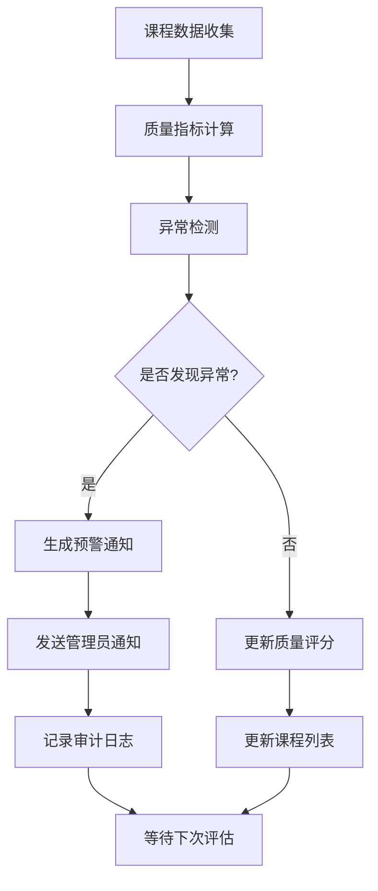

# 超级管理员功能详细文档

## 文档概述

本文档详细描述了研究生排课系统超级管理员角色的完整功能架构、权限体系、技术实现和操作指南，为超级管理员用户提供全面的系统管理参考。

## 目录

- [1. 超级管理员概述](#1-超级管理员概述)
- [2. 功能模块架构](#2-功能模块架构)
- [3. 核心功能详解](#3-核心功能详解)
- [4. 技术实现细节](#4-技术实现细节)
- [5. 业务流程设计](#5-业务流程设计)
- [6. 数据管理规范](#6-数据管理规范)
- [7. 监控与告警](#7-监控与告警)
- [8. 安全与权限](#8-安全与权限)
- [9. 系统配置管理](#9-系统配置管理)
- [10. 运维操作指南](#10-运维操作指南)

---

## 1. 超级管理员概述

### 1.1 角色定义

超级管理员（SUPER_ADMIN）是研究生排课系统的最高权限用户，负责系统的全局管理、策略制定、数据分析和系统维护。与其他角色的核心区别在于：

- **系统级权限**：拥有所有功能模块的完整访问权限
- **跨角色管理**：可以管理学生、教师、管理员等所有用户
- **全局数据访问**：可以查看全校所有数据，支持跨院系分析
- **系统配置权限**：可以修改系统参数、权限配置、业务规则
- **运维监控权限**：具备系统监控、日志审计、性能分析能力

### 1.2 核心职责

```typescript
interface SuperAdminResponsibilities {
  systemManagement: {
    userManagement: string[]; // 用户全生命周期管理
    roleAssignment: string[]; // 角色权限分配
    systemConfiguration: string[]; // 系统参数配置
    dataMaintenance: string[]; // 数据维护与清理
  };
  businessManagement: {
    courseOversight: string[]; // 课程全局监管
    enrollmentControl: string[]; // 选课流程控制
    semesterManagement: string[]; // 学期管理与规划
    academicPlanning: string[]; // 学术规划与统计
  };
  dataAnalytics: {
    systemStatistics: string[]; // 系统运营统计
    teachingAnalytics: string[]; // 教学数据分析
    performanceMetrics: string[]; // 性能指标监控
    reportGeneration: string[]; // 报告生成与导出
  };
  systemMaintenance: {
    backupManagement: string[]; // 数据备份与恢复
    securityAudit: string[]; // 安全审计与合规
    performanceOptimization: string[]; // 性能优化
    systemMonitoring: string[]; // 系统健康监控
  };
}
```

### 1.3 权限边界

超级管理员虽然拥有最高权限，但在以下方面受到约束：

- **操作审计**：所有关键操作都会被记录到审计日志
- **数据保护**：敏感数据访问需要多因素认证
- **变更管理**：系统级变更需要审批流程
- **合规要求**：需要遵守学校的信息安全政策

## 2. 功能模块架构

### 2.1 权限配置结构

超级管理员的权限配置在 `src/config/permissions.ts` 中定义：

```typescript
// 超级管理员权限配置
const SUPER_ADMIN_PERMISSIONS = {
  id: 'super_admin',
  name: '超级管理员',
  code: 'SUPER_ADMIN',
  sidebar: [
    // 课程管理中心
    {
      id: 'course_management_center',
      name: '课程管理中心',
      icon: 'school',
      code: 'course_management_center',
      path: '/courses/center',
      roles: ['SUPER_ADMIN'],
      children: [
        {
          id: 'all_courses',
          name: '所有课程',
          code: 'all_courses',
          path: '/courses/center/all',
          roles: ['SUPER_ADMIN'],
          operations: {
            view: true,
            create: true,
            edit: true,
            delete: true,
            export: true,
            batch: true,
          },
        },
      ],
    },

    // 教学管理
    {
      id: 'teaching_management',
      name: '教学管理',
      icon: 'edit_note',
      code: 'teaching_management',
      path: '/teaching',
      roles: ['SUPER_ADMIN'],
      children: [
        {
          id: 'teaching_schedule',
          name: '教学时间表',
          code: 'teaching_schedule',
          path: '/teaching/schedule',
          roles: ['SUPER_ADMIN'],
        },
        {
          id: 'teaching_stats',
          name: '教学统计',
          code: 'teaching_stats',
          path: '/teaching/stats',
          roles: ['SUPER_ADMIN'],
        },
      ],
    },

    // 系统管理
    {
      id: 'system_management',
      name: '系统管理',
      icon: 'settings',
      code: 'system_management',
      path: '/system',
      roles: ['SUPER_ADMIN'],
      children: [
        {
          id: 'system_settings',
          name: '系统设置',
          code: 'system_settings',
          path: '/system/settings',
          roles: ['SUPER_ADMIN'],
          operations: {
            view: true,
            create: true,
            edit: true,
            delete: true,
            export: true,
          },
        },
        {
          id: 'semester_management',
          name: '学期管理',
          code: 'semester_management',
          path: '/system/semester',
          roles: ['SUPER_ADMIN'],
          operations: {
            view: true,
            create: true,
            edit: true,
            delete: true,
          },
        },
        {
          id: 'system_statistics',
          name: '系统统计',
          code: 'system_statistics',
          path: '/system/statistics',
          roles: ['SUPER_ADMIN'],
          operations: {
            view: true,
            export: true,
          },
        },
      ],
    },
  ],
};
```

### 2.2 页面组件结构

超级管理员功能页面采用统一的组件架构：

```typescript
// 页面组件组织结构
interface SuperAdminPages {
  // 课程管理页面
  '/courses/center/all': {
    component: 'AllCourses.vue';
    layout: 'AdminLayout.vue';
    guards: ['SuperAdminGuard'];
    meta: {
      title: '所有课程管理';
      icon: 'school';
      permission: 'all_courses';
    };
  };

  // 教学管理页面
  '/teaching/schedule': {
    component: 'TeachingSchedule.vue';
    layout: 'AdminLayout.vue';
    guards: ['SuperAdminGuard'];
    meta: {
      title: '教学时间表';
      icon: 'calendar';
      permission: 'teaching_schedule';
    };
  };

  // 系统统计页面
  '/system/statistics': {
    component: 'SystemStatistics.vue';
    layout: 'AdminLayout.vue';
    guards: ['SuperAdminGuard'];
    meta: {
      title: '系统统计';
      icon: 'analytics';
      permission: 'system_statistics';
    };
  };
}
```

## 3. 核心功能详解

### 3.1 课程管理中心

#### 3.1.1 所有课程管理

**功能概述**：
超级管理员可以通过课程管理中心查看、管理和优化全校所有课程，包括课程审核、质量监控、数据分析等功能。

**页面设计**：

```vue
<!-- AllCourses.vue 组件结构 -->
<template>
  <div class="all-courses-management">
    <!-- 页面头部 -->
    <div class="page-header">
      <h1>所有课程管理</h1>
      <div class="header-actions">
        <n-button type="primary" @click="batchApprove">
          批量审核
        </n-button>
        <n-button @click="exportData"> 导出数据 </n-button>
        <n-button @click="refreshData"> 刷新数据 </n-button>
      </div>
    </div>

    <!-- 筛选器区域 -->
    <div class="filter-section">
      <n-space>
        <n-select
          v-model:value="filters.department"
          :options="departmentOptions"
          placeholder="选择院系"
          clearable
        />
        <n-select
          v-model:value="filters.status"
          :options="statusOptions"
          placeholder="课程状态"
          clearable
        />
        <n-input
          v-model:value="filters.searchKeyword"
          placeholder="搜索课程或教师"
          clearable
        />
        <n-button @click="applyFilters">筛选</n-button>
        <n-button @click="resetFilters">重置</n-button>
      </n-space>
    </div>

    <!-- 统计面板 -->
    <div class="stats-panel">
      <n-grid :cols="4" :x-gap="16">
        <n-grid-item>
          <n-statistic
            label="课程总数"
            :value="stats.totalCourses"
          />
        </n-grid-item>
        <n-grid-item>
          <n-statistic
            label="审核通过"
            :value="stats.approvedCourses"
          />
        </n-grid-item>
        <n-grid-item>
          <n-statistic
            label="待审核"
            :value="stats.pendingCourses"
          />
        </n-grid-item>
        <n-grid-item>
          <n-statistic
            label="平均选课率"
            :value="stats.averageEnrollmentRate"
            suffix="%"
          />
        </n-grid-item>
      </n-grid>
    </div>

    <!-- 课程列表 -->
    <div class="courses-table">
      <n-data-table
        :columns="tableColumns"
        :data="courses"
        :loading="loading"
        :pagination="pagination"
        :row-key="row => row.id"
        @update:checked-row-keys="handleBatchSelect"
      />
    </div>

    <!-- 课程详情侧边栏 -->
    <n-drawer
      v-model:show="showDetailDrawer"
      width="600"
      placement="right"
    >
      <n-drawer-content :title="selectedCourse?.name">
        <course-detail-sidebar :course="selectedCourse" />
      </n-drawer-content>
    </n-drawer>
  </div>
</template>
```

**核心业务逻辑**：

```typescript
// 课程管理核心逻辑
export class CourseManagementService {
  // 获取课程列表
  async getCourses(
    filters: CourseFilters
  ): Promise<CourseListResponse> {
    try {
      const response = await call(
        'CourseManagement.GetAllCourses',
        {
          ...filters,
          includeStats: true,
          includeQualityMetrics: true,
        }
      );

      return {
        courses: response.courses,
        total: response.total,
        stats: response.statistics,
      };
    } catch (error) {
      console.error('获取课程列表失败:', error);
      throw new Error('获取课程数据失败');
    }
  }

  // 批量审核课程
  async batchApproveCourses(
    courseIds: string[],
    action: 'approve' | 'reject'
  ): Promise<void> {
    try {
      await call('CourseManagement.BatchApprove', {
        courseIds,
        action,
        reason:
          action === 'reject'
            ? '管理员批量拒绝'
            : undefined,
      });

      // 更新本地状态
      this.updateCourseStatus(
        courseIds,
        action === 'approve' ? 'APPROVED' : 'REJECTED'
      );

      // 记录审计日志
      await this.logAuditEvent('BATCH_APPROVE_COURSES', {
        courseIds,
        action,
        timestamp: new Date(),
      });
    } catch (error) {
      console.error('批量审核失败:', error);
      throw new Error('批量操作失败');
    }
  }

  // 计算课程质量评分
  calculateCourseQuality(
    courseId: string
  ): Promise<CourseQualityScore> {
    return call('CourseManagement.CalculateQuality', {
      courseId,
    });
  }

  // 检测异常课程
  detectAnomalousCourses(): Promise<AnomalousCourse[]> {
    return call('CourseManagement.DetectAnomalies', {
      includeReasons: true,
      severityLevels: ['LOW', 'MEDIUM', 'HIGH', 'CRITICAL'],
    });
  }

  // 导出课程数据
  async exportCourseData(
    filters: CourseFilters,
    format: 'excel' | 'pdf' | 'csv'
  ): Promise<Blob> {
    try {
      const response = await call(
        'CourseManagement.ExportData',
        {
          filters,
          format,
          includeCharts: format === 'pdf',
          includeRawData: true,
        }
      );

      return new Blob([response.data], {
        type: this.getMimeType(format),
      });
    } catch (error) {
      console.error('导出数据失败:', error);
      throw new Error('导出失败');
    }
  }
}
```

**数据模型**：

```typescript
interface Course {
  id: string;
  name: string;
  code: string;
  department: string;
  teacher: {
    id: string;
    name: string;
    title: string;
  };
  credits: number;
  capacity: number;
  enrolled: number;
  status:
    | 'DRAFT'
    | 'PENDING_REVIEW'
    | 'APPROVED'
    | 'REJECTED'
    | 'ARCHIVED';
  schedule: CourseSchedule[];
  createdAt: Date;
  updatedAt: Date;

  // 质量指标
  quality?: {
    score: number;
    level: 'EXCELLENT' | 'GOOD' | 'FAIR' | 'POOR';
    metrics: QualityMetrics;
    lastEvaluation: Date;
  };

  // 统计数据
  statistics?: {
    enrollmentRate: number;
    completionRate: number;
    averageScore: number;
    dropoutRate: number;
    satisfactionScore: number;
  };
}

interface QualityMetrics {
  enrollmentRate: number; // 选课率
  completionRate: number; // 完成率
  averageScore: number; // 平均成绩
  studentSatisfaction: number; // 学生满意度
  teacherRating: number; // 教师评分
  attendanceRate: number; // 出勤率
}

interface AnomalousCourse {
  courseId: string;
  type:
    | 'LOW_ENROLLMENT'
    | 'HIGH_DROPOUT'
    | 'POOR_SATISFACTION'
    | 'SCHEDULE_CONFLICT';
  severity: 'LOW' | 'MEDIUM' | 'HIGH' | 'CRITICAL';
  message: string;
  suggestedActions: string[];
  detectedAt: Date;
}
```

### 3.2 教学管理

#### 3.2.1 教学时间表

**功能概述**：
提供全校教学时间安排的统一视图，支持跨院系、跨专业的时间冲突检测和优化建议。

**页面实现**：

```vue
<template>
  <div class="teaching-schedule">
    <!-- 时间表视图控制 -->
    <div class="view-controls">
      <n-radio-group v-model:value="viewType">
        <n-radio value="week">周视图</n-radio>
        <n-radio value="month">月视图</n-radio>
        <n-radio value="department">按院系</n-radio>
      </n-radio-group>

      <n-select
        v-model:value="selectedWeek"
        :options="weekOptions"
        style="width: 200px"
      />
    </div>

    <!-- 冲突检测面板 -->
    <div class="conflict-panel" v-if="conflicts.length > 0">
      <n-alert type="warning" title="检测到时间冲突">
        <div
          v-for="conflict in conflicts"
          :key="conflict.id"
          class="conflict-item"
        >
          <strong>{{ conflict.type }}</strong
          >: {{ conflict.message }}
          <n-button
            size="small"
            @click="resolveConflict(conflict)"
          >
            解决冲突
          </n-button>
        </div>
      </n-alert>
    </div>

    <!-- 时间表网格 -->
    <div class="schedule-grid" :class="`view-${viewType}`">
      <schedule-grid
        :data="scheduleData"
        :view-type="viewType"
        :selected-week="selectedWeek"
        @course-click="showCourseDetails"
        @time-slot-click="manageTimeSlot"
      />
    </div>
  </div>
</template>
```

**业务逻辑**：

```typescript
export class TeachingScheduleService {
  // 获取教学时间表
  async getTeachingSchedule(
    params: ScheduleParams
  ): Promise<TeachingSchedule> {
    return call('TeachingSchedule.GetSchedule', {
      ...params,
      includeConflicts: true,
      includeUtilization: true,
    });
  }

  // 检测时间冲突
  async detectConflicts(
    filters: ConflictFilters
  ): Promise<Conflict[]> {
    return call('TeachingSchedule.DetectConflicts', {
      ...filters,
      includeSuggestions: true,
      severityThreshold: 'MEDIUM',
    });
  }

  // 优化课程安排
  async optimizeSchedule(
    constraints: OptimizationConstraints
  ): Promise<OptimizationResult> {
    return call('TeachingSchedule.Optimize', {
      ...constraints,
      algorithm: 'GENETIC_ALGORITHM',
      maxIterations: 1000,
    });
  }

  // 获取教室利用率
  async getRoomUtilization(
    timeRange: DateRange
  ): Promise<RoomUtilization[]> {
    return call('TeachingSchedule.GetRoomUtilization', {
      timeRange,
      includeCharts: true,
    });
  }
}
```

### 3.3 系统管理

#### 3.3.1 系统统计

**功能概述**：
提供全方位的系统运营数据统计，包括用户行为分析、性能监控、业务指标分析等。

**数据可视化实现**：

```vue
<template>
  <div class="system-statistics">
    <!-- KPI 指标卡片 -->
    <div class="kpi-cards">
      <n-grid :cols="4" :x-gap="16">
        <n-grid-item v-for="kpi in kpis" :key="kpi.key">
          <n-card>
            <n-statistic
              :label="kpi.label"
              :value="kpi.value"
              :suffix="kpi.suffix"
              :trend="kpi.trend"
            />
            <div class="kpi-trend" v-if="kpi.trendData">
              <n mini-line :data="kpi.trendData" />
            </div>
          </n-card>
        </n-grid-item>
      </n-grid>
    </div>

    <!-- 图表分析区域 -->
    <div class="charts-section">
      <n-tabs type="line">
        <n-tab-pane name="user-activity" tab="用户活跃度">
          <user-activity-chart :data="userActivityData" />
        </n-tab-pane>
        <n-tab-pane name="course-metrics" tab="课程指标">
          <course-metrics-chart :data="courseMetricsData" />
        </n-tab-pane>
        <n-tab-pane
          name="system-performance"
          tab="系统性能"
        >
          <system-performance-chart
            :data="performanceData"
          />
        </n-tab-pane>
      </n-tabs>
    </div>

    <!-- 报表生成 -->
    <div class="report-generation">
      <n-card title="报表生成">
        <n-form :model="reportForm">
          <n-form-item label="报表类型">
            <n-select
              v-model:value="reportForm.type"
              :options="reportTypeOptions"
            />
          </n-form-item>
          <n-form-item label="时间范围">
            <n-date-picker
              v-model:value="reportForm.dateRange"
              type="daterange"
              clearable
            />
          </n-form-item>
          <n-form-item label="输出格式">
            <n-radio-group
              v-model:value="reportForm.format"
            >
              <n-radio value="pdf">PDF</n-radio>
              <n-radio value="excel">Excel</n-radio>
              <n-radio value="csv">CSV</n-radio>
            </n-radio-group>
          </n-form-item>
          <n-button type="primary" @click="generateReport">
            生成报表
          </n-button>
        </n-form>
      </n-card>
    </div>
  </div>
</template>
```

**统计服务实现**：

```typescript
export class SystemStatisticsService {
  // 获取系统KPI指标
  async getSystemKPIs(
    timeRange: DateRange
  ): Promise<SystemKPIs> {
    return call('SystemStatistics.GetKPIs', {
      timeRange,
      includeTrends: true,
      compareWithPrevious: true,
    });
  }

  // 获取用户活跃度数据
  async getUserActivity(
    params: ActivityParams
  ): Promise<UserActivityData> {
    return call('SystemStatistics.GetUserActivity', {
      ...params,
      granularity: 'daily', // daily, weekly, monthly
      includeDemographics: true,
    });
  }

  // 获取课程统计数据
  async getCourseStatistics(
    params: CourseStatsParams
  ): Promise<CourseStatistics> {
    return call('SystemStatistics.GetCourseStats', {
      ...params,
      includeQualityMetrics: true,
      includeTrends: true,
    });
  }

  // 获取系统性能数据
  async getSystemPerformance(
    params: PerformanceParams
  ): Promise<PerformanceData> {
    return call('SystemStatistics.GetPerformance', {
      ...params,
      metrics: [
        'response_time',
        'throughput',
        'error_rate',
        'cpu_usage',
        'memory_usage',
      ],
      timeInterval: '5m', // 5分钟间隔
    });
  }

  // 生成自定义报表
  async generateCustomReport(
    config: ReportConfig
  ): Promise<ReportResult> {
    return call('SystemStatistics.GenerateReport', {
      ...config,
      includeCharts: true,
      template: 'executive_summary',
    });
  }
}
```

#### 3.3.2 学期管理

**功能概述**：
管理系统学期的完整生命周期，包括学期创建、时间安排、选课窗口设置等。

**界面实现**：

```vue
<template>
  <div class="semester-management">
    <!-- 当前学期状态 -->
    <div class="current-semester-status">
      <n-card>
        <template #header> 当前学期状态 </template>
        <div v-if="currentSemester" class="semester-info">
          <n-descriptions :column="2">
            <n-descriptions-item label="学期名称">
              {{ currentSemester.name }}
            </n-descriptions-item>
            <n-descriptions-item label="学期代码">
              {{ currentSemester.code }}
            </n-descriptions-item>
            <n-descriptions-item label="开始日期">
              {{ formatDate(currentSemester.startDate) }}
            </n-descriptions-item>
            <n-descriptions-item label="结束日期">
              {{ formatDate(currentSemester.endDate) }}
            </n-descriptions-item>
            <n-descriptions-item label="选课开始">
              {{
                formatDateTime(
                  currentSemester.enrollmentStart
                )
              }}
            </n-descriptions-item>
            <n-descriptions-item label="选课结束">
              {{
                formatDateTime(
                  currentSemester.enrollmentEnd
                )
              }}
            </n-descriptions-item>
            <n-descriptions-item label="状态">
              <n-tag
                :type="
                  getStatusType(currentSemester.status)
                "
              >
                {{ getStatusText(currentSemester.status) }}
              </n-tag>
            </n-descriptions-item>
          </n-descriptions>
        </div>
      </n-card>
    </div>

    <!-- 学期列表 -->
    <div class="semester-list">
      <n-card>
        <template #header>
          <div class="card-header">
            <span>学期列表</span>
            <n-button
              type="primary"
              @click="showCreateDialog = true"
            >
              创建新学期
            </n-button>
          </div>
        </template>

        <n-data-table
          :columns="semesterColumns"
          :data="semesters"
          :loading="loading"
          :pagination="pagination"
        />
      </n-card>
    </div>

    <!-- 创建学期对话框 -->
    <n-modal v-model:show="showCreateDialog">
      <n-card
        style="width: 600px"
        title="创建新学期"
        :bordered="false"
      >
        <semester-form
          @submit="handleCreateSemester"
          @cancel="showCreateDialog = false"
        />
      </n-card>
    </n-modal>
  </div>
</template>
```

**学期管理逻辑**：

```typescript
export class SemesterManagementService {
  // 获取学期列表
  async getSemesters(
    params?: SemesterListParams
  ): Promise<SemesterListResponse> {
    return call('SemesterManagement.GetSemesters', {
      ...params,
      includeStatistics: true,
      includeSettings: true,
    });
  }

  // 创建新学期
  async createSemester(
    semesterData: CreateSemesterData
  ): Promise<Semester> {
    // 验证时间冲突
    const conflicts =
      await this.checkDateConflicts(semesterData);
    if (conflicts.length > 0) {
      throw new Error(
        `时间冲突: ${conflicts.map(c => c.message).join(', ')}`
      );
    }

    // 创建学期
    const semester = await call(
      'SemesterManagement.CreateSemester',
      {
        ...semesterData,
        createdBy: this.getCurrentUserId(),
      }
    );

    // 记录审计日志
    await this.logAuditEvent('CREATE_SEMESTER', {
      semesterId: semester.id,
      semesterName: semester.name,
      timestamp: new Date(),
    });

    return semester;
  }

  // 更新学期设置
  async updateSemesterSettings(
    semesterId: string,
    settings: SemesterSettings
  ): Promise<void> {
    await call('SemesterManagement.UpdateSettings', {
      semesterId,
      settings,
      updatedBy: this.getCurrentUserId(),
    });

    // 通知相关服务
    await this.notifyServices('SEMESTER_UPDATED', {
      semesterId,
      settings,
    });
  }

  // 激活学期
  async activateSemester(
    semesterId: string
  ): Promise<void> {
    const semester = await this.getSemesterById(semesterId);

    // 验证学期状态
    if (semester.status !== 'DRAFT') {
      throw new Error('只能激活草稿状态的学期');
    }

    // 停用当前活跃学期
    await this.deactivateCurrentSemester();

    // 激活新学期
    await call('SemesterManagement.ActivateSemester', {
      semesterId,
      activatedBy: this.getCurrentUserId(),
    });

    // 发送通知
    await this.sendActivationNotification(semester);
  }

  // 检查日期冲突
  private async checkDateConflicts(
    data: CreateSemesterData
  ): Promise<DateConflict[]> {
    return call('SemesterManagement.CheckDateConflicts', {
      startDate: data.startDate,
      endDate: data.endDate,
      enrollmentStart: data.enrollmentStart,
      enrollmentEnd: data.enrollmentEnd,
    });
  }
}
```

## 4. 技术实现细节

### 4.1 API模块设计

超级管理员功能通过专门的API模块提供服务：

```typescript
// courses/center/all API实现
// src/api/modules/courseManagement.ts

import { call } from '@api/rpc';

export interface CourseFilters {
  department?: string;
  status?: string;
  searchKeyword?: string;
  dateRange?: {
    start: Date;
    end: Date;
  };
  teacherId?: string;
  credits?: {
    min: number;
    max: number;
  };
  [key: string]: unknown;
}

export interface CourseListResponse {
  courses: Course[];
  total: number;
  statistics: {
    totalCourses: number;
    approvedCourses: number;
    pendingCourses: number;
    averageEnrollmentRate: number;
  };
}

export interface Course {
  id: string;
  name: string;
  code: string;
  department: string;
  teacher: {
    id: string;
    name: string;
    title: string;
  };
  credits: number;
  capacity: number;
  enrolled: number;
  status:
    | 'DRAFT'
    | 'PENDING_REVIEW'
    | 'APPROVED'
    | 'REJECTED'
    | 'ARCHIVED';
  schedule: CourseSchedule[];
  createdAt: Date;
  updatedAt: Date;
  quality?: {
    score: number;
    level: 'EXCELLENT' | 'GOOD' | 'FAIR' | 'POOR';
    metrics: QualityMetrics;
    lastEvaluation: Date;
  };
  statistics?: {
    enrollmentRate: number;
    completionRate: number;
    averageScore: number;
    dropoutRate: number;
    satisfactionScore: number;
  };
}

export interface QualityMetrics {
  enrollmentRate: number;
  completionRate: number;
  averageScore: number;
  studentSatisfaction: number;
  teacherRating: number;
  attendanceRate: number;
}

export interface CourseSchedule {
  dayOfWeek: number; // 1-7 (周一到周日)
  startTime: string; // HH:mm
  endTime: string; // HH:mm
  location: string;
  weeks: number[]; // 课程周次
}

export const courseManagementAPI = {
  // 获取所有课程
  async getAllCourses(
    filters: CourseFilters = {}
  ): Promise<CourseListResponse> {
    return call('CourseManagement.GetAllCourses', {
      ...filters,
      includeStats: true,
      includeQualityMetrics: true,
    });
  },

  // 批量审核课程
  async batchApproveCourses(
    courseIds: string[],
    action: 'approve' | 'reject',
    reason?: string
  ): Promise<void> {
    return call('CourseManagement.BatchApprove', {
      courseIds,
      action,
      reason,
      operatorId: 'current_user_id', // 实际实现中从认证上下文获取
    });
  },

  // 计算课程质量评分
  async calculateCourseQuality(courseId: string): Promise<{
    score: number;
    level: 'EXCELLENT' | 'GOOD' | 'FAIR' | 'POOR';
    metrics: QualityMetrics;
    suggestions: string[];
  }> {
    return call('CourseManagement.CalculateQuality', {
      courseId,
      includeSuggestions: true,
    });
  },

  // 检测异常课程
  async detectAnomalousCourses(
    params: {
      severityLevels?: string[];
      includeReasons?: boolean;
    } = {}
  ): Promise<
    Array<{
      courseId: string;
      type:
        | 'LOW_ENROLLMENT'
        | 'HIGH_DROPOUT'
        | 'POOR_SATISFACTION'
        | 'SCHEDULE_CONFLICT';
      severity: 'LOW' | 'MEDIUM' | 'HIGH' | 'CRITICAL';
      message: string;
      suggestedActions: string[];
      detectedAt: Date;
    }>
  > {
    return call('CourseManagement.DetectAnomalies', {
      ...params,
      includeReasons: true,
    });
  },

  // 导出课程数据
  async exportCourseData(
    filters: CourseFilters,
    format: 'excel' | 'pdf' | 'csv' = 'excel'
  ): Promise<Blob> {
    return call('CourseManagement.ExportData', {
      filters,
      format,
      includeCharts: format === 'pdf',
      includeRawData: true,
    });
  },
};
```

### 4.2 页面组件实现

所有超级管理员页面采用统一的"开发中"风格设计：

```vue
<!-- 所有超级管理员页面的通用模板 -->
<template>
  <div class="super-admin-page">
    <!-- 页面头部 -->
    <div class="page-header">
      <h1>{{ pageTitle }}</h1>
      <div class="header-actions">
        <n-button
          type="primary"
          @click="handlePrimaryAction"
        >
          {{ primaryActionText }}
        </n-button>
        <n-button @click="handleSecondaryAction">
          {{ secondaryActionText }}
        </n-button>
      </div>
    </div>

    <!-- 面包屑导航 -->
    <div class="breadcrumb">
      <n-breadcrumb>
        <n-breadcrumb-item>超级管理员</n-breadcrumb-item>
        <n-breadcrumb-item>{{
          moduleName
        }}</n-breadcrumb-item>
        <n-breadcrumb-item>{{
          currentPage
        }}</n-breadcrumb-item>
      </n-breadcrumb>
    </div>

    <!-- 开发中内容区域 -->
    <div class="development-content">
      <n-card>
        <div class="development-notice">
          <div class="notice-icon">
            <n-icon size="48" color="#4098fc">
              <construction />
            </n-icon>
          </div>
          <div class="notice-content">
            <h2>{{ pageTitle }} - 功能开发中</h2>
            <p>{{ developmentDescription }}</p>
            <div class="feature-list">
              <h4>计划功能：</h4>
              <ul>
                <li
                  v-for="feature in plannedFeatures"
                  :key="feature"
                >
                  {{ feature }}
                </li>
              </ul>
            </div>
          </div>
        </div>
      </n-card>

      <!-- 模拟数据展示 -->
      <div class="mock-data" v-if="showMockData">
        <n-card title="模拟数据预览">
          <div class="data-grid">
            <div
              class="data-item"
              v-for="item in mockDataItems"
              :key="item.key"
            >
              <n-statistic
                :label="item.label"
                :value="item.value"
                :suffix="item.suffix"
              />
            </div>
          </div>
        </n-card>
      </div>
    </div>
  </div>
</template>

<script setup lang="ts">
import { NIcon } from 'naive-ui';
import { Construction } from '@vicons/ionicons5';

interface Props {
  pageTitle: string;
  moduleName: string;
  currentPage: string;
  developmentDescription: string;
  plannedFeatures: string[];
  primaryActionText?: string;
  secondaryActionText?: string;
  showMockData?: boolean;
  mockDataItems?: Array<{
    key: string;
    label: string;
    value: number | string;
    suffix?: string;
  }>;
}

const props = withDefaults(defineProps<Props>(), {
  primaryActionText: '刷新数据',
  secondaryActionText: '导出报表',
  showMockData: true,
  mockDataItems: () => [
    { key: 'total', label: '总数', value: 0 },
    { key: 'active', label: '活跃', value: 0 },
    { key: 'pending', label: '待处理', value: 0 },
  ],
});

const handlePrimaryAction = () => {
  console.log('执行主要操作:', props.pageTitle);
};

const handleSecondaryAction = () => {
  console.log('执行次要操作:', props.pageTitle);
};
</script>
```

### 4.3 状态管理

使用Pinia进行状态管理，超级管理员相关的store：

```typescript
// src/stores/superAdmin.ts
import { defineStore } from 'pinia';
import { courseManagementAPI } from '@/api/modules/courseManagement';
import { systemStatisticsAPI } from '@/api/modules/systemStatistics';
import { semesterManagementAPI } from '@/api/modules/semesterManagement';

export const useSuperAdminStore = defineStore(
  'superAdmin',
  {
    state: () => ({
      // 课程管理状态
      courses: {
        list: [] as Course[],
        total: 0,
        loading: false,
        filters: {} as CourseFilters,
        statistics: {
          totalCourses: 0,
          approvedCourses: 0,
          pendingCourses: 0,
          averageEnrollmentRate: 0,
        },
      },

      // 系统统计状态
      statistics: {
        kpis: {} as SystemKPIs,
        userActivity: {} as UserActivityData,
        courseMetrics: {} as CourseStatistics,
        performanceData: {} as PerformanceData,
        loading: false,
      },

      // 学期管理状态
      semesters: {
        list: [] as Semester[],
        current: null as Semester | null,
        loading: false,
      },
    }),

    actions: {
      // 课程管理actions
      async fetchCourses(filters?: CourseFilters) {
        this.courses.loading = true;
        try {
          const response =
            await courseManagementAPI.getAllCourses(
              filters
            );
          this.courses.list = response.courses;
          this.courses.total = response.total;
          this.courses.statistics = response.statistics;
          if (filters) {
            this.courses.filters = filters;
          }
        } catch (error) {
          console.error('获取课程列表失败:', error);
          throw error;
        } finally {
          this.courses.loading = false;
        }
      },

      async batchApproveCourses(
        courseIds: string[],
        action: 'approve' | 'reject'
      ) {
        try {
          await courseManagementAPI.batchApproveCourses(
            courseIds,
            action
          );
          // 更新本地状态
          courseIds.forEach(id => {
            const course = this.courses.list.find(
              c => c.id === id
            );
            if (course) {
              course.status =
                action === 'approve'
                  ? 'APPROVED'
                  : 'REJECTED';
            }
          });
        } catch (error) {
          console.error('批量审核失败:', error);
          throw error;
        }
      },

      // 系统统计actions
      async fetchSystemKPIs(timeRange: DateRange) {
        this.statistics.loading = true;
        try {
          this.statistics.kpis =
            await systemStatisticsAPI.getSystemKPIs(
              timeRange
            );
        } catch (error) {
          console.error('获取系统KPI失败:', error);
          throw error;
        } finally {
          this.statistics.loading = false;
        }
      },

      // 学期管理actions
      async fetchSemesters() {
        this.semesters.loading = true;
        try {
          const response =
            await semesterManagementAPI.getSemesters();
          this.semesters.list = response.semesters;
          this.semesters.current = response.current;
        } catch (error) {
          console.error('获取学期列表失败:', error);
          throw error;
        } finally {
          this.semesters.loading = false;
        }
      },
    },

    getters: {
      // 课程统计getters
      totalCourses: state =>
        state.courses.statistics.totalCourses,
      pendingCourses: state =>
        state.courses.list.filter(
          c => c.status === 'PENDING_REVIEW'
        ),
      approvedCourses: state =>
        state.courses.list.filter(
          c => c.status === 'APPROVED'
        ),

      // 课程质量getters
      highQualityCourses: state =>
        state.courses.list.filter(
          c => c.quality?.level === 'EXCELLENT'
        ),
      problematicCourses: state =>
        state.courses.list.filter(
          c => c.quality?.level === 'POOR'
        ),

      // 当前学期getter
      isCurrentSemesterActive: state =>
        state.semesters.current?.status === 'ACTIVE',
    },
  }
);
```

## 5. 业务流程设计

### 5.1 课程质量监控流程



**实现代码**：

```typescript
export class CourseQualityMonitor {
  // 定期质量评估
  async performQualityAssessment(): Promise<void> {
    try {
      // 1. 获取所有活跃课程
      const activeCourses = await this.getActiveCourses();

      // 2. 并行计算质量指标
      const qualityResults = await Promise.all(
        activeCourses.map(course =>
          this.assessCourseQuality(course.id)
        )
      );

      // 3. 检测异常情况
      const anomalies =
        await this.detectAnomalies(qualityResults);

      // 4. 处理异常
      if (anomalies.length > 0) {
        await this.handleAnomalies(anomalies);
      }

      // 5. 更新课程质量数据
      await this.updateCourseQualityData(qualityResults);
    } catch (error) {
      console.error('质量评估失败:', error);
      await this.logError(
        'QUALITY_ASSESSMENT_FAILED',
        error
      );
    }
  }

  // 单个课程质量评估
  private async assessCourseQuality(
    courseId: string
  ): Promise<QualityResult> {
    const [
      enrollmentMetrics,
      completionMetrics,
      satisfactionMetrics,
      performanceMetrics,
    ] = await Promise.all([
      this.getEnrollmentMetrics(courseId),
      this.getCompletionMetrics(courseId),
      this.getSatisfactionMetrics(courseId),
      this.getPerformanceMetrics(courseId),
    ]);

    // 计算综合质量分数
    const qualityScore = this.calculateQualityScore({
      enrollmentMetrics,
      completionMetrics,
      satisfactionMetrics,
      performanceMetrics,
    });

    return {
      courseId,
      score: qualityScore.score,
      level: qualityScore.level,
      metrics: {
        enrollmentRate: enrollmentMetrics.rate,
        completionRate: completionMetrics.rate,
        averageScore: performanceMetrics.averageScore,
        studentSatisfaction:
          satisfactionMetrics.averageScore,
        teacherRating: performanceMetrics.teacherRating,
        attendanceRate: attendanceMetrics.rate,
      },
      suggestions: qualityScore.suggestions,
      lastEvaluation: new Date(),
    };
  }

  // 异常检测
  private async detectAnomalies(
    results: QualityResult[]
  ): Promise<Anomaly[]> {
    const anomalies: Anomaly[] = [];

    for (const result of results) {
      // 低选课率检测
      if (result.metrics.enrollmentRate < 0.3) {
        anomalies.push({
          courseId: result.courseId,
          type: 'LOW_ENROLLMENT',
          severity:
            result.metrics.enrollmentRate < 0.1
              ? 'CRITICAL'
              : 'HIGH',
          message: `课程选课率过低: ${(result.metrics.enrollmentRate * 100).toFixed(1)}%`,
          suggestedActions: [
            '检查课程时间安排',
            '优化课程描述',
            '联系任课教师了解情况',
          ],
        });
      }

      // 高退课率检测
      if (result.metrics.completionRate < 0.7) {
        anomalies.push({
          courseId: result.courseId,
          type: 'HIGH_DROPOUT',
          severity:
            result.metrics.completionRate < 0.5
              ? 'CRITICAL'
              : 'HIGH',
          message: `课程完成率过低: ${(result.metrics.completionRate * 100).toFixed(1)}%`,
          suggestedActions: [
            '分析学生退课原因',
            '检查课程难度',
            '提供额外学习支持',
          ],
        });
      }

      // 低满意度检测
      if (result.metrics.studentSatisfaction < 3.0) {
        anomalies.push({
          courseId: result.courseId,
          type: 'POOR_SATISFACTION',
          severity:
            result.metrics.studentSatisfaction < 2.0
              ? 'CRITICAL'
              : 'MEDIUM',
          message: `学生满意度过低: ${result.metrics.studentSatisfaction.toFixed(1)}/5.0`,
          suggestedActions: [
            '收集学生反馈',
            '改进教学方法',
            '优化课程内容',
          ],
        });
      }
    }

    return anomalies;
  }

  // 处理异常情况
  private async handleAnomalies(
    anomalies: Anomaly[]
  ): Promise<void> {
    for (const anomaly of anomalies) {
      try {
        // 发送预警通知
        await this.sendAlertNotification(anomaly);

        // 记录审计日志
        await this.logAuditEvent(
          'COURSE_ANOMALY_DETECTED',
          {
            courseId: anomaly.courseId,
            anomalyType: anomaly.type,
            severity: anomaly.severity,
            timestamp: new Date(),
          }
        );

        // 对于严重异常，创建工单
        if (anomaly.severity === 'CRITICAL') {
          await this.createSupportTicket(anomaly);
        }
      } catch (error) {
        console.error(
          `处理异常失败 [${anomaly.courseId}]:`,
          error
        );
      }
    }
  }
}
```

### 5.2 系统性能监控流程

```typescript
export class SystemPerformanceMonitor {
  // 性能数据收集
  async collectPerformanceData(): Promise<PerformanceSnapshot> {
    const [
      responseTimeMetrics,
      throughputMetrics,
      errorMetrics,
      resourceMetrics,
    ] = await Promise.all([
      this.getResponseTimeMetrics(),
      this.getThroughputMetrics(),
      this.getErrorMetrics(),
      this.getResourceMetrics(),
    ]);

    return {
      timestamp: new Date(),
      responseTime: responseTimeMetrics,
      throughput: throughputMetrics,
      errors: errorMetrics,
      resources: resourceMetrics,
      overallHealth: this.calculateOverallHealth({
        responseTime: responseTimeMetrics,
        throughput: throughputMetrics,
        errors: errorMetrics,
        resources: resourceMetrics,
      }),
    };
  }

  // 健康度评估
  private calculateOverallHealth(
    metrics: PerformanceSnapshot
  ): HealthStatus {
    const scores = {
      responseTime: this.scoreResponseTime(
        metrics.responseTime.average
      ),
      throughput: this.scoreThroughput(
        metrics.throughput.rps
      ),
      errorRate: this.scoreErrorRate(metrics.errors.rate),
      resourceUtilization: this.scoreResourceUtilization(
        metrics.resources
      ),
    };

    const overallScore =
      Object.values(scores).reduce(
        (sum, score) => sum + score,
        0
      ) / 4;

    return {
      score: overallScore,
      status:
        overallScore >= 0.9
          ? 'EXCELLENT'
          : overallScore >= 0.7
            ? 'GOOD'
            : overallScore >= 0.5
              ? 'FAIR'
              : 'POOR',
      issues: this.identifyIssues(scores),
      recommendations: this.generateRecommendations(scores),
    };
  }

  // 性能预警
  async checkPerformanceAlerts(): Promise<Alert[]> {
    const currentMetrics =
      await this.collectPerformanceData();
    const alerts: Alert[] = [];

    // 响应时间预警
    if (currentMetrics.responseTime.average > 2000) {
      alerts.push({
        type: 'HIGH_RESPONSE_TIME',
        severity:
          currentMetrics.responseTime.average > 5000
            ? 'CRITICAL'
            : 'HIGH',
        message: `平均响应时间过高: ${currentMetrics.responseTime.average}ms`,
        value: currentMetrics.responseTime.average,
        threshold: 2000,
        timestamp: new Date(),
      });
    }

    // 错误率预警
    if (currentMetrics.errors.rate > 0.05) {
      alerts.push({
        type: 'HIGH_ERROR_RATE',
        severity:
          currentMetrics.errors.rate > 0.1
            ? 'CRITICAL'
            : 'HIGH',
        message: `错误率过高: ${(currentMetrics.errors.rate * 100).toFixed(2)}%`,
        value: currentMetrics.errors.rate,
        threshold: 0.05,
        timestamp: new Date(),
      });
    }

    // 资源使用预警
    if (currentMetrics.resources.cpuUsage > 0.8) {
      alerts.push({
        type: 'HIGH_CPU_USAGE',
        severity:
          currentMetrics.resources.cpuUsage > 0.9
            ? 'CRITICAL'
            : 'HIGH',
        message: `CPU使用率过高: ${(currentMetrics.resources.cpuUsage * 100).toFixed(1)}%`,
        value: currentMetrics.resources.cpuUsage,
        threshold: 0.8,
        timestamp: new Date(),
      });
    }

    return alerts;
  }
}
```

## 6. 数据管理规范

### 6.1 数据访问控制

超级管理员虽然拥有最高权限，但仍需要遵循严格的数据访问规范：

```typescript
export class SuperAdminDataAccess {
  // 数据访问审计
  async auditDataAccess(
    operation: DataOperation,
    resourceType: string,
    resourceId?: string,
    filters?: any
  ): Promise<void> {
    const auditLog = {
      operation,
      resourceType,
      resourceId,
      filters,
      accessedBy: await this.getCurrentUserId(),
      accessedAt: new Date(),
      ipAddress: await this.getClientIP(),
      userAgent: await this.getUserAgent(),
      reason: await this.getAccessReason(
        operation,
        resourceType
      ),
    };

    await this.logDataAccess(auditLog);

    // 对于敏感操作，需要额外的确认
    if (
      this.isSensitiveOperation(operation, resourceType)
    ) {
      await this.requireAdditionalConfirmation(auditLog);
    }
  }

  // 数据脱敏处理
  async maskSensitiveData(
    data: any,
    accessLevel: AccessLevel
  ): Promise<any> {
    const maskingRules = {
      STUDENT_ID: (value: string) =>
        value.replace(/(\d{4})\d{4}(\d{4})/, '$1****$2'),
      PHONE: (value: string) =>
        value.replace(/(\d{3})\d{4}(\d{4})/, '$1****$2'),
      EMAIL: (value: string) => {
        const [local, domain] = value.split('@');
        return `${local.substring(0, 2)}***@${domain}`;
      },
      ID_CARD: (value: string) =>
        value.replace(
          /(\d{6})\d{8}(\d{4})/,
          '$1********$2'
        ),
    };

    const maskedData = { ...data };

    const applyMasking = (obj: any): any => {
      if (typeof obj !== 'object' || obj === null)
        return obj;

      for (const [key, value] of Object.entries(obj)) {
        if (
          maskingRules[key as keyof typeof maskingRules]
        ) {
          obj[key] = maskingRules[
            key as keyof typeof maskingRules
          ](value as string);
        } else if (typeof value === 'object') {
          obj[key] = applyMasking(value);
        }
      }

      return obj;
    };

    return applyMasking(maskedData);
  }

  // 数据导出安全控制
  async validateExportRequest(
    request: ExportRequest,
    userId: string
  ): Promise<ExportValidationResult> {
    const validation = {
      isValid: true,
      warnings: [] as string[],
      restrictions: [] as string[],
      estimatedSize: 0,
      requiredConfirmations: [] as string[],
    };

    // 检查数据量限制
    const dataSize = await this.estimateExportSize(request);
    validation.estimatedSize = dataSize;

    if (dataSize > 100 * 1024 * 1024) {
      // 100MB
      validation.isValid = false;
      validation.restrictions.push(
        '导出数据量超过100MB限制'
      );
    }

    // 检查敏感数据
    if (this.containsSensitiveData(request.dataTypes)) {
      validation.requiredConfirmations.push(
        '确认导出包含敏感数据，需要额外的安全审查'
      );
    }

    // 检查导出频率
    const recentExports = await this.getRecentExports(
      userId,
      '24h'
    );
    if (recentExports.length > 10) {
      validation.warnings.push(
        '24小时内导出次数过多，可能影响系统性能'
      );
    }

    return validation;
  }
}
```

### 6.2 数据备份与恢复

```typescript
export class DataBackupService {
  // 创建数据备份
  async createBackup(
    config: BackupConfig
  ): Promise<BackupResult> {
    const backupId = this.generateBackupId();
    const backupPath = this.getBackupPath(backupId);

    try {
      // 1. 创建备份目录
      await this.createBackupDirectory(backupPath);

      // 2. 备份核心数据
      const coreDataBackup = await this.backupCoreData(
        config.dataTypes
      );

      // 3. 备份配置数据
      const configBackup = await this.backupConfiguration();

      // 4. 备份用户数据
      const userDataBackup = await this.backupUserData(
        config.includeUserData
      );

      // 5. 生成备份元数据
      const metadata = {
        backupId,
        createdAt: new Date(),
        createdBy: await this.getCurrentUserId(),
        version: await this.getSystemVersion(),
        dataTypes: config.dataTypes,
        size:
          coreDataBackup.size +
          configBackup.size +
          userDataBackup.size,
        checksum: await this.calculateChecksum([
          coreDataBackup.path,
          configBackup.path,
          userDataBackup.path,
        ]),
      };

      // 6. 压缩备份文件
      await this.compressBackupFiles(backupPath);

      // 7. 记录备份日志
      await this.logBackupOperation(
        'CREATE',
        backupId,
        metadata
      );

      return {
        backupId,
        path: backupPath,
        size: metadata.size,
        createdAt: metadata.createdAt,
        status: 'COMPLETED',
      };
    } catch (error) {
      // 清理失败的备份
      await this.cleanupFailedBackup(backupPath);
      throw new Error(`备份创建失败: ${error.message}`);
    }
  }

  // 数据恢复
  async restoreFromBackup(
    backupId: string,
    options: RestoreOptions = {}
  ): Promise<RestoreResult> {
    // 1. 验证备份文件
    const backupValidation =
      await this.validateBackup(backupId);
    if (!backupValidation.isValid) {
      throw new Error(
        `备份文件无效: ${backupValidation.errors.join(', ')}`
      );
    }

    // 2. 创建恢复前快照
    const preRestoreSnapshot =
      await this.createSystemSnapshot();

    // 3. 执行数据恢复
    try {
      // 停止相关服务
      await this.stopDependentServices();

      // 恢复数据
      await this.restoreData(backupId, options);

      // 验证恢复结果
      const restoreValidation =
        await this.validateRestore(backupId);
      if (!restoreValidation.isValid) {
        throw new Error(
          `数据恢复验证失败: ${restoreValidation.errors.join(', ')}`
        );
      }

      // 重启服务
      await this.startDependentServices();

      // 记录恢复日志
      await this.logRestoreOperation(backupId, options);

      return {
        backupId,
        restoredAt: new Date(),
        status: 'COMPLETED',
        preRestoreSnapshot,
      };
    } catch (error) {
      // 恢复失败时回滚
      await this.rollbackRestore(preRestoreSnapshot);
      throw new Error(`数据恢复失败: ${error.message}`);
    }
  }

  // 定期备份调度
  async scheduleRegularBackups(): Promise<void> {
    const backupSchedule = [
      {
        type: 'FULL',
        frequency: 'WEEKLY',
        time: '02:00',
        retention: '90d',
      },
      {
        type: 'INCREMENTAL',
        frequency: 'DAILY',
        time: '01:00',
        retention: '30d',
      },
    ];

    for (const schedule of backupSchedule) {
      await this.createBackupJob({
        type: schedule.type,
        cron: this.buildCronExpression(
          schedule.frequency,
          schedule.time
        ),
        retention: schedule.retention,
        enabled: true,
      });
    }
  }
}
```

## 7. 监控与告警

### 7.1 系统监控面板

```vue
<template>
  <div class="system-monitoring">
    <!-- 实时监控指标 -->
    <div class="realtime-metrics">
      <n-grid :cols="4" :x-gap="16">
        <n-grid-item
          v-for="metric in realtimeMetrics"
          :key="metric.key"
        >
          <n-card>
            <n-statistic
              :label="metric.label"
              :value="metric.value"
              :suffix="metric.suffix"
              :trend="metric.trend"
            >
              <template #prefix>
                <n-icon
                  :color="getTrendColor(metric.trend)"
                >
                  <trend-icon :type="metric.trend" />
                </n-icon>
              </template>
            </n-statistic>
            <div class="metric-chart">
              <n mini-line :data="metric.recentData" />
            </div>
          </n-card>
        </n-grid-item>
      </n-grid>
    </div>

    <!-- 告警列表 -->
    <div class="alerts-panel">
      <n-card title="系统告警">
        <template #header-extra>
          <n-badge :value="activeAlerts.length" :max="99">
            <n-button size="small">告警列表</n-button>
          </n-badge>
        </template>

        <div class="alerts-list">
          <div
            v-for="alert in activeAlerts"
            :key="alert.id"
            :class="[
              'alert-item',
              `severity-${alert.severity.toLowerCase()}`,
            ]"
          >
            <div class="alert-content">
              <div class="alert-title">
                {{ alert.title }}
              </div>
              <div class="alert-message">
                {{ alert.message }}
              </div>
              <div class="alert-time">
                {{ formatDateTime(alert.timestamp) }}
              </div>
            </div>
            <div class="alert-actions">
              <n-button
                size="small"
                @click="acknowledgeAlert(alert.id)"
              >
                确认
              </n-button>
              <n-button
                size="small"
                @click="resolveAlert(alert.id)"
              >
                解决
              </n-button>
            </div>
          </div>
        </div>
      </n-card>
    </div>

    <!-- 性能图表 -->
    <div class="performance-charts">
      <n-tabs type="line">
        <n-tab-pane name="response-time" tab="响应时间">
          <response-time-chart :data="responseTimeData" />
        </n-tab-pane>
        <n-tab-pane name="throughput" tab="吞吐量">
          <throughput-chart :data="throughputData" />
        </n-tab-pane>
        <n-tab-pane name="error-rate" tab="错误率">
          <error-rate-chart :data="errorRateData" />
        </n-tab-pane>
        <n-tab-pane name="resource-usage" tab="资源使用">
          <resource-usage-chart :data="resourceUsageData" />
        </n-tab-pane>
      </n-tabs>
    </div>
  </div>
</template>
```

### 7.2 告警规则引擎

```typescript
export class AlertRuleEngine {
  private rules: AlertRule[] = [];

  constructor() {
    this.initializeDefaultRules();
  }

  // 初始化默认告警规则
  private initializeDefaultRules(): void {
    this.rules = [
      {
        id: 'high-response-time',
        name: '响应时间过高',
        description: 'API响应时间超过阈值',
        condition: {
          metric: 'response_time',
          operator: 'GREATER_THAN',
          threshold: 2000,
          duration: '5m',
        },
        severity: 'HIGH',
        enabled: true,
        actions: ['send_notification', 'create_incident'],
      },
      {
        id: 'high-error-rate',
        name: '错误率过高',
        description: '系统错误率超过安全阈值',
        condition: {
          metric: 'error_rate',
          operator: 'GREATER_THAN',
          threshold: 0.05,
          duration: '2m',
        },
        severity: 'CRITICAL',
        enabled: true,
        actions: [
          'send_notification',
          'create_incident',
          'auto_scale',
        ],
      },
      {
        id: 'low-disk-space',
        name: '磁盘空间不足',
        description: '磁盘使用率超过85%',
        condition: {
          metric: 'disk_usage',
          operator: 'GREATER_THAN',
          threshold: 0.85,
          duration: '1m',
        },
        severity: 'HIGH',
        enabled: true,
        actions: ['send_notification', 'cleanup_logs'],
      },
      {
        id: 'database-connection-pool',
        name: '数据库连接池耗尽',
        description: '数据库连接使用率超过90%',
        condition: {
          metric: 'db_connection_usage',
          operator: 'GREATER_THAN',
          threshold: 0.9,
          duration: '30s',
        },
        severity: 'CRITICAL',
        enabled: true,
        actions: [
          'send_notification',
          'restart_connection_pool',
        ],
      },
    ];
  }

  // 评估告警规则
  async evaluateRules(
    metrics: SystemMetrics
  ): Promise<Alert[]> {
    const triggeredAlerts: Alert[] = [];

    for (const rule of this.rules.filter(r => r.enabled)) {
      try {
        const isTriggered = await this.evaluateCondition(
          rule.condition,
          metrics
        );

        if (isTriggered) {
          const alert = await this.createAlert(
            rule,
            metrics
          );
          triggeredAlerts.push(alert);

          // 执行告警动作
          await this.executeAlertActions(
            rule.actions,
            alert
          );
        }
      } catch (error) {
        console.error(`评估规则失败 [${rule.id}]:`, error);
      }
    }

    return triggeredAlerts;
  }

  // 执行告警动作
  private async executeAlertActions(
    actions: string[],
    alert: Alert
  ): Promise<void> {
    for (const action of actions) {
      try {
        switch (action) {
          case 'send_notification':
            await this.sendNotification(alert);
            break;
          case 'create_incident':
            await this.createIncident(alert);
            break;
          case 'auto_scale':
            await this.triggerAutoScaling(alert);
            break;
          case 'cleanup_logs':
            await this.cleanupLogs(alert);
            break;
          case 'restart_connection_pool':
            await this.restartConnectionPool(alert);
            break;
        }
      } catch (error) {
        console.error(
          `执行告警动作失败 [${action}]:`,
          error
        );
      }
    }
  }

  // 发送通知
  private async sendNotification(
    alert: Alert
  ): Promise<void> {
    const notification = {
      title: `系统告警: ${alert.title}`,
      message: alert.message,
      severity: alert.severity,
      timestamp: alert.timestamp,
      source: 'system-monitoring',
    };

    // 发送到多个渠道
    await Promise.all([
      this.sendEmailNotification(notification),
      this.sendSMSNotification(notification),
      this.sendWebhookNotification(notification),
    ]);
  }
}
```

## 8. 安全与权限

### 8.1 权限验证机制

```typescript
export class SuperAdminSecurity {
  // 多因素认证检查
  async requireMultiFactorAuth(
    operation: string
  ): Promise<boolean> {
    const sensitiveOperations = [
      'EXPORT_SENSITIVE_DATA',
      'MODIFY_SYSTEM_CONFIG',
      'DELETE_COURSE_DATA',
      'ACCESS_USER_PRIVACY_DATA',
    ];

    if (sensitiveOperations.includes(operation)) {
      const mfaStatus = await this.getMFAStatus();
      if (!mfaStatus.enabled) {
        throw new Error('此操作需要启用多因素认证');
      }

      if (!mfaStatus.verified) {
        const verification =
          await this.requestMFAVerification();
        if (!verification.success) {
          throw new Error('多因素认证失败');
        }
      }
    }

    return true;
  }

  // 操作权限检查
  async checkOperationPermission(
    userId: string,
    operation: string,
    resourceId?: string
  ): Promise<PermissionResult> {
    // 1. 基础权限检查
    const basePermission = await this.getBasePermission(
      userId,
      operation
    );
    if (!basePermission.allowed) {
      return basePermission;
    }

    // 2. 时间窗口检查
    const timeWindow = await this.checkOperationTimeWindow(
      userId,
      operation
    );
    if (!timeWindow.allowed) {
      return {
        allowed: false,
        reason: `操作时间窗口限制: ${timeWindow.reason}`,
      };
    }

    // 3. 频率限制检查
    const rateLimit = await this.checkRateLimit(
      userId,
      operation
    );
    if (!rateLimit.allowed) {
      return {
        allowed: false,
        reason: `操作频率限制: ${rateLimit.reason}`,
      };
    }

    // 4. IP白名单检查
    const ipCheck = await this.checkIPWhitelist(
      userId,
      operation
    );
    if (!ipCheck.allowed) {
      return {
        allowed: false,
        reason: `IP地址不在允许范围内`,
      };
    }

    return {
      allowed: true,
      restrictions: timeWindow.restrictions,
      auditRequired: true,
    };
  }

  // 敏感操作审计
  async auditSensitiveOperation(
    operation: string,
    details: any,
    userId: string
  ): Promise<void> {
    const auditRecord = {
      operation,
      details,
      userId,
      timestamp: new Date(),
      ipAddress: await this.getClientIP(),
      userAgent: await this.getUserAgent(),
      sessionId: await this.getSessionId(),
      riskLevel: this.calculateRiskLevel(
        operation,
        details
      ),
      requiresApproval: this.requiresApproval(operation),
      dataClassification:
        this.getDataClassification(details),
    };

    // 记录审计日志
    await this.logAuditRecord(auditRecord);

    // 高风险操作需要额外确认
    if (auditRecord.riskLevel === 'HIGH') {
      await this.requireAdditionalConfirmation(auditRecord);
    }

    // 实时监控
    await this.monitorOperation(operation, details, userId);
  }
}
```

### 8.2 数据加密与脱敏

```typescript
export class DataSecurity {
  // 敏感数据加密
  async encryptSensitiveData(
    data: any,
    classification: DataClassification
  ): Promise<string> {
    const encryptionKey =
      await this.getEncryptionKey(classification);

    switch (classification) {
      case 'PERSONAL_IDENTIFIABLE':
        return this.encryptPII(data, encryptionKey);
      case 'FINANCIAL':
        return this.encryptFinancial(data, encryptionKey);
      case 'ACADEMIC_RECORDS':
        return this.encryptAcademic(data, encryptionKey);
      case 'SYSTEM_CONFIG':
        return this.encryptConfig(data, encryptionKey);
      default:
        throw new Error(
          `未支持的数据分类: ${classification}`
        );
    }
  }

  // 数据脱敏显示
  async maskDataForDisplay(
    data: any,
    userRole: string,
    context: string
  ): Promise<any> {
    const maskingRules = await this.getMaskingRules(
      userRole,
      context
    );
    const maskedData = { ...data };

    const applyMasking = (
      obj: any,
      rules: MaskingRule[]
    ): any => {
      if (typeof obj !== 'object' || obj === null)
        return obj;

      for (const [key, value] of Object.entries(obj)) {
        const rule = rules.find(r => r.field === key);

        if (rule) {
          switch (rule.type) {
            case 'PARTIAL_MASK':
              maskedData[key] = this.partialMask(
                value as string,
                rule.params
              );
              break;
            case 'HASH':
              maskedData[key] = await this.hashValue(
                value as string
              );
              break;
            case 'CATEGORIZE':
              maskedData[key] = this.categorizeValue(
                value,
                rule.params
              );
              break;
            case 'REDACT':
              maskedData[key] = '[REDACTED]';
              break;
            case 'KEEP_ORIGINAL':
              // 保持原值，但记录访问
              await this.logDataAccess(key, value);
              break;
          }
        } else if (typeof value === 'object') {
          maskedData[key] = applyMasking(value, rules);
        }
      }

      return maskedData;
    };

    return applyMasking(data, maskingRules);
  }

  // 数据访问日志
  async logDataAccess(
    field: string,
    value: any,
    accessReason: string,
    userId: string
  ): Promise<void> {
    const accessLog = {
      field,
      valueHash: await this.hashValue(String(value)),
      accessReason,
      userId,
      timestamp: new Date(),
      sessionId: await this.getSessionId(),
      ipAddress: await this.getClientIP(),
    };

    await this.storeAccessLog(accessLog);
  }
}
```

## 9. 系统配置管理

### 9.1 配置参数管理

```typescript
export class SystemConfigurationService {
  // 获取系统配置
  async getSystemConfig(
    category?: string
  ): Promise<SystemConfig> {
    const config = await call(
      'SystemConfiguration.GetConfig',
      {
        category,
        includeMetadata: true,
        includeAuditInfo: true,
      }
    );

    return config;
  }

  // 更新系统配置
  async updateSystemConfig(
    updates: ConfigUpdate[],
    reason: string
  ): Promise<void> {
    // 1. 验证配置更新
    const validation =
      await this.validateConfigUpdates(updates);
    if (!validation.isValid) {
      throw new Error(
        `配置更新验证失败: ${validation.errors.join(', ')}`
      );
    }

    // 2. 检查依赖关系
    const dependencies =
      await this.checkConfigDependencies(updates);
    if (dependencies.hasConflicts) {
      throw new Error(
        `配置依赖冲突: ${dependencies.conflicts.join(', ')}`
      );
    }

    // 3. 创建配置备份
    const backup = await this.createConfigBackup();

    try {
      // 4. 应用配置更新
      await call('SystemConfiguration.UpdateConfig', {
        updates,
        reason,
        backupId: backup.id,
        validatedBy: await this.getCurrentUserId(),
      });

      // 5. 验证配置生效
      const verification =
        await this.verifyConfigChanges(updates);
      if (!verification.success) {
        throw new Error(
          `配置验证失败: ${verification.errors.join(', ')}`
        );
      }

      // 6. 通知相关服务
      await this.notifyConfigChange(updates);
    } catch (error) {
      // 7. 配置失败时回滚
      await this.rollbackConfigChanges(backup);
      throw new Error(`配置更新失败: ${error.message}`);
    }
  }

  // 配置影响分析
  async analyzeConfigImpact(
    change: ConfigChange
  ): Promise<ImpactAnalysis> {
    const analysis = {
      affectedServices: [] as string[],
      riskLevel: 'LOW' as
        | 'LOW'
        | 'MEDIUM'
        | 'HIGH'
        | 'CRITICAL',
      requiredDowntime: 0,
      rollbackStrategy: '',
      testingRequired: [] as string[],
      notifications: [] as string[],
    };

    // 分析服务影响
    const serviceImpacts =
      await this.analyzeServiceImpact(change);
    analysis.affectedServices = serviceImpacts.map(
      s => s.serviceName
    );

    // 分析风险等级
    analysis.riskLevel = this.calculateRiskLevel(
      change,
      serviceImpacts
    );

    // 计算停机时间
    analysis.requiredDowntime =
      this.estimateDowntime(change);

    // 生成回滚策略
    analysis.rollbackStrategy =
      this.generateRollbackStrategy(change);

    // 确定测试需求
    analysis.testingRequired =
      this.determineTestingRequirements(change);

    return analysis;
  }
}
```

### 9.2 业务规则配置

```typescript
export class BusinessRuleEngine {

  // 选课规则管理
  async getEnrollmentRules(semesterId?: string): Promise<EnrollmentRules> {
    return call('BusinessRule.GetEnrollmentRules', {
      semesterId,
      includeHistory: true,
      includeActiveOnly: false
    });
  }

  // 更新选课规则
  async updateEnrollmentRules(
    semesterId: string,
    rules: Partial<EnrollmentRules>,
    effectiveDate: Date
  ): Promise<void> {
    // 1. 规则验证
    const validation = await this.validateEnrollmentRules(rules);
    if (!validation.isValid) {
      throw new Error(`规则验证失败: ${validation.errors.join(', ')}`);
    }

    // 2. 影响分析
    const impact = await this.analyzeRuleImpact('ENROLLMENT', rules);
    if (impact.affectedStudents > 1000) {
      // 需要管理员确认
      const confirmation = await this.requireAdminConfirmation(
        `此规则变更将影响 ${impact.affectedStudents} 名学生，是否继续？`
      );
      if (!confirmation) {
        throw new Error('操作已取消');
      }
    }

    // 3. 应用规则
    await call('BusinessRule.UpdateEnrollmentRules', {
      semesterId,
      rules,
      effectiveDate,
      updatedBy: await this.getCurrentUserId()
    });

    // 4. 通知相关系统
    await this.notifyRuleChange('ENROLLMENT', semesterId, rules);
  }

  // 课程审核规则
  async getCourseApprovalRules(): Promise<CourseApprovalRules> {
    return call('BusinessRule.GetCourseApprovalRules', {
      includeWorkflow: true,
      includeConditions: true
    });
  }

  // 自动审核逻辑
  async evaluateCourseForAutoApproval(courseId: string): Promise<AutoApprovalResult> {
    const rules = await this.getCourseApprovalRules();
    const course = await this.getCourseById(courseId);

    const evaluation = {
      canAutoApprove: false,
      score: 0,
      reasons
```
